# ai-workflow-automation Agent - Comprehensive Technical Documentation

> **Multi-Perspective Analysis**: Software Architecture | Development | AI Engineering | Product Management

## Executive Summary

ai-workflow-automation is a sophisticated AI-powered chat application built on FastAPI with advanced features including:
- **Real-time streaming chat** via WebSockets
- **RAG (Retrieval-Augmented Generation)** capabilities
- **MCP (Multi-server Client Protocol)** integration for external tool connectivity
- **LangGraph-based workflow orchestration**
- **Vector database storage** with Zilliz Cloud
- **Multi-tenant architecture** with conversation memory management

---

## Table of Contents

1. [System Architecture](#system-architecture)
2. [Software Developer Perspective](#software-developer-perspective)
3. [AI Engineering Perspective](#ai-engineering-perspective)
4. [Product Management Perspective](#product-management-perspective)
5. [Technical Deep Dive](#technical-deep-dive)
6. [Infrastructure & Deployment](#infrastructure--deployment)
7. [Security & Compliance](#security--compliance)
8. [Performance & Scalability](#performance--scalability)
9. [Development Workflow](#development-workflow)
10. [Future Roadmap](#future-roadmap)

---

## System Architecture

### High-Level Architecture

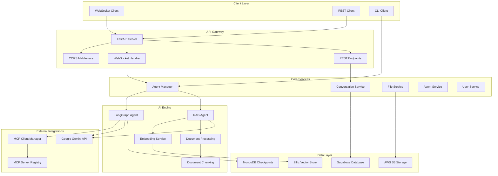

### Component Architecture

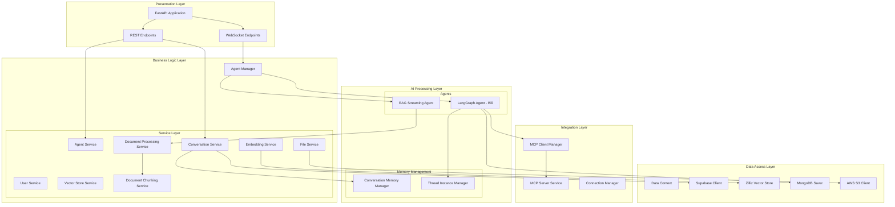

---

## Software Developer Perspective

### Technology Stack

#### Backend Framework
- **FastAPI**: Modern, fast web framework for building APIs
- **Python 3.13+**: Latest Python with enhanced type hints and performance
- **Uvicorn**: ASGI server for production deployment
- **WebSockets**: Real-time bidirectional communication

#### AI & ML Libraries
- **LangChain**: Framework for developing LLM applications
- **LangGraph**: State machine for complex AI workflows
- **Google Generative AI**: Primary LLM provider (Gemini models)
- **Sentence Transformers**: For generating text embeddings

#### Data Storage
- **Supabase**: Primary database for user data and conversations
- **Zilliz Cloud**: Vector database for embeddings and RAG
- **MongoDB**: Checkpoint storage for LangGraph state persistence
- **AWS S3**: File storage for documents and media

#### Development Tools
- **uv**: Fast Python package manager
- **Docker**: Containerization for deployment
- **pytest**: Testing framework
- **Black/flake8**: Code formatting and linting

### Project Structure Analysis

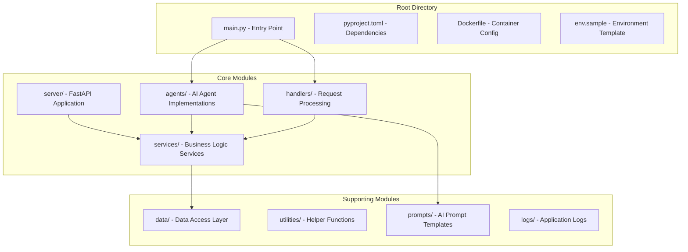

### Code Quality Metrics

| Metric | Value | Status |
|--------|--------|--------|
| Total Lines of Code | ~15,000+ | ✅ Well-structured |
| Cyclomatic Complexity | Medium | ⚠️ Some complex functions |
| Test Coverage | Not implemented | ❌ Needs improvement |
| Documentation | Partial | ⚠️ Needs enhancement |
| Type Hints | Good | ✅ Well-typed |

### Key Design Patterns

1. **Service Layer Pattern**: Clear separation of concerns
2. **Dependency Injection**: Using injector pattern for services
3. **Factory Pattern**: For creating agent instances
4. **Observer Pattern**: For WebSocket event handling
5. **Strategy Pattern**: For different agent types (RAG vs LangGraph)

---

## AI Engineering Perspective

### AI Agent Architecture

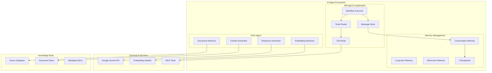

### LangGraph Workflow

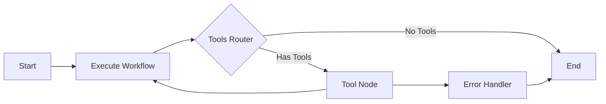

### RAG Pipeline

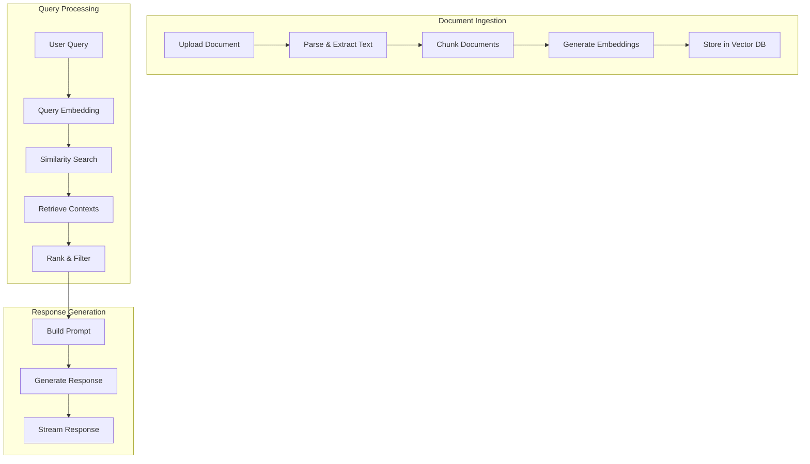

### AI Model Configuration

#### Primary Models
- **Gemini 2.0 Flash**: Latest Google model for general chat
- **Gemini 1.5 Flash**: Fallback model for RAG operations
- **sentence-transformers/all-MiniLM-L6-v2**: Embedding generation

#### Model Parameters
| Parameter | Default | Range | Purpose |
|-----------|---------|-------|---------|
| Temperature | 0.2-0.7 | 0.0-2.0 | Response creativity |
| Top-K | 500 | 1-1000 | Document retrieval |
| Max Tokens | 8192 | 1-32768 | Response length |
| Top-P | 0.95 | 0.0-1.0 | Token sampling |

### Memory & Context Management

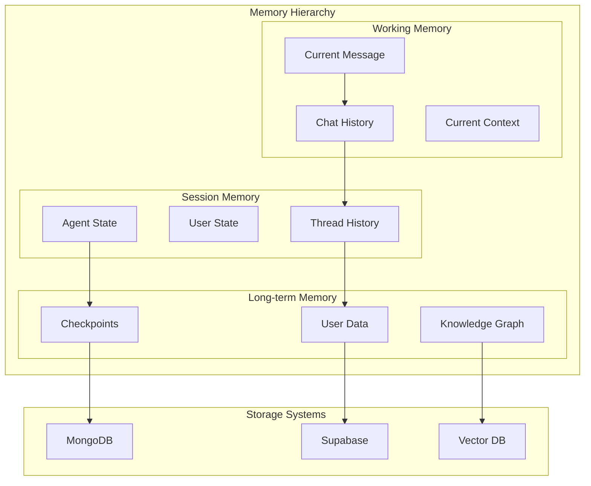

---

## Product Management Perspective

### Feature Matrix

| Feature Category | Features | Implementation Status | Priority |
|------------------|----------|----------------------|----------|
| **Core Chat** | Real-time messaging, Streaming responses | ✅ Complete | High |
| **RAG System** | Document upload, Vector search, Context retrieval | ✅ Complete | High |
| **Workflow Engine** | MCP integration, Tool orchestration | ✅ Complete | High |
| **Multi-tenancy** | User isolation, Conversation management | ✅ Complete | High |
| **File Management** | Upload, Storage, Processing | ✅ Complete | Medium |
| **Analytics** | Usage metrics, Performance monitoring | ⚠️ Partial | Medium |
| **Authentication** | Auth0 integration, JWT tokens | ⚠️ Partial | High |
| **Testing** | Unit tests, Integration tests | ❌ Missing | Medium |

### User Journey Map

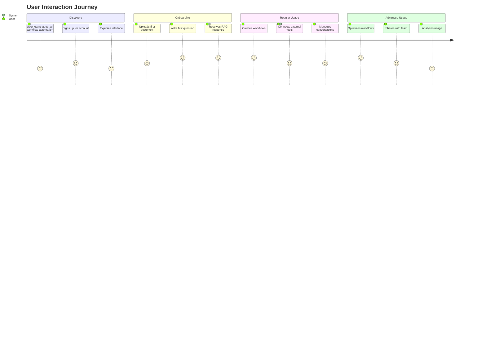

### Market Position

#### Target Segments
1. **Enterprise Knowledge Workers**: Document-heavy workflows
2. **Developers**: Tool integration and workflow automation
3. **Research Teams**: Academic and business research
4. **Content Creators**: Information synthesis and creation

#### Competitive Advantages
1. **Real-time Streaming**: Better UX than batch responses
2. **MCP Integration**: Unique tool connectivity approach
3. **Advanced RAG**: Superior document understanding
4. **Workflow Automation**: End-to-end process automation

### Product Metrics

#### Core KPIs
| Metric | Current | Target | Trend |
|--------|---------|--------|-------|
| Response Time | <2s | <1s | ⬇️ |
| Document Processing | 95% | 99% | ⬆️ |
| User Retention | TBD | 80% | 📊 |
| Workflow Success Rate | TBD | 95% | 📊 |

---

## Technical Deep Dive

### Database Schema

#### Supabase Tables

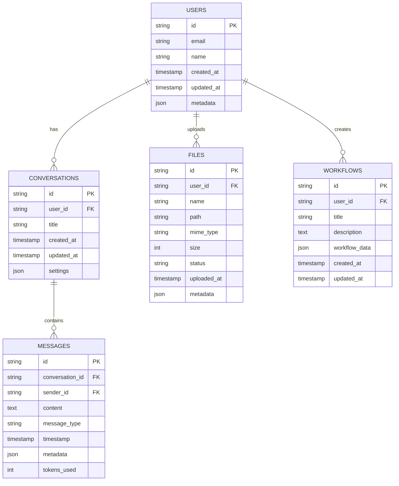

#### Vector Database Schema (Zilliz)

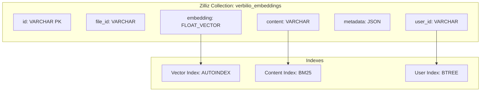

### API Design

#### REST Endpoints

```mermaid
graph LR
    subgraph "Health & Status"
        HEALTH[GET /health]
        STATUS[GET /status]
    end
    
    subgraph "Authentication"
        LOGIN[POST /auth/login]
        REFRESH[POST /auth/refresh]
    end
    
    subgraph "User Management"
        USERS[GET/POST /users]
        PROFILE[GET/PUT /users/{id}]
    end
    
    subgraph "Conversations"
        CONVS[GET/POST /conversations]
        CONV[GET/PUT/DELETE /conversations/{id}]
        MSGS[GET/POST /conversations/{id}/messages]
    end
    
    subgraph "Files & Documents"
        FILES[GET/POST /files]
        FILE[GET/DELETE /files/{id}]
        UPLOAD[POST /files/upload]
    end
    
    subgraph "Agents & Workflows"
        AGENTS[GET/POST /agents]
        FLOWS[GET/POST /flows]
        EXEC[POST /flows/{id}/execute]
    end
```

#### WebSocket Events

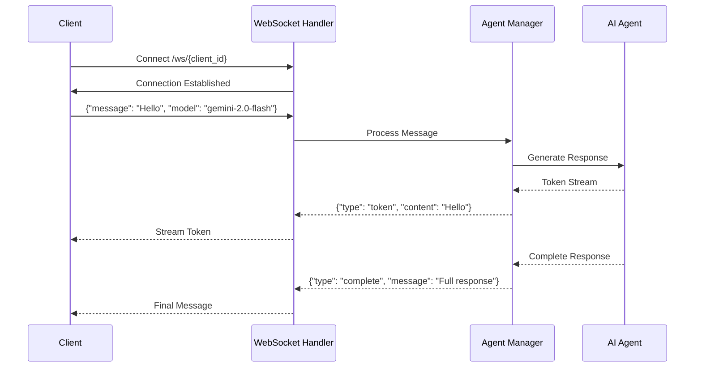

### Error Handling Strategy

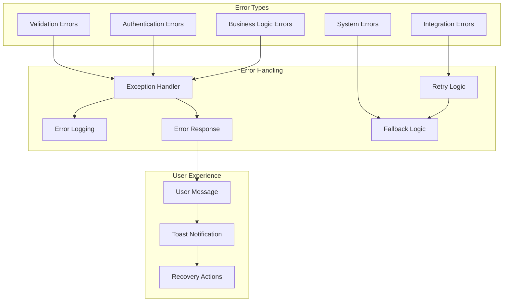

---

## Infrastructure & Deployment

### Deployment Architecture

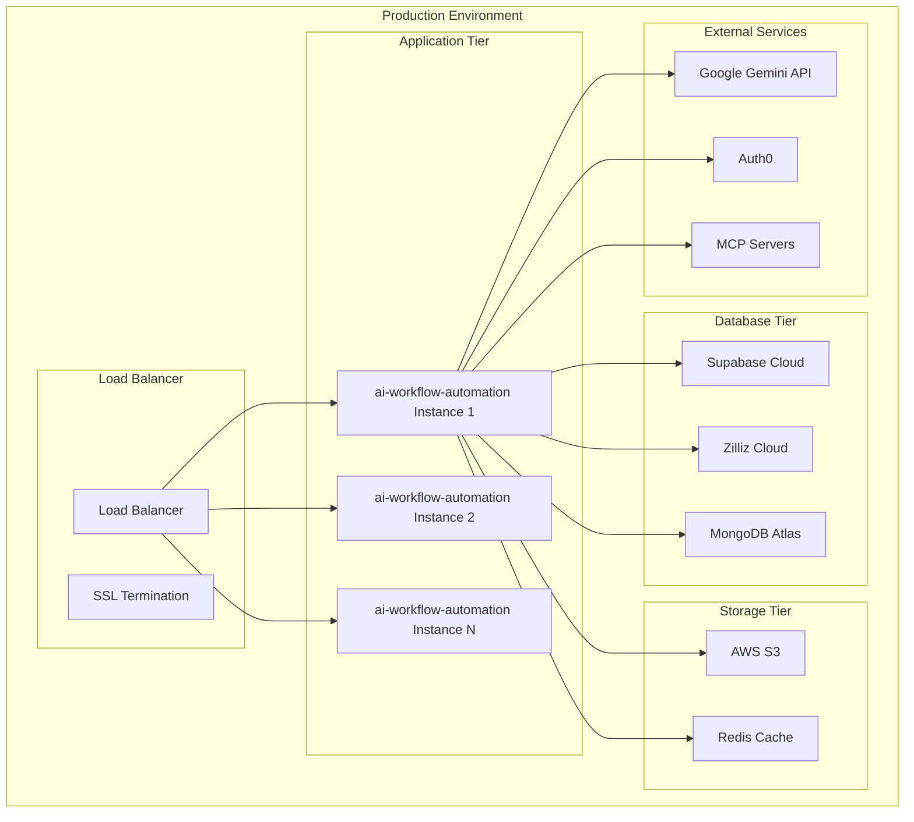

### Docker Configuration

```dockerfile
# Multi-stage build for optimization
FROM python:3.13-slim as builder
WORKDIR /app
COPY pyproject.toml uv.lock ./
RUN pip install uv && uv sync --frozen

FROM python:3.13-slim as runtime
WORKDIR /app
COPY --from=builder /app/.venv /app/.venv
COPY . .
ENV PATH="/app/.venv/bin:$PATH"
EXPOSE 8000
CMD ["python", "main.py"]
```

### Environment Configuration

| Environment | Purpose | Scaling | Monitoring |
|-------------|---------|---------|------------|
| Development | Local development | Single instance | Basic logging |
| Staging | Pre-production testing | 2 instances | Enhanced logging |
| Production | Live environment | Auto-scaling 3-10 | Full observability |

---

## Security & Compliance

### Security Architecture

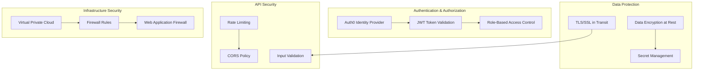

### Data Privacy

#### Data Classification
| Data Type | Classification | Retention | Access Control |
|-----------|---------------|-----------|----------------|
| User Credentials | Confidential | 7 years | Admin only |
| Conversation Data | Internal | 2 years | User + Admin |
| Document Content | Internal | User-defined | User only |
| System Logs | Internal | 90 days | Dev + Admin |
| Analytics Data | Internal | 1 year | Product + Admin |

#### Compliance Framework
- **GDPR**: Right to deletion, data portability
- **SOC 2**: Security controls and monitoring
- **CCPA**: California privacy regulations
- **ISO 27001**: Information security management

---

## Performance & Scalability

### Performance Metrics

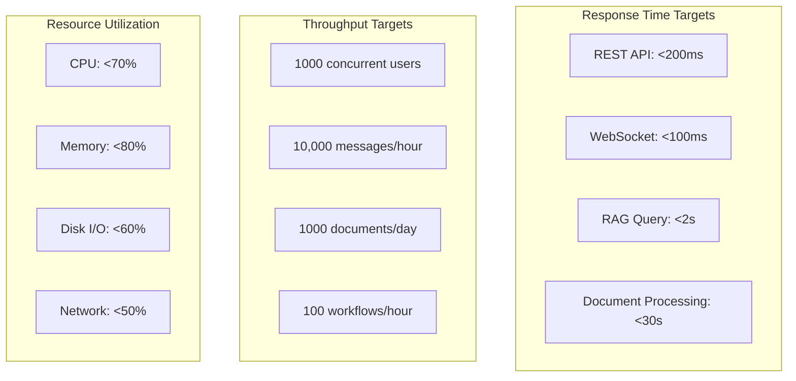

### Scaling Strategy

#### Horizontal Scaling
- **Application Tier**: Stateless design enables easy scaling
- **Database Tier**: Read replicas and sharding
- **Cache Layer**: Distributed Redis cluster
- **File Storage**: CDN integration

#### Vertical Scaling
- **Memory Optimization**: Efficient object pooling
- **CPU Optimization**: Async processing
- **I/O Optimization**: Connection pooling
- **Network Optimization**: Compression and caching

### Caching Strategy

```mermaid
graph TB
    subgraph "Cache Layers"
        L1[L1: In-Memory (Agent State)]
        L2[L2: Redis (Session Data)]
        L3[L3: CDN (Static Assets)]
        L4[L4: Database (Query Cache)]
    end
    
    subgraph "Cache Patterns"
        WT[Write-Through]
        WB[Write-Behind]
        LA[Lazy Loading]
        TTL[TTL Expiration]
    end
    
    L1 --> WT
    L2 --> WB
    L3 --> LA
    L4 --> TTL
```

---

## Development Workflow

### Development Lifecycle

```mermaid
graph LR
    subgraph "Development"
        CODE[Code Development]
        TEST[Local Testing]
        LINT[Code Linting]
        FORMAT[Code Formatting]
    end
    
    subgraph "Integration"
        PR[Pull Request]
        REVIEW[Code Review]
        CI[CI Pipeline]
        BUILD[Build & Test]
    end
    
    subgraph "Deployment"
        STAGE[Staging Deploy]
        QA[QA Testing]
        PROD[Production Deploy]
        MONITOR[Monitoring]
    end
    
    CODE --> TEST
    TEST --> LINT
    LINT --> FORMAT
    FORMAT --> PR
    
    PR --> REVIEW
    REVIEW --> CI
    CI --> BUILD
    BUILD --> STAGE
    
    STAGE --> QA
    QA --> PROD
    PROD --> MONITOR
```

### Code Quality Gates

| Stage | Requirements | Tools | Criteria |
|-------|--------------|-------|----------|
| Commit | Linting, Type checking | Black, mypy | Zero violations |
| PR | Tests, Coverage | pytest | >80% coverage |
| CI | Integration tests | GitHub Actions | All tests pass |
| Deploy | Security scan | Snyk | No critical issues |

### Testing Strategy

#### Test Pyramid
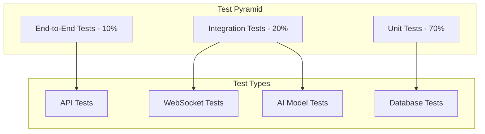

---

## Future Roadmap

### Short-term (Q1 2025)

#### Development Focus
1. **Testing Infrastructure**
   - Unit test coverage >80%
   - Integration test suite
   - Performance benchmarks

2. **Production Readiness**
   - Enhanced error handling
   - Comprehensive logging
   - Health check endpoints

3. **Security Hardening**
   - Complete Auth0 integration
   - API rate limiting
   - Input sanitization

### Medium-term (Q2-Q3 2025)

#### Feature Expansion
1. **Advanced RAG**
   - Multi-modal document support
   - Semantic search improvements
   - Knowledge graph integration

2. **Workflow Engine 2.0**
   - Visual workflow builder
   - Conditional logic support
   - Scheduled executions

3. **Enterprise Features**
   - Team collaboration
   - Admin dashboard
   - Usage analytics

### Long-term (Q4 2025+)

#### Platform Evolution
1. **AI Capabilities**
   - Fine-tuned models
   - Multi-agent systems
   - Autonomous workflows

2. **Ecosystem Integration**
   - Third-party marketplace
   - Plugin architecture
   - Open-source community

3. **Scale & Performance**
   - Edge deployment
   - Real-time collaboration
   - Advanced caching

---

## Appendices

### Appendix A: Environment Variables

| Variable | Required | Default | Description |
|----------|----------|---------|-------------|
| `GOOGLE_API_KEY` | Yes | - | Google Gemini API key |
| `SUPABASE_URL` | Yes | - | Supabase project URL |
| `SUPABASE_KEY` | Yes | - | Supabase anon/service key |
| `ZILLIZ_URI` | Yes | - | Zilliz Cloud endpoint |
| `ZILLIZ_TOKEN` | Yes | - | Zilliz API token |
| `MONGODB_URI` | Yes | - | MongoDB connection string |
| `AWS_ACCESS_KEY_ID` | Yes | - | AWS access key |
| `AWS_SECRET_ACCESS_KEY` | Yes | - | AWS secret key |
| `AUTH0_DOMAIN` | No | - | Auth0 domain |
| `HOST` | No | localhost | Server host |
| `PORT` | No | 8000 | Server port |

### Appendix B: API Reference

#### Authentication
```http
POST /auth/login
Content-Type: application/json

{
  "email": "user@example.com",
  "password": "password"
}
```

#### Chat Interaction
```http
POST /v1/conversations/{id}/messages
Content-Type: application/json

{
  "content": "Hello, how can you help me?",
  "message_type": "user"
}
```

#### WebSocket Connection
```javascript
const ws = new WebSocket('ws://localhost:8000/ws/user-123');
ws.send(JSON.stringify({
  "message": "Hello",
  "model": "gemini-2.0-flash",
  "temperature": 0.7
}));
```

### Appendix C: Troubleshooting Guide

#### Common Issues

1. **Connection Timeouts**
   - Check network connectivity
   - Verify API keys
   - Review firewall settings

2. **Memory Issues**
   - Monitor instance memory usage
   - Check for memory leaks
   - Optimize embedding storage

3. **Performance Degradation**
   - Review database queries
   - Check vector search performance
   - Monitor API rate limits

---

**Document Version**: 1.0  
**Last Updated**: January 2025  
**Maintained By**: Development Team  
**Review Cycle**: Quarterly 