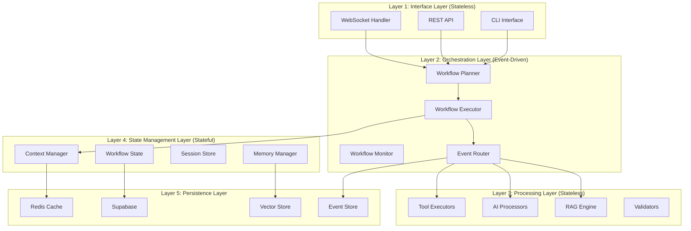
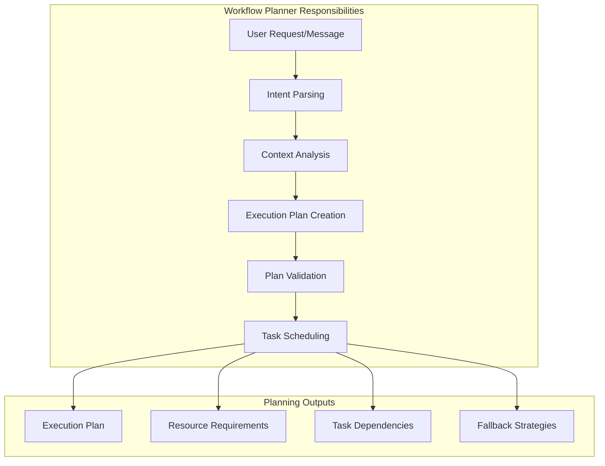
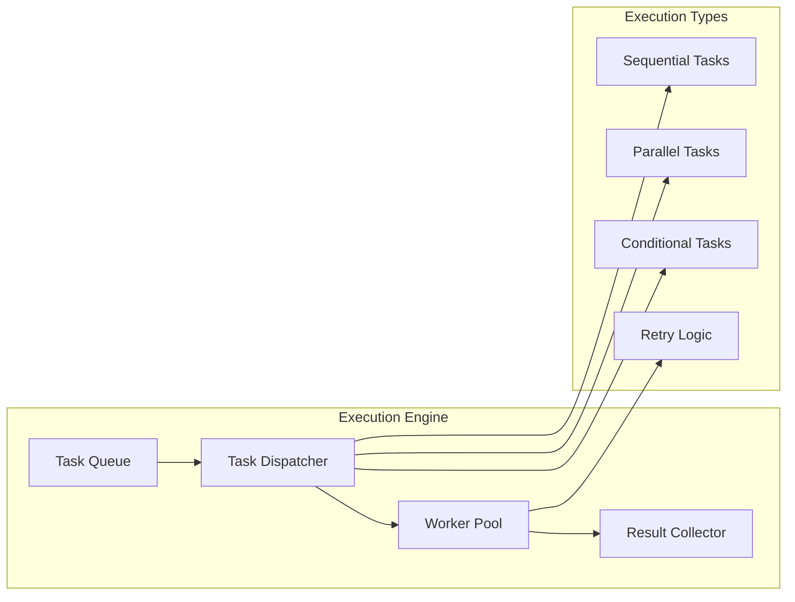
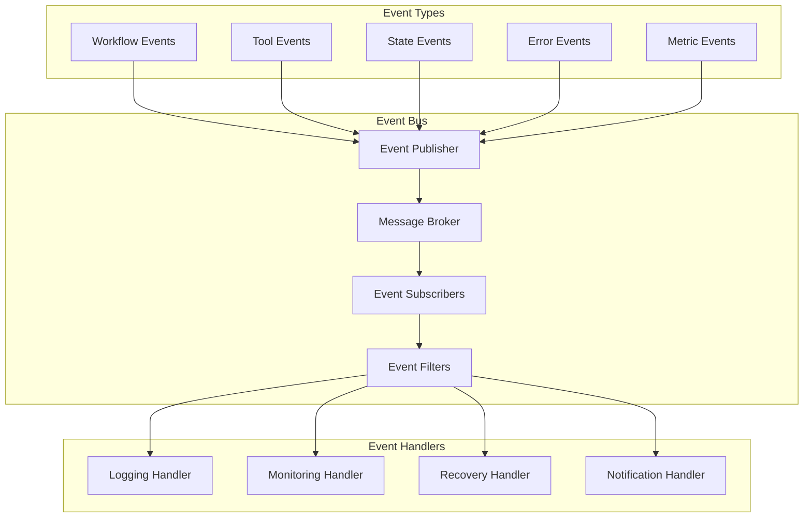
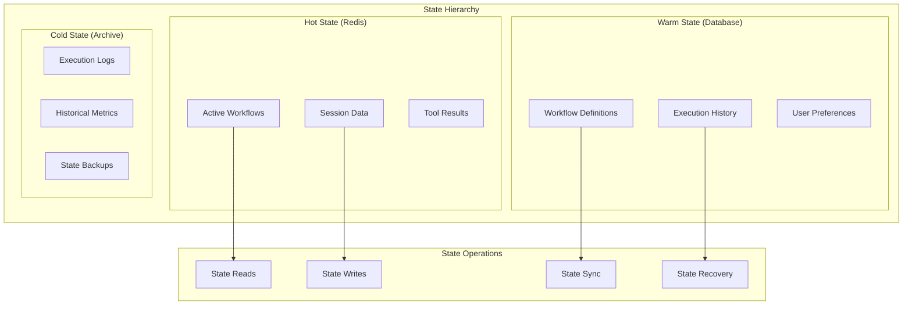
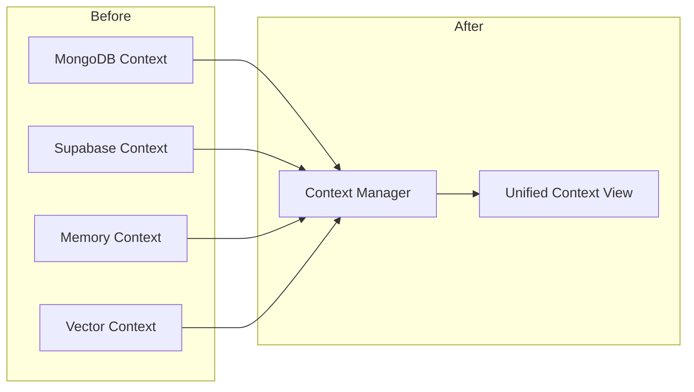
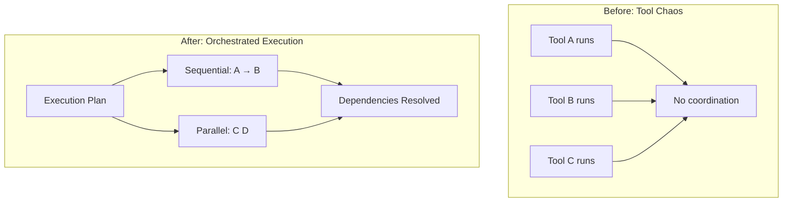
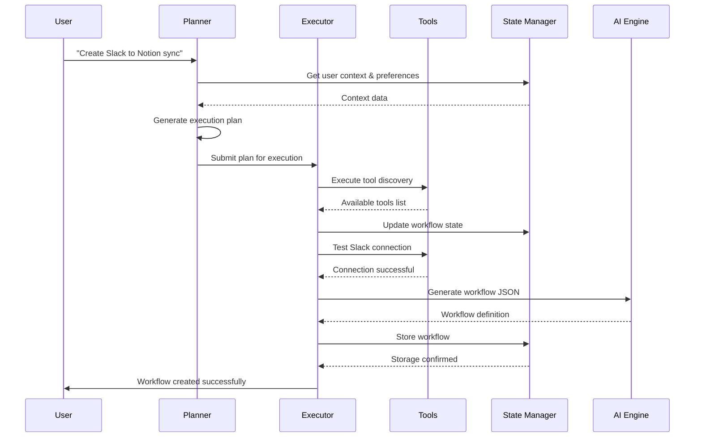

Absolutely! Let me provide a comprehensive breakdown of the recommended **Event-Driven Workflow Architecture** and how it would transform the ai-workflow-automation Agent system.

## 🏗️ **Event-Driven Workflow Architecture Deep Dive**

### **Core Philosophy**

The architecture separates **concerns** into distinct layers while maintaining **loose coupling** through events. This creates a system that's both **stateless where it matters** (for scalability) and **stateful where it's needed** (for context continuity).



## 🔄 **Component Breakdown**

### **1. Workflow Planner**

*The Brain of the System*



**Key Functions:**

- **Intent Recognition**: What does the user actually want?
- **Context Retrieval**: What relevant information exists?
- **Tool Discovery**: Which tools are needed and available?
- **Dependency Resolution**: In what order should tasks execute?
- **Resource Estimation**: How much compute/memory/time needed?
- **Fallback Planning**: What if something fails?

**Example Planning Process:**

```jsx
// User Input: "Create a workflow to sync Slack messages to Notion"
{
  "intent": "workflow_creation",
  "entities": ["Slack", "Notion", "sync", "messages"],
  "plan": {
    "phase1": "validate_tool_availability",
    "phase2": "create_connection_configs",
    "phase3": "test_connections",
    "phase4": "generate_workflow_json",
    "phase5": "store_workflow"
  },
  "resources": {
    "tools": ["slack_api", "notion_api"],
    "estimated_time": "30s",
    "memory_needed": "50MB"
  },
  "fallbacks": {
    "slack_api_fail": "manual_connection_guide",
    "notion_api_fail": "alternative_storage_options"
  }
}

```

### **2. Workflow Executor**

*The Hands of the System*



**Execution Patterns:**

1. **Sequential Execution**

```python
# Phase-by-phase execution
async def execute_sequential(plan):
    for phase in plan.phases:
        result = await execute_phase(phase)
        if result.failed:
            return await handle_failure(phase, result)
        await update_state(phase, result)

```

1. **Parallel Execution**

```python
# Multiple tools running simultaneously
async def execute_parallel(tasks):
    results = await asyncio.gather(*[
        execute_task(task) for task in tasks
    ], return_exceptions=True)
    return await process_results(results)

```

1. **Conditional Execution**

```python
# Dynamic branching based on results
async def execute_conditional(condition, true_path, false_path):
    if await evaluate_condition(condition):
        return await execute_path(true_path)
    else:
        return await execute_path(false_path)

```

### **3. Event Bus System**

*The Nervous System*



**Event Flow Example:**

```jsx
// Tool execution starts
{
  "event_type": "tool.execution.started",
  "workflow_id": "wf_123",
  "tool_name": "slack_api",
  "timestamp": "2025-01-06T15:30:00Z",
  "context": {
    "user_id": "user_456",
    "session_id": "sess_789"
  }
}

// Tool execution completes
{
  "event_type": "tool.execution.completed",
  "workflow_id": "wf_123",
  "tool_name": "slack_api",
  "result": { "status": "success", "data": "..." },
  "duration_ms": 1500,
  "timestamp": "2025-01-06T15:30:01.5Z"
}

// State update triggered
{
  "event_type": "state.updated",
  "workflow_id": "wf_123",
  "changes": {
    "slack_connected": true,
    "next_phase": "notion_connection"
  }
}

```

### **4. State Management Layer**

*The Memory of the System*



**State Management Strategy:**

1. **Context Window Management**

```python
class ContextManager:
    def __init__(self, max_tokens=8192):
        self.max_tokens = max_tokens
        self.context_layers = {
            'system': SystemContext(),
            'workflow': WorkflowContext(),
            'conversation': ConversationContext(),
            'tool': ToolContext()
        }

    async def get_optimized_context(self, workflow_id):
        # Smart context assembly
        context = await self.merge_contexts(workflow_id)
        if self.count_tokens(context) > self.max_tokens:
            context = await self.compress_context(context)
        return context

```

1. **State Consistency**

```python
class StateConsistency:
    async def atomic_update(self, workflow_id, updates):
        async with self.transaction():
            current_state = await self.get_state(workflow_id)
            new_state = self.apply_updates(current_state, updates)
            await self.validate_state(new_state)
            await self.save_state(workflow_id, new_state)
            await self.publish_state_change(workflow_id, updates)

```

## 🎯 **How This Solves Current Problems**

### **Problem 1: Context Fragmentation**

**Current Issue:** Context scattered across multiple stores
**Solution:** Unified Context Manager with intelligent merging



### **Problem 2: State Race Conditions**

**Current Issue:** Multiple instances modifying state simultaneously
**Solution:** Event-driven state updates with proper ordering

```python
# Before: Direct state mutation
state.conversation_history.append(message)  # Race condition!

# After: Event-driven state updates
await event_bus.publish(StateUpdateEvent(
    workflow_id=workflow_id,
    update_type="conversation.message.added",
    data=message,
    sequence_number=get_next_sequence()
))

```

### **Problem 3: Tool Execution Chaos**

**Current Issue:** No clear tool orchestration
**Solution:** Planned execution with dependency resolution



## 🚀 **Implementation Benefits**

### **1. Scalability**

- **Horizontal Scaling**: Each component scales independently
- **Load Distribution**: Events distribute work across workers
- **Resource Optimization**: Smart resource allocation based on workflow complexity

### **2. Reliability**

- **Fault Tolerance**: Individual component failures don't crash the system
- **Retry Mechanisms**: Built-in retry logic with exponential backoff
- **State Recovery**: System can recover from any point in execution

### **3. Observability**

- **Complete Traceability**: Every action generates events
- **Performance Monitoring**: Real-time metrics on all components
- **Debug Capability**: Full workflow execution replay

### **4. Maintainability**

- **Loose Coupling**: Components can be updated independently
- **Clear Boundaries**: Each component has well-defined responsibilities
- **Testing**: Each component can be tested in isolation

## 🔄 **Data Flow Example**

Let's trace a complete workflow execution:



This architecture transforms `ai-workflow-automation` from a complex, tightly-coupled system into a **modular, event-driven platform** that can scale, maintain, and evolve much more effectively. Each component has a clear purpose, and the event-driven nature ensures that the system remains responsive and observable.

Would you like me to dive deeper into any specific component or discuss the migration strategy from the current architecture?