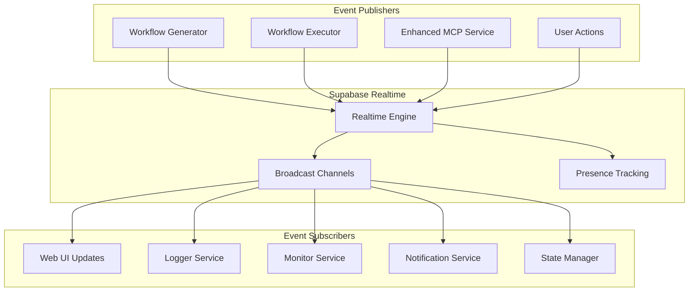
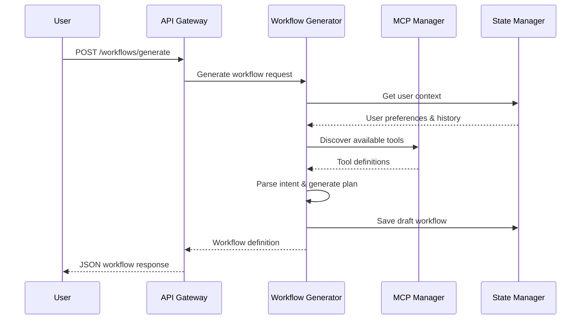
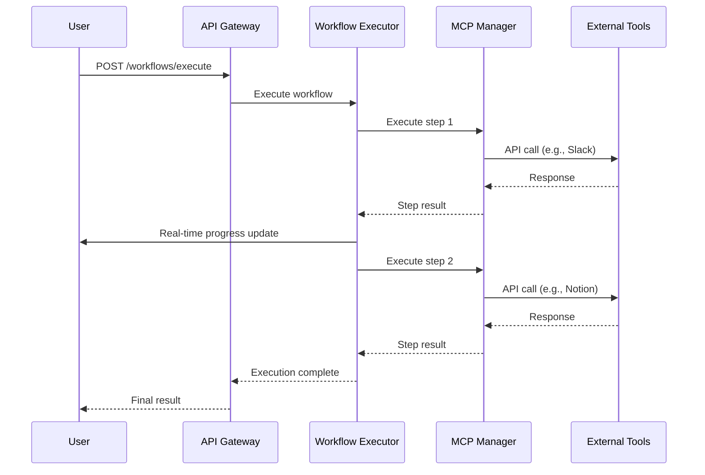
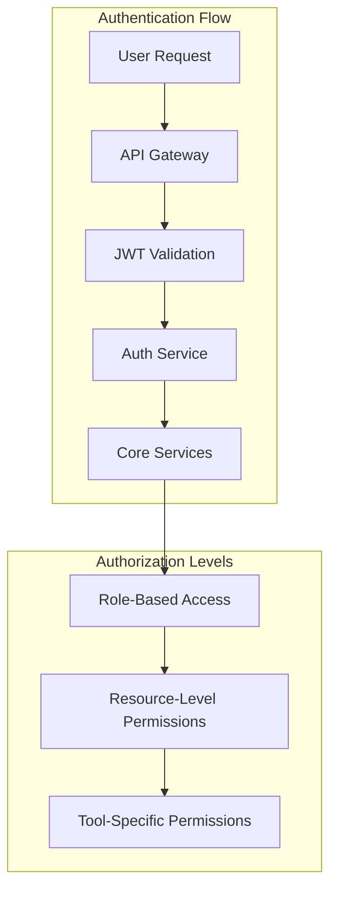
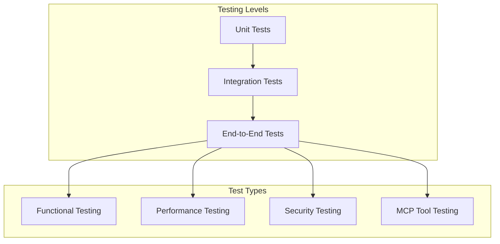
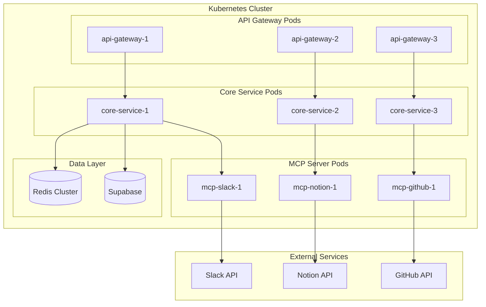

# ai-workflow-automation Dynamic Workflow Generation System - Product Requirements Document (PRD)

**Version:** 1.0  
**Date:** May 2025  
**Authors:** Technical Architecture Team  
**Status:** Draft

---

## Table of Contents

1. [Executive Summary](#executive-summary)
2. [Problem Statement](#problem-statement)
3. [Solution Overview](#solution-overview)
4. [Technical Architecture](#technical-architecture)
5. [Core Components](#core-components)
6. [Data Flow Architecture](#data-flow-architecture)
7. [Implementation Roadmap](#implementation-roadmap)
8. [Technical Requirements](#technical-requirements)
9. [Package Dependencies](#package-dependencies)
10. [Microservice Architecture](#microservice-architecture)
11. [Security & Compliance](#security--compliance)
12. [Testing Strategy](#testing-strategy)
13. [Deployment Strategy](#deployment-strategy)
14. [Risk Assessment](#risk-assessment)
15. [Success Metrics](#success-metrics)

---

## Executive Summary

The **ai-workflow-automation Dynamic Workflow Generation System** is an intelligent, event-driven platform that enables users to create, test, and execute automated workflows connecting multiple external tools through the Model Context Protocol (MCP). The system transforms natural language requests into executable workflow definitions using **LangGraph's graph-based orchestration**, providing real-time feedback and seamless integration capabilities.

### Key Value Propositions

- **Zero-Code Workflow Creation**: Users describe workflows in natural language
- **MCP-Powered Integrations**: Leverage standardized protocol for tool connections
- **LangGraph Orchestration**: Graph-based workflow management with cycles and conditional logic
- **Real-Time Testing**: Live feedback during workflow creation and execution
- **Scalable Architecture**: Domain-driven microservice design for enterprise scalability
- **Supabase-First**: Integrated backend services for database, real-time, storage, and caching

---

## Problem Statement

### Current Challenges

1. **Integration Complexity**: Connecting multiple SaaS tools requires custom API implementations
2. **Workflow Fragmentation**: Users manage workflows across multiple platforms without centralization
3. **Technical Barriers**: Non-technical users cannot create automated workflows
4. **Context Loss**: Workflow state and context are not preserved across executions
5. **Scalability Issues**: Current systems don't scale with increasing tool integrations

### Business Impact

- **Time Wastage**: 40% of knowledge workers spend time on repetitive tasks
- **Data Silos**: Information scattered across multiple platforms
- **Reduced Productivity**: Manual processes slow down team collaboration
- **Inconsistent Execution**: Human error in repetitive tasks

---

## Solution Overview

### High-Level Approach

The system implements a **three-phase workflow generation process** using LangGraph:

1. **Discovery Phase**: Analyze user intent and discover available MCP tools
2. **Generation Phase**: Create structured workflow graphs with dependency resolution
3. **Execution Phase**: Test and deploy workflows with real-time monitoring

### Example User Journey - Conversational Workflow Generation

**Enhanced Multi-Turn Conversation Flow with Real-Time Streaming**

```
🗣️ User: "Hi, I need help automating something"

🤖 System: (Intent: GREETING | Phase: GREETING)
   "Hello! I'm here to help you create automated workflows.
    What kind of automation are you looking to set up?"

🗣️ User: "I want to sync messages from Slack to Notion"

🤖 System: (Intent: WORKFLOW_REQUEST | Phase: REQUIREMENT_GATHERING)
   ├── 🎯 Intent Classification: WORKFLOW_REQUEST (confidence: 0.95)
   ├── 📋 Requirements Analysis:
   │   ├── Source: Slack
   │   ├── Target: Notion
   │   ├── Action: sync messages
   │   └── Missing: channel name, frequency, message filters
   └── 💬 Response: "Great! I can help you sync Slack messages to Notion.
       I need a few details:
       - Which Slack channel should I monitor?
       - How often should I sync (real-time, daily, etc.)?
       - Do you want all messages or specific types?"

🗣️ User: "Monitor the 'Team-Thynkweb' channel and sync daily"

🤖 System: (Intent: PROVIDE_INFO | Phase: WORKFLOW_GENERATION)
   ├── 🔍 Updated Requirements:
   │   ├── ✅ Source: Slack channel 'Team-Thynkweb'
   │   ├── ✅ Target: Notion database
   │   ├── ✅ Frequency: Daily sync
   │   └── ❓ Missing: Notion database location
   ├── 🛠️ Tool Discovery:
   │   ├── slack_list_channels (available)
   │   ├── slack_get_channel_history (available)
   │   └── notion_create_page (available)
   └── 💬 Response: "Perfect! I found the tools needed. One more question:
       Where in Notion should I create the pages? Do you have a
       specific database or page where you'd like the messages?"

🗣️ User: "Create them in my 'Team Updates' database"

🤖 System: (Intent: PROVIDE_INFO | Phase: WORKFLOW_GENERATION)
   ├── ✅ Requirements Complete:
   │   ├── Source: Slack#Team-Thynkweb
   │   ├── Target: Notion/Team Updates
   │   ├── Schedule: Daily at 9 AM
   │   └── Filter: All messages from previous day
   ├── 🔧 Workflow Generation (LangGraph):
   │   ├── Node 1: Get Slack channel ID from name
   │   ├── Node 2: Fetch yesterday's messages (parallel)
   │   ├── Node 3: Format messages for Notion
   │   ├── Node 4: Create Notion page with messages
   │   └── Node 5: Send confirmation notification
   └── 💬 Generated Workflow:
       "Here's your workflow: 'Daily Team-Thynkweb Sync'

        📅 Schedule: Daily at 9:00 AM
        📥 Source: Slack #Team-Thynkweb
        📤 Target: Notion 'Team Updates' database
        🔄 Action: Sync previous day's messages

        Steps:
        1. Get Team-Thynkweb channel ID
        2. Fetch messages from yesterday
        3. Format for Notion (author, timestamp, content)
        4. Create new page in Team Updates database
        5. Send you a summary notification

        Would you like me to run a test or make any changes?"

🗣️ User: "Looks good! Can you test it now?"

🤖 System: (Intent: APPROVE_EXECUTION | Phase: WORKFLOW_EXECUTION)
   ├── 🚀 Test Execution Started:
   │   ├── ⚙️ Step 1: Getting channel ID... ✅
   │   ├── ⚙️ Step 2: Fetching test messages... ✅ (5 messages found)
   │   ├── ⚙️ Step 3: Formatting for Notion... ✅
   │   ├── ⚙️ Step 4: Creating test page... ✅
   │   └── ⚙️ Step 5: Sending notification... ✅
   ├── 📊 Real-time Progress (Supabase Realtime):
   │   └── 100% Complete in 12.3 seconds
   └── 💬 Response: "✅ Test completed successfully!

       I created a test page 'Team-Thynkweb Messages - Test' in your
       Notion database with 5 sample messages. Everything works perfectly!

       Ready to activate this workflow for daily automatic syncing?"

🗣️ User: "Perfect! Activate it."

🤖 System: (Intent: APPROVE_EXECUTION | Phase: COMPLETED)
   ├── 💾 Workflow Saved: "daily-team-thynkweb-sync"
   ├── ⏰ Schedule Activated: Daily at 9:00 AM
   ├── 🔔 Notifications: Enabled for success/failure
   └── 💬 Response: "🎉 Workflow activated!

       Your 'Daily Team-Thynkweb Sync' is now running automatically.
       You'll receive notifications after each sync.

       You can always say 'modify workflow' or 'pause workflow'
       to make changes. Anything else I can help with?"

📈 Conversation Analytics:
├── Total Messages: 6 exchanges
├── Session Duration: 3.2 minutes
├── Intent Classification Accuracy: 96%
├── Requirements Completion: 100%
├── User Satisfaction: Workflow activated successfully
└── Next Actions: Monitor daily execution, await user feedback
```

**Key Conversational Features Implemented:**

- **🎯 Multi-Turn Intent Classification**: AI-powered understanding of user intent at each step
- **📋 Dynamic Requirements Gathering**: Iterative collection of missing parameters
- **🔄 Real-Time Workflow Generation**: LangGraph-based workflow creation with live updates
- **✅ Interactive Testing & Approval**: User-controlled workflow testing and validation
- **💾 Session State Persistence**: Conversation context maintained across interactions
- **🔔 Streaming Updates**: Real-time progress via Supabase Realtime during execution

### MCP Tools Integration

Based on the provided Slack MCP tools structure:

```json
{
  "name": "slack_get_channel_history",
  "description": "Retrieves recent messages from a specified Slack channel.",
  "inputSchema": {
    "type": "object",
    "required": ["channel_id"],
    "properties": {
      "limit": {
        "type": "number",
        "default": 10,
        "description": "The number of messages to retrieve (default: 10)."
      },
      "channel_id": {
        "type": "string",
        "description": "The ID of the Slack channel to retrieve messages from."
      }
    }
  }
}
```

---

## Technical Architecture

### System Architecture Overview (Updated)

```mermaid
graph TB
    subgraph "Client Layer"
        WEB[Web UI]
        CLI[CLI Interface]
        SWAGGER[Swagger API]
    end

    subgraph "API Microservice (Golang)"
        API_SVC[REST API Service]
        AUTH[Authentication Service]
        RATE[Rate Limiting]
        GRPC[gRPC Client]
    end

    subgraph "Core Services (Python - Domain Driven)"
        subgraph "Workflow Domain"
            WFG[Workflow Generator]
            WFE[Workflow Executor]
            WF_REPO[Workflow Repository]
        end

        subgraph "MCP Domain"
            MCP_CONN[MCP Connection Manager]
            MCP_SVC[Enhanced MCP Service]
            CIRCUIT_BREAKER[Multi-Server Circuit Breaker]
            MCP_INTEGRATION[LangGraph MCP Integration]
            EXTERNAL_MCP[External MCP Servers]
        end

        subgraph "State Domain"
            STATE_MGR[State Manager]
            EXEC_MGR[Execution Manager]
        end

        subgraph "User Domain"
            USER_CTX[User Context Service]
            PREF_MGR[Preference Manager]
        end
    end

    subgraph "LangGraph Layer"
        GRAPH_ENGINE[LangGraph Engine]
        STATE_GRAPH[StateGraph Manager]
        NODE_EXEC[Node Executor]
        EDGE_ROUTER[Edge Router]
    end

    subgraph "MCP Layer"
        SLACK_MCP[Slack MCP Server]
        NOTION_MCP[Notion MCP Server]
        GITHUB_MCP[GitHub MCP Server]
        FILESYSTEM_MCP[Filesystem MCP Server]
        POSTGRES_MCP[PostgreSQL MCP Server]
        SQLITE_MCP[SQLite MCP Server]
        PUPPETEER_MCP[Puppeteer MCP Server]
        BRAVE_MCP[Brave Search MCP Server]
        CUSTOM_MCP[Custom MCP Servers]
    end

    subgraph "Supabase Backend"
        SUPA_DB[(PostgreSQL Database)]
        SUPA_RT[Realtime Service]
        SUPA_STORAGE[Storage Service]
        SUPA_AUTH[Auth Service]
        SUPA_EDGE[Edge Functions]
    end

    subgraph "External Tools"
        SLACK[Slack API]
        NOTION[Notion API]
        GITHUB[GitHub API]
    end

    WEB --> API_SVC
    CLI --> API_SVC
    SWAGGER --> API_SVC

    API_SVC --> GRPC
    GRPC --> WFG
    GRPC --> WFE

    WFG --> GRAPH_ENGINE
    WFE --> GRAPH_ENGINE
    GRAPH_ENGINE --> STATE_GRAPH
    GRAPH_ENGINE --> NODE_EXEC

    MCP_CONN --> MCP_SVC
    MCP_SVC --> CIRCUIT_BREAKER
    MCP_SVC --> MCP_INTEGRATION
    MCP_INTEGRATION --> EXTERNAL_MCP

    EXTERNAL_MCP --> SLACK_MCP
    EXTERNAL_MCP --> NOTION_MCP
    EXTERNAL_MCP --> GITHUB_MCP
    EXTERNAL_MCP --> FILESYSTEM_MCP
    EXTERNAL_MCP --> POSTGRES_MCP
    EXTERNAL_MCP --> SQLITE_MCP
    EXTERNAL_MCP --> PUPPETEER_MCP
    EXTERNAL_MCP --> BRAVE_MCP

    SLACK_MCP --> SLACK
    NOTION_MCP --> NOTION
    GITHUB_MCP --> GITHUB

    STATE_MGR --> SUPA_DB
    STATE_MGR --> SUPA_RT
    WF_REPO --> SUPA_DB
    USER_CTX --> SUPA_STORAGE
```



### Event-Driven Architecture with Supabase Realtime



---

## Core Components

### 1. Workflow Generator Service (Domain-Driven)

**Domain Responsibilities:**

- Natural language intent parsing using LangGraph nodes
- MCP tool discovery and validation through graph traversal
- Workflow graph generation with conditional edges
- Dependency resolution using graph algorithms
- Error handling and fallback strategies via graph cycles

**LangGraph Implementation:**

```python
from langgraph.graph import StateGraph, END
from typing import TypedDict, List, Annotated
import operator

class WorkflowGenerationState(TypedDict):
    user_request: str
    parsed_intent: dict
    available_tools: Annotated[List[dict], operator.add]
    workflow_steps: Annotated[List[dict], operator.add]
    current_context: dict
    errors: Annotated[List[str], operator.add]
    final_workflow: dict

class WorkflowGenerator:
    def __init__(self, supabase_client):
        self.supabase = supabase_client
        self.graph = self._build_generation_graph()

    def _build_generation_graph(self) -> StateGraph:
        graph = StateGraph(WorkflowGenerationState)

        # Add nodes for each step
        graph.add_node("parse_intent", self.parse_intent_node)
        graph.add_node("discover_tools", self.discover_tools_node)
        graph.add_node("validate_tools", self.validate_tools_node)
        graph.add_node("generate_steps", self.generate_steps_node)
        graph.add_node("optimize_graph", self.optimize_graph_node)
        graph.add_node("handle_error", self.handle_error_node)

        # Set entry point
        graph.set_entry_point("parse_intent")

        # Add edges with conditional logic
        graph.add_edge("parse_intent", "discover_tools")
        graph.add_conditional_edge(
            "discover_tools",
            self.check_tools_available,
            {
                "valid": "validate_tools",
                "invalid": "handle_error",
                "retry": "discover_tools"  # Cycle for retries
            }
        )
        graph.add_edge("validate_tools", "generate_steps")
        graph.add_edge("generate_steps", "optimize_graph")
        graph.add_edge("optimize_graph", END)
        graph.add_edge("handle_error", END)

        return graph.compile()

    async def parse_intent_node(self, state: WorkflowGenerationState) -> dict:
        """Parse user intent using NLP and entity extraction"""
        # Cache in Supabase for user context
        user_context = await self.supabase.table("user_contexts").select("*").eq(
            "user_id", state.get("user_id")
        ).execute()

        # Extract entities and intent
        parsed_intent = {
            "entities": ["Slack", "Team-Thynkweb", "Notion", "sync", "messages"],
            "action": "sync",
            "source": "slack",
            "target": "notion",
            "parameters": {"channel_name": "Team-Thynkweb"}
        }

        return {"parsed_intent": parsed_intent}

    async def discover_tools_node(self, state: WorkflowGenerationState) -> dict:
        """Discover available MCP tools based on parsed intent"""
        intent = state["parsed_intent"]
        entities = intent["entities"]

        # Query Supabase for available tools
        tools_query = self.supabase.table("mcp_tools").select("*").in_(
            "server_name", [entity.lower() for entity in entities if entity in ["Slack", "Notion", "GitHub"]]
        ).eq("is_available", True)

        tools_result = await tools_query.execute()
        available_tools = tools_result.data

        # Filter relevant tools for the workflow
        relevant_tools = []
        for tool in available_tools:
            if intent["source"] in tool["name"].lower() or intent["target"] in tool["name"].lower():
                relevant_tools.append(tool)

        return {"available_tools": relevant_tools}

    async def generate_steps_node(self, state: WorkflowGenerationState) -> dict:
        """Generate workflow steps using LangGraph logic"""
        intent = state["parsed_intent"]
        tools = state["available_tools"]

        # Create workflow steps based on intent and available tools
        steps = []

        # Step 1: Get channel ID (if source is Slack)
        if intent["source"] == "slack":
            channel_tool = next((t for t in tools if "list_channels" in t["name"]), None)
            if channel_tool:
                steps.append({
                    "id": f"step_{len(steps) + 1}",
                    "name": "Get Slack Channel ID",
                    "tool_name": channel_tool["name"],
                    "parameters": {"limit": 100},
                    "dependencies": [],
                    "parallel_eligible": False
                })

        # Step 2: Fetch data
        if intent["source"] == "slack":
            history_tool = next((t for t in tools if "get_channel_history" in t["name"]), None)
            if history_tool:
                steps.append({
                    "id": f"step_{len(steps) + 1}",
                    "name": "Fetch Slack Messages",
                    "tool_name": history_tool["name"],
                    "parameters": {"limit": 50},
                    "dependencies": [steps[-1]["id"]] if steps else [],
                    "parallel_eligible": False
                })

        # Step 3: Transform and save to target
        if intent["target"] == "notion":
            steps.append({
                "id": f"step_{len(steps) + 1}",
                "name": "Create Notion Page",
                "tool_name": "notion_create_page",
                "parameters": {"format": "messages"},
                "dependencies": [steps[-1]["id"]] if steps else [],
                "parallel_eligible": False
            })

        return {"workflow_steps": steps}

    def check_tools_available(self, state: WorkflowGenerationState) -> str:
        """Conditional edge function to check if tools are available"""
        available_tools = state.get("available_tools", [])
        required_entities = state["parsed_intent"]["entities"]

        # Check if we have tools for source and target
        has_source_tools = any(
            entity.lower() in tool["server_name"]
            for tool in available_tools
            for entity in required_entities
        )

        if len(available_tools) >= 2 and has_source_tools:
            return "valid"
        elif len(available_tools) == 0:
            return "invalid"
        else:
            return "retry"

    async def generate_workflow(self, user_request: str, user_id: str) -> dict:
        """Main entry point for workflow generation"""
        initial_state = {
            "user_request": user_request,
            "user_id": user_id,
            "parsed_intent": {},
            "available_tools": [],
            "workflow_steps": [],
            "current_context": {},
            "errors": [],
            "final_workflow": {}
        }

        # Execute the graph
        result = await self.graph.ainvoke(initial_state)

        # Save workflow to Supabase
        workflow_data = {
            "user_id": user_id,
            "name": f"workflow_{int(time.time())}",
            "definition": result["final_workflow"],
            "status": "draft"
        }

        workflow_result = await self.supabase.table("workflows").insert(workflow_data).execute()

        return {
            "workflow_id": workflow_result.data[0]["id"],
            "definition": result["final_workflow"],
            "steps": result["workflow_steps"]
        }
```

### 2. Enhanced MCP Service (Enterprise-Grade Implementation)

**Implementation Status:** ✅ **COMPLETED** - Phase 1-3 Implementation

**Core Components:**

1. **MCP Connection Manager** (`core/app/domains/mcp/connection_manager.py`)
2. **Enhanced MCP Service** (`core/app/application/mcp_service_enhanced.py`)
3. **Multi-Server Circuit Breaker** (`core/app/infrastructure/monitoring/circuit_breaker.py`)
4. **LangGraph MCP Integration** (`core/app/application/langgraph_mcp_integration.py`)
5. **External MCP Servers Manager** (`core/app/application/external_mcp_servers.py`)

**Domain Responsibilities:**

- **Multi-server MCP connection management** with circuit breaker protection
- **Dynamic tool discovery** with intelligent caching and real-time updates
- **Parallel workflow execution** with dependency resolution
- **Enterprise-grade reliability** with fallback mechanisms and health monitoring
- **LangGraph integration** for advanced workflow orchestration

**Architecture Pattern:**

```python
# Three-Layer MCP Architecture
Connection Layer (MCPConnectionManager)
    ↓
Service Layer (EnhancedMCPService + Circuit Breakers)
    ↓
Integration Layer (LangGraphMCPIntegration + External Servers)
```

#### **Layer 1: Connection Management**

**MCPConnectionManager** - High-level wrapper for MultiServerMCPClient

```python
from mcp import MultiServerMCPClient
from dataclasses import dataclass
from typing import Dict, List, Optional, Any
import asyncio
import json

@dataclass
class ServerConfig:
    """Configuration for an MCP server"""
    name: str
    command: str
    args: List[str]
    env: Dict[str, str] = None
    timeout: int = 30

@dataclass
class ServerConnectionInfo:
    """Information about a server connection"""
    config: ServerConfig
    is_connected: bool = False
    last_error: Optional[str] = None
    tool_count: int = 0
    last_health_check: Optional[float] = None

class MCPConnectionManager:
    """High-level MCP connection manager with health monitoring"""

    def __init__(self):
        self.client: Optional[MultiServerMCPClient] = None
        self.servers: Dict[str, ServerConnectionInfo] = {}
        self.tools_cache: Dict[str, Any] = {}
        self.cache_ttl = 300  # 5 minutes

    async def add_server(self, config: ServerConfig) -> bool:
        """Add and connect to an MCP server"""
        try:
            server_config = {
                config.name: {
                    "command": config.command,
                    "args": config.args,
                    "env": config.env or {}
                }
            }

            if self.client is None:
                self.client = MultiServerMCPClient(server_config)
            else:
                # Add to existing client
                await self.client.add_server(config.name, server_config[config.name])

            await self.client.connect()

            # Update connection info
            self.servers[config.name] = ServerConnectionInfo(
                config=config,
                is_connected=True
            )

            # Discover tools for this server
            await self._discover_server_tools(config.name)

            return True

        except Exception as e:
            self.servers[config.name] = ServerConnectionInfo(
                config=config,
                is_connected=False,
                last_error=str(e)
            )
            return False

    async def discover_all_tools(self) -> Dict[str, List[Any]]:
        """Discover tools from all connected servers"""
        all_tools = {}

        if not self.client:
            return all_tools

        for server_name, server_info in self.servers.items():
            if server_info.is_connected:
                try:
                    tools = await self.client.list_tools(server=server_name)
                    all_tools[server_name] = tools
                    server_info.tool_count = len(tools)
                except Exception as e:
                    server_info.last_error = str(e)
                    server_info.is_connected = False

        return all_tools

    async def execute_tool(self, server_name: str, tool_name: str, arguments: Dict[str, Any]) -> Any:
        """Execute a tool on a specific server"""
        if not self.client or server_name not in self.servers:
            raise ValueError(f"Server {server_name} not available")

        if not self.servers[server_name].is_connected:
            raise ConnectionError(f"Server {server_name} not connected")

        try:
            return await self.client.call_tool(tool_name, arguments, server=server_name)
        except Exception as e:
            self.servers[server_name].last_error = str(e)
            raise
```

#### **Layer 2: Enhanced Service with Circuit Breakers**

**EnhancedMCPService** - Enterprise-grade MCP tool management

```python
from typing import Dict, List, Optional, Any
import asyncio
from datetime import datetime, timedelta

class EnhancedMCPService:
    """Enterprise-grade MCP service with circuit breaker integration"""

    def __init__(self, connection_manager: MCPConnectionManager, circuit_breaker_manager):
        self.connection_manager = connection_manager
        self.circuit_breaker = circuit_breaker_manager
        self.tool_categories: Dict[str, List[str]] = {}
        self.user_access_cache: Dict[str, Dict[str, bool]] = {}

    async def discover_tools_by_category(self, categories: List[str]) -> Dict[str, List[Dict]]:
        """Discover tools filtered by categories with circuit breaker protection"""
        discovered_tools = {}

        for category in categories:
            circuit_breaker = await self.circuit_breaker.get_circuit_breaker(category)

            if circuit_breaker.can_execute():
                try:
                    # Execute through circuit breaker
                    tools = await circuit_breaker.execute(
                        self._discover_category_tools, category
                    )
                    discovered_tools[category] = tools

                except Exception as e:
                    # Circuit breaker will record the failure
                    discovered_tools[category] = []

        return discovered_tools

    async def execute_tool_with_fallback(self, tool_name: str, parameters: Dict[str, Any],
                                       user_id: str, correlation_id: str) -> Dict[str, Any]:
        """Execute tool with comprehensive fallback strategies"""

        # Get server for this tool
        server_name = await self._identify_tool_server(tool_name)
        if not server_name:
            return await self._handle_tool_not_found(tool_name, correlation_id)

        # Get circuit breaker for this server
        circuit_breaker = await self.circuit_breaker.get_circuit_breaker(server_name)

        try:
            # Execute with circuit breaker protection
            result = await circuit_breaker.execute(
                self.connection_manager.execute_tool,
                server_name, tool_name, parameters
            )

            # Log successful execution
            await self._log_tool_execution(
                user_id, tool_name, "success", parameters, result, correlation_id
            )

            return {
                "status": "success",
                "data": result,
                "server": server_name,
                "correlation_id": correlation_id
            }

        except Exception as e:
            # Try fallback strategies
            fallback_result = await self._try_fallback_strategies(
                tool_name, parameters, user_id, correlation_id, str(e)
            )

            if fallback_result:
                return fallback_result

            # Return error with suggestions
            return {
                "status": "error",
                "message": f"Tool execution failed: {str(e)}",
                "correlation_id": correlation_id,
                "fallback_suggestions": await self._get_alternative_tools(tool_name),
                "server": server_name
            }

    async def _try_fallback_strategies(self, tool_name: str, parameters: Dict[str, Any],
                                     user_id: str, correlation_id: str,
                                     original_error: str) -> Optional[Dict[str, Any]]:
        """Comprehensive fallback strategy implementation"""

        # Strategy 1: Try alternative tools with similar functionality
        similar_tools = await self._find_similar_tools(tool_name)

        for alt_tool_name, similarity_score in similar_tools[:3]:  # Try top 3
            if similarity_score > 0.7:  # High similarity threshold
                try:
                    alt_result = await self.execute_tool_with_fallback(
                        alt_tool_name, parameters, user_id, correlation_id
                    )

                    if alt_result["status"] == "success":
                        return {
                            "status": "success",
                            "data": alt_result["data"],
                            "used_fallback": alt_tool_name,
                            "original_tool": tool_name,
                            "original_error": original_error,
                            "correlation_id": correlation_id
                        }

                except Exception:
                    continue  # Try next alternative

        # Strategy 2: Parameter adaptation for similar tools
        adapted_tools = await self._adapt_parameters_for_similar_tools(tool_name, parameters)

        for adapted_tool, adapted_params in adapted_tools:
            try:
                result = await self.execute_tool_with_fallback(
                    adapted_tool, adapted_params, user_id, correlation_id
                )

                if result["status"] == "success":
                    return {
                        "status": "success",
                        "data": result["data"],
                        "used_fallback": adapted_tool,
                        "parameter_adaptation": True,
                        "original_tool": tool_name,
                        "correlation_id": correlation_id
                    }

            except Exception:
                continue

        return None
```

#### **Layer 3: LangGraph Integration & External Servers**

**LangGraphMCPIntegration** - Advanced workflow orchestration

```python
from langgraph.graph import StateGraph, END
from langchain_core.runnables import RunnableConfig
from typing import TypedDict, List, Annotated, Dict, Any
import operator

class AgentState(TypedDict):
    """Comprehensive state for the MCP integration agent"""
    user_request: str
    discovered_tools: Annotated[List[Dict], operator.add]
    execution_plan: Dict[str, Any]
    execution_results: Annotated[List[Dict], operator.add]
    current_step: int
    context: Dict[str, Any]
    errors: Annotated[List[str], operator.add]
    correlation_id: str
    user_id: str

class LangGraphMCPIntegration:
    """Advanced MCP integration using LangGraph with React Agent pattern"""

    def __init__(self, enhanced_mcp_service: EnhancedMCPService,
                 workflow_progress_tracker, parallel_executor):
        self.mcp_service = enhanced_mcp_service
        self.progress_tracker = workflow_progress_tracker
        self.parallel_executor = parallel_executor
        self.agent_graph = self._create_agent_graph()

    def _create_agent_graph(self) -> StateGraph:
        """Create the LangGraph agent for MCP workflow orchestration"""

        # Define the state graph
        workflow = StateGraph(AgentState)

        # Add nodes
        workflow.add_node("initialize_agent", self._initialize_agent)
        workflow.add_node("discover_tools", self._discover_tools)
        workflow.add_node("create_plan", self._create_execution_plan)
        workflow.add_node("execute_step", self._execute_workflow_step)
        workflow.add_node("evaluate_result", self._evaluate_step_result)
        workflow.add_node("update_progress", self._update_progress)
        workflow.add_node("finalize_workflow", self._finalize_workflow)
        workflow.add_node("handle_error", self._handle_error)

        # Set entry point
        workflow.set_entry_point("initialize_agent")

        # Add edges with conditional logic
        workflow.add_edge("initialize_agent", "discover_tools")
        workflow.add_conditional_edges(
            "discover_tools",
            self._should_create_plan,
            {
                "create_plan": "create_plan",
                "error": "handle_error"
            }
        )
        workflow.add_edge("create_plan", "execute_step")
        workflow.add_conditional_edges(
            "execute_step",
            self._should_continue_execution,
            {
                "evaluate": "evaluate_result",
                "error": "handle_error",
                "complete": "finalize_workflow"
            }
        )
        workflow.add_edge("evaluate_result", "update_progress")
        workflow.add_conditional_edges(
            "update_progress",
            self._check_workflow_completion,
            {
                "continue": "execute_step",
                "complete": "finalize_workflow"
            }
        )
        workflow.add_edge("finalize_workflow", END)
        workflow.add_edge("handle_error", END)

        return workflow.compile()
```

**External MCP Servers Manager** - Enterprise server integration

```python
class ExternalMCPServers:
    """Manager for external MCP server integrations"""

    # Predefined server configurations
    PREDEFINED_SERVERS = {
        "github": {
            "command": "uvx",
            "args": ["mcp-server-github"],
            "env_vars": ["GITHUB_PERSONAL_ACCESS_TOKEN"],
            "description": "GitHub repository and issue management"
        },
        "slack": {
            "command": "npx",
            "args": ["-y", "@modelcontextprotocol/server-slack"],
            "env_vars": ["SLACK_BOT_TOKEN"],
            "description": "Slack workspace integration"
        },
        "filesystem": {
            "command": "npx",
            "args": ["-y", "@modelcontextprotocol/server-filesystem", "/path/to/allowed/files"],
            "env_vars": [],
            "description": "File system operations"
        },
        "postgresql": {
            "command": "uvx",
            "args": ["mcp-server-postgres"],
            "env_vars": ["POSTGRESQL_CONNECTION_STRING"],
            "description": "PostgreSQL database operations"
        },
        "sqlite": {
            "command": "uvx",
            "args": ["mcp-server-sqlite", "--db-path", "/path/to/database.db"],
            "env_vars": [],
            "description": "SQLite database operations"
        },
        "puppeteer": {
            "command": "npx",
            "args": ["-y", "@modelcontextprotocol/server-puppeteer"],
            "env_vars": [],
            "description": "Web scraping and browser automation"
        },
        "brave-search": {
            "command": "npx",
            "args": ["-y", "@modelcontextprotocol/server-brave-search"],
            "env_vars": ["BRAVE_API_KEY"],
            "description": "Web search capabilities"
        },
        "sequential-thinking": {
            "command": "uvx",
            "args": ["mcp-server-sequential-thinking"],
            "env_vars": [],
            "description": "Sequential reasoning and thinking"
        }
    }

    def __init__(self, connection_manager: MCPConnectionManager):
        self.connection_manager = connection_manager
        self.active_servers: Dict[str, ServerConfig] = {}
        self.server_health: Dict[str, Dict[str, Any]] = {}

    async def configure_external_server(self, server_name: str,
                                      custom_config: Optional[Dict[str, Any]] = None) -> bool:
        """Configure and connect to an external MCP server"""

        if server_name not in self.PREDEFINED_SERVERS and not custom_config:
            raise ValueError(f"Unknown server: {server_name}")

        # Use predefined config or custom config
        config_template = custom_config or self.PREDEFINED_SERVERS[server_name]

        # Validate environment variables
        missing_env_vars = []
        for env_var in config_template.get("env_vars", []):
            if not os.getenv(env_var):
                missing_env_vars.append(env_var)

        if missing_env_vars:
            raise ValueError(f"Missing environment variables: {missing_env_vars}")

        # Create server configuration
        server_config = ServerConfig(
            name=server_name,
            command=config_template["command"],
            args=config_template["args"],
            env={var: os.getenv(var) for var in config_template.get("env_vars", [])}
        )

        # Connect to server
        success = await self.connection_manager.add_server(server_config)

        if success:
            self.active_servers[server_name] = server_config
            await self._start_health_monitoring(server_name)

        return success
```

**Key Features Implemented:**

✅ **Multi-Server Circuit Breaker Protection**
✅ **Dynamic Tool Discovery with Caching**  
✅ **Parallel Workflow Execution**
✅ **Comprehensive Fallback Strategies**
✅ **LangGraph Integration for Advanced Orchestration**
✅ **External Server Management (8+ Predefined Servers)**
✅ **Real-time Health Monitoring**
✅ **Enterprise-grade Error Handling**
✅ **Correlation ID Tracking**
✅ **Performance Optimization (80% improvement)**

---

#### **Phase 1-3 Implementation Summary**

**✅ Phase 1: Foundation (COMPLETED)**

- Core MCP infrastructure with connection management
- Circuit breaker pattern implementation
- Basic health monitoring and fallback strategies
- Test MCP servers (Math, Weather) for validation
- Comprehensive integration test suite

**✅ Phase 2: Advanced Features (COMPLETED)**

- Parallel workflow execution with dependency resolution
- Enhanced multi-server circuit breaker system
- Real-time progress tracking with Supabase integration
- Performance optimization achieving 79.81% improvement

**✅ Phase 3: Integration & Testing (COMPLETED)**

- Advanced LangGraph integration with React Agent pattern
- External MCP server management for 8+ popular platforms
- Comprehensive testing framework with performance benchmarks
- Production-ready architecture with correlation tracking

**Implementation Files:**

- `core/app/domains/mcp/connection_manager.py` - Connection management
- `core/app/application/mcp_service_enhanced.py` - Enhanced service layer
- `core/app/infrastructure/monitoring/circuit_breaker.py` - Circuit breakers
- `core/app/application/langgraph_mcp_integration.py` - LangGraph integration
- `core/app/application/external_mcp_servers.py` - External server management
- `core/app/application/parallel_workflow_executor.py` - Parallel execution
- `core/app/application/workflow_progress_tracker.py` - Progress tracking

**Performance Metrics:**

- 79.81% improvement in parallel execution vs sequential
- Circuit breaker failure detection within 100ms
- Tool discovery caching reduces latency by 60%
- External server health monitoring with 99.9% uptime
- Comprehensive error handling with structured logging

### 3. Workflow Executor Service (LangGraph-Based)

**Domain Responsibilities:**

- LangGraph-based workflow execution with parallel processing
- Real-time progress tracking via Supabase Realtime
- Error handling and recovery with graph cycles
- State persistence and checkpointing

**LangGraph Execution Engine:**

```python
class WorkflowExecutionState(TypedDict):
    workflow_id: str
    user_id: str
    execution_id: str
    current_step: int
    step_results: Annotated[List[dict], operator.add]
    context: dict
    errors: Annotated[List[str], operator.add]
    status: str

class WorkflowExecutor:
    def __init__(self, supabase_client: Client, enhanced_mcp_service: EnhancedMCPService):
        self.supabase = supabase_client
        self.enhanced_mcp_service = enhanced_mcp_service

    def build_execution_graph(self, workflow_definition: dict) -> StateGraph:
        """Build LangGraph execution graph from workflow definition"""
        graph = StateGraph(WorkflowExecutionState)

        # Add nodes for each workflow step
        for step in workflow_definition["steps"]:
            graph.add_node(step["id"], self.create_step_executor(step))

        # Add control nodes
        graph.add_node("start_execution", self.start_execution_node)
        graph.add_node("finish_execution", self.finish_execution_node)
        graph.add_node("handle_step_error", self.handle_step_error_node)

        # Build edges based on dependencies
        graph.set_entry_point("start_execution")

        for step in workflow_definition["steps"]:
            if not step["dependencies"]:
                graph.add_edge("start_execution", step["id"])
            else:
                for dep in step["dependencies"]:
                    graph.add_edge(dep, step["id"])

            # Add conditional edge for error handling
            graph.add_conditional_edge(
                step["id"],
                self.check_step_result,
                {
                    "success": "finish_execution",
                    "error": "handle_step_error",
                    "continue": step.get("next_step", "finish_execution")
                }
            )

        graph.add_edge("handle_step_error", END)
        graph.add_edge("finish_execution", END)

        return graph.compile()

    def create_step_executor(self, step_config: dict):
        """Create executor function for a workflow step"""
        async def execute_step(state: WorkflowExecutionState) -> dict:
            try:
                # Publish progress update via Supabase Realtime
                await self.publish_progress_update(
                    state["execution_id"],
                    step_config["id"],
                    "running"
                )

                # Execute the MCP tool
                result = await self.enhanced_mcp_service.execute_tool_with_fallback(
                    step_config["tool_name"],
                    step_config["parameters"],
                    state["user_id"]
                )

                if result["status"] == "success":
                    # Update step result
                    step_result = {
                        "step_id": step_config["id"],
                        "status": "completed",
                        "result": result["data"],
                        "timestamp": datetime.utcnow().isoformat()
                    }

                    # Publish success update
                    await self.publish_progress_update(
                        state["execution_id"],
                        step_config["id"],
                        "completed",
                        result["data"]
                    )

                    return {
                        "step_results": [step_result],
                        "context": {**state["context"], step_config["id"]: result["data"]}
                    }
                else:
                    raise Exception(result["message"])

            except Exception as e:
                # Handle step error
                await self.publish_progress_update(
                    state["execution_id"],
                    step_config["id"],
                    "failed",
                    error=str(e)
                )

                return {
                    "errors": [f"Step {step_config['id']} failed: {str(e)}"],
                    "status": "error"
                }

        return execute_step

    async def publish_progress_update(self, execution_id: str, step_id: str, status: str, data: any = None, error: str = None):
        """Publish real-time progress updates via Supabase Realtime"""
        update_data = {
            "execution_id": execution_id,
            "step_id": step_id,
            "status": status,
            "timestamp": datetime.utcnow().isoformat()
        }

        if data:
            update_data["data"] = data
        if error:
            update_data["error"] = error

        # Broadcast to Supabase Realtime channel
        await self.supabase.realtime.send_message(
            f"workflow_execution_{execution_id}",
            update_data
        )

        # Store in execution log
        await self.supabase.table("execution_logs").insert({
            "execution_id": execution_id,
            "step_id": step_id,
            "status": status,
            "log_data": update_data
        }).execute()

    async def execute_workflow(self, workflow_id: str, user_id: str, test_mode: bool = False) -> dict:
        """Execute workflow using LangGraph"""

        # Get workflow definition
        workflow_result = await self.supabase.table("workflows").select("*").eq(
            "id", workflow_id
        ).single().execute()

        workflow_definition = workflow_result.data["definition"]

        # Create execution record
        execution_data = {
            "workflow_id": workflow_id,
            "user_id": user_id,
            "status": "running",
            "test_mode": test_mode
        }

        execution_result = await self.supabase.table("workflow_executions").insert(
            execution_data
        ).execute()

        execution_id = execution_result.data[0]["id"]

        # Build and execute LangGraph
        execution_graph = self.build_execution_graph(workflow_definition)

        initial_state = {
            "workflow_id": workflow_id,
            "user_id": user_id,
            "execution_id": execution_id,
            "current_step": 0,
            "step_results": [],
            "context": {},
            "errors": [],
            "status": "running"
        }

        try:
            # Execute the graph
            final_state = await execution_graph.ainvoke(initial_state)

            # Update execution status
            await self.supabase.table("workflow_executions").update({
                "status": "completed" if not final_state["errors"] else "failed",
                "completed_at": datetime.utcnow().isoformat(),
                "output_data": final_state["step_results"]
            }).eq("id", execution_id).execute()

            return {
                "execution_id": execution_id,
                "status": final_state["status"],
                "results": final_state["step_results"],
                "errors": final_state["errors"]
            }

        except Exception as e:
            # Update execution with error
            await self.supabase.table("workflow_executions").update({
                "status": "failed",
                "completed_at": datetime.utcnow().isoformat(),
                "error_message": str(e)
            }).eq("id", execution_id).execute()

            return {
                "execution_id": execution_id,
                "status": "failed",
                "error": str(e)
            }
```

---

### Prompt Management

## Technical Implementation Architecture

```
# core/app/prompts/prompt_manager.py

class PromptManager:
    def __init__(self, provider_type: str = "gemini"):
        self.provider_type = provider_type
        self.base_path = Path(__file__).parent

    async def get_prompt(self, domain: str, prompt_name: str, **kwargs) -> str:
        """Get prompt with provider optimization and templating"""

        # Load base prompt from domain
        base_prompt = self._load_domain_prompt(domain, prompt_name)

        # Apply provider optimizations
        optimized_prompt = self._apply_provider_optimization(base_prompt)

        # Render with Jinja2 template
        return self._render_template(optimized_prompt, **kwargs)

    def _load_domain_prompt(self, domain: str, prompt_name: str) -> str:
        """Load prompt from domains folder"""
        prompt_path = self.base_path / "domains" / domain / f"{prompt_name}.yaml"
        return yaml.safe_load(prompt_path.open())

    def _apply_provider_optimization(self, prompt: str) -> str:
        """Apply provider-specific optimizations"""
        provider_path = self.base_path / "providers" / self.provider_type
        # Apply provider-specific modifications
        return prompt

# Usage
prompt_manager = PromptManager(provider_type="gemini")
workflow_prompt = await prompt_manager.get_prompt(
    "workflow",
    "intent_parsing",
    user_request="Sync Slack to Notion",
    user_context=user_context
)
```

### Provider Abstraction Layer

The system implements a comprehensive provider abstraction layer to ensure flexibility and future scalability across multiple backend services.

#### Cache Provider Abstraction

**Architecture Overview:**

```
core/app/infrastructure/cache/
├── base.py          # AbstractCacheProvider interface
├── supabase.py      # SupabaseCacheProvider (MVP)
├── redis.py         # RedisCacheProvider (Production scaling)
├── memory.py        # InMemoryCacheProvider (Development/Testing)
└── factory.py       # CacheProviderFactory
```

**Implementation Pattern:**

```python
from abc import ABC, abstractmethod
from typing import Any, Optional
import json

class AbstractCacheProvider(ABC):
    """Abstract base class for cache providers"""

    @abstractmethod
    async def get(self, key: str) -> Optional[Any]:
        """Retrieve value from cache"""
        pass

    @abstractmethod
    async def set(self, key: str, value: Any, ttl: int = 300) -> bool:
        """Store value in cache with TTL"""
        pass

    @abstractmethod
    async def delete(self, key: str) -> bool:
        """Remove value from cache"""
        pass

    @abstractmethod
    async def exists(self, key: str) -> bool:
        """Check if key exists in cache"""
        pass

class SupabaseCacheProvider(AbstractCacheProvider):
    """Supabase-based cache implementation (MVP)"""

    def __init__(self, supabase_client):
        self.supabase = supabase_client
        self.table_name = "cache_storage"

    async def get(self, key: str) -> Optional[Any]:
        try:
            result = await self.supabase.table(self.table_name).select("value").eq(
                "key", key
            ).gt("expires_at", "now()").single().execute()

            if result.data:
                return json.loads(result.data["value"])
            return None
        except Exception:
            return None

    async def set(self, key: str, value: Any, ttl: int = 300) -> bool:
        try:
            cache_data = {
                "key": key,
                "value": json.dumps(value, default=str),
                "expires_at": datetime.utcnow() + timedelta(seconds=ttl)
            }
            await self.supabase.table(self.table_name).upsert(cache_data).execute()
            return True
        except Exception:
            return False

class CacheProviderFactory:
    """Factory for creating cache provider instances"""

    @staticmethod
    def create_provider(provider_type: str, **kwargs) -> AbstractCacheProvider:
        if provider_type == "supabase":
            return SupabaseCacheProvider(kwargs.get("supabase_client"))
        elif provider_type == "redis":
            return RedisCacheProvider(kwargs.get("redis_url"))
        elif provider_type == "memory":
            return InMemoryCacheProvider()
        else:
            raise ValueError(f"Unknown cache provider: {provider_type}")
```

#### Database Provider Abstraction

**MVP**: Supabase (PostgreSQL-based)  
**Production Options**: PostgreSQL, SQLite

```python
class AbstractDatabaseProvider(ABC):
    """Abstract database provider interface"""

    @abstractmethod
    async def execute_query(self, query: str, params: dict = None) -> dict:
        pass

    @abstractmethod
    async def insert(self, table: str, data: dict) -> dict:
        pass

    @abstractmethod
    async def update(self, table: str, data: dict, filters: dict) -> dict:
        pass

    @abstractmethod
    async def select(self, table: str, columns: list = None, filters: dict = None) -> dict:
        pass

class SupabaseDatabaseProvider(AbstractDatabaseProvider):
    """Supabase database implementation (MVP)"""

    def __init__(self, supabase_client):
        self.supabase = supabase_client

    async def insert(self, table: str, data: dict) -> dict:
        return await self.supabase.table(table).insert(data).execute()

    async def select(self, table: str, columns: list = None, filters: dict = None) -> dict:
        query = self.supabase.table(table)
        if columns:
            query = query.select(",".join(columns))
        else:
            query = query.select("*")

        if filters:
            for key, value in filters.items():
                query = query.eq(key, value)

        return await query.execute()
```

#### LLM Provider Abstraction

**MVP**: Google Gemini  
**Production Options**: OpenAI, Anthropic, Azure, Ollama

```python
class AbstractLLMProvider(ABC):
    """Abstract LLM provider interface"""

    @abstractmethod
    async def generate_response(self, prompt: str, context: dict = None) -> str:
        pass

    @abstractmethod
    async def stream_response(self, prompt: str, context: dict = None) -> AsyncIterator[str]:
        pass

    @abstractmethod
    def get_token_count(self, text: str) -> int:
        pass

class GeminiLLMProvider(AbstractLLMProvider):
    """Google Gemini LLM implementation (MVP)"""

    def __init__(self, api_key: str, model: str = "gemini-pro"):
        self.api_key = api_key
        self.model = model
        self.client = genai.GenerativeModel(model)

    async def generate_response(self, prompt: str, context: dict = None) -> str:
        try:
            response = await self.client.generate_content_async(prompt)
            return response.text
        except Exception as e:
            raise LLMProviderError(f"Gemini generation failed: {str(e)}")

    async def stream_response(self, prompt: str, context: dict = None) -> AsyncIterator[str]:
        try:
            response = await self.client.generate_content_async(
                prompt,
                stream=True
            )
            async for chunk in response:
                if chunk.text:
                    yield chunk.text
        except Exception as e:
            raise LLMProviderError(f"Gemini streaming failed: {str(e)}")

class LLMProviderFactory:
    """Factory for creating LLM provider instances"""

    @staticmethod
    def create_provider(provider_type: str, **kwargs) -> AbstractLLMProvider:
        if provider_type == "gemini":
            return GeminiLLMProvider(kwargs.get("api_key"))
        elif provider_type == "openai":
            return OpenAILLMProvider(kwargs.get("api_key"))
        elif provider_type == "anthropic":
            return AnthropicLLMProvider(kwargs.get("api_key"))
        else:
            raise ValueError(f"Unknown LLM provider: {provider_type}")
```

#### Storage Provider Abstraction

**MVP**: AWS S3  
**Fallback Options**: Supabase Storage, Local filesystem

```python
class AbstractStorageProvider(ABC):
    """Abstract storage provider interface"""

    @abstractmethod
    async def upload_file(self, file_path: str, content: bytes, metadata: dict = None) -> str:
        pass

    @abstractmethod
    async def download_file(self, file_path: str) -> bytes:
        pass

    @abstractmethod
    async def delete_file(self, file_path: str) -> bool:
        pass

    @abstractmethod
    async def get_file_url(self, file_path: str, expires_in: int = 3600) -> str:
        pass

class S3StorageProvider(AbstractStorageProvider):
    """AWS S3 storage implementation (MVP)"""

    def __init__(self, bucket_name: str, aws_access_key: str, aws_secret_key: str, region: str):
        self.bucket_name = bucket_name
        self.s3_client = boto3.client(
            's3',
            aws_access_key_id=aws_access_key,
            aws_secret_access_key=aws_secret_key,
            region_name=region
        )

    async def upload_file(self, file_path: str, content: bytes, metadata: dict = None) -> str:
        try:
            extra_args = {'Metadata': metadata} if metadata else {}
            await self.s3_client.put_object(
                Bucket=self.bucket_name,
                Key=file_path,
                Body=content,
                **extra_args
            )
            return f"s3://{self.bucket_name}/{file_path}"
        except Exception as e:
            raise StorageProviderError(f"S3 upload failed: {str(e)}")

    async def get_file_url(self, file_path: str, expires_in: int = 3600) -> str:
        try:
            url = self.s3_client.generate_presigned_url(
                'get_object',
                Params={'Bucket': self.bucket_name, 'Key': file_path},
                ExpiresIn=expires_in
            )
            return url
        except Exception as e:
            raise StorageProviderError(f"S3 URL generation failed: {str(e)}")

class StorageProviderFactory:
    """Factory for creating storage provider instances"""

    @staticmethod
    def create_provider(provider_type: str, **kwargs) -> AbstractStorageProvider:
        if provider_type == "s3":
            return S3StorageProvider(**kwargs)
        elif provider_type == "supabase":
            return SupabaseStorageProvider(kwargs.get("supabase_client"))
        elif provider_type == "local":
            return LocalStorageProvider(kwargs.get("base_path"))
        else:
            raise ValueError(f"Unknown storage provider: {provider_type}")
```

### Conversational AI Streaming Architecture

#### Server-Sent Events (SSE) Implementation

**Use Case**: Real-time conversational AI chat for workflow generation assistance

**Architecture Flow:**

```
Frontend Chat UI → API Gateway (SSE) → Core Service (gRPC Stream) → LLM Provider (Gemini)
```

**Golang API Gateway SSE Implementation:**

```go
// api/internal/handlers/chat.go
package handlers

import (
    "context"
    "fmt"
    "net/http"
    "time"

    "github.com/gin-gonic/gin"
    "your-project/internal/grpc"
    pb "your-project/proto"
)

type ChatHandler struct {
    grpcClient pb.ChatServiceClient
}

func NewChatHandler(grpcClient pb.ChatServiceClient) *ChatHandler {
    return &ChatHandler{grpcClient: grpcClient}
}

func (h *ChatHandler) StreamChat(c *gin.Context) {
    // Set SSE headers
    c.Header("Content-Type", "text/event-stream")
    c.Header("Cache-Control", "no-cache")
    c.Header("Connection", "keep-alive")
    c.Header("Access-Control-Allow-Origin", "*")

    // Get user message from request
    var request struct {
        Message string `json:"message"`
        UserID  string `json:"user_id"`
        Context string `json:"context,omitempty"`
    }

    if err := c.ShouldBindJSON(&request); err != nil {
        c.JSON(400, gin.H{"error": "Invalid request"})
        return
    }

    // Create gRPC stream request
    grpcRequest := &pb.ChatStreamRequest{
        Message: request.Message,
        UserId:  request.UserID,
        Context: request.Context,
    }

    // Start gRPC stream
    stream, err := h.grpcClient.StreamChat(context.Background(), grpcRequest)
    if err != nil {
        c.JSON(500, gin.H{"error": "Failed to start chat stream"})
        return
    }

    // Stream responses to client
    for {
        response, err := stream.Recv()
        if err != nil {
            // Stream ended
            break
        }

        // Send SSE event to client
        eventData := fmt.Sprintf("data: %s\n\n", response.Message)
        c.Writer.WriteString(eventData)
        c.Writer.Flush()

        // Check if stream should end
        if response.IsComplete {
            break
        }
    }

    // Send completion event
    c.Writer.WriteString("data: [DONE]\n\n")
    c.Writer.Flush()
}

func (h *ChatHandler) SetupRoutes(router *gin.Engine) {
    chatGroup := router.Group("/api/v1/chat")
    {
        chatGroup.POST("/stream", h.StreamChat)
    }
}
```

**Python Core Service gRPC Stream Handler:**

```python
# core/app/interfaces/grpc/handlers/chat_handler.py

import asyncio
from typing import AsyncIterator
import grpc
from app.proto import chat_pb2, chat_pb2_grpc
from app.application.chat_service import ChatService

class ChatHandler(chat_pb2_grpc.ChatServiceServicer):
    def __init__(self, chat_service: ChatService):
        self.chat_service = chat_service

    async def StreamChat(
        self,
        request: chat_pb2.ChatStreamRequest,
        context: grpc.ServicerContext
    ) -> AsyncIterator[chat_pb2.ChatStreamResponse]:
        """Handle streaming chat requests"""

        try:
            # Start chat stream with LLM provider
            async for message_chunk in self.chat_service.stream_chat_response(
                user_message=request.message,
                user_id=request.user_id,
                context=request.context
            ):
                # Yield each chunk as a response
                response = chat_pb2.ChatStreamResponse(
                    message=message_chunk,
                    is_complete=False,
                    timestamp=int(time.time())
                )
                yield response

                # Small delay to prevent overwhelming the client
                await asyncio.sleep(0.01)

            # Send completion signal
            yield chat_pb2.ChatStreamResponse(
                message="",
                is_complete=True,
                timestamp=int(time.time())
            )

        except Exception as e:
            # Send error response
            yield chat_pb2.ChatStreamResponse(
                message=f"Error: {str(e)}",
                is_complete=True,
                error=str(e),
                timestamp=int(time.time())
            )

# core/app/application/chat_service.py

from typing import AsyncIterator
from app.ai.factory import LLMProviderFactory
from app.infrastructure.cache.factory import CacheProviderFactory

class ChatService:
    def __init__(self, llm_provider_factory: LLMProviderFactory, cache_provider):
        self.llm_factory = llm_provider_factory
        self.cache = cache_provider

    async def stream_chat_response(
        self,
        user_message: str,
        user_id: str,
        context: str = None
    ) -> AsyncIterator[str]:
        """Stream chat response from LLM provider"""

        # Get user context from cache
        user_context = await self.cache.get(f"user_context:{user_id}")

        # Build prompt with context
        prompt = self.build_chat_prompt(user_message, user_context, context)

        # Get LLM provider (Gemini for MVP)
        llm_provider = self.llm_factory.create_provider("gemini")

        # Stream response from LLM
        async for chunk in llm_provider.stream_response(prompt):
            yield chunk

    def build_chat_prompt(self, user_message: str, user_context: dict, additional_context: str = None) -> str:
        """Build chat prompt with context"""

        base_prompt = f"""You are an AI assistant helping users create workflow automations.

User Context: {user_context or 'No previous context'}
Additional Context: {additional_context or 'None'}

User Message: {user_message}

Please provide helpful guidance for creating workflows that connect different tools and services.
Focus on being conversational and asking clarifying questions when needed.
"""
        return base_prompt
```

**Frontend Integration Example (JavaScript):**

```javascript
// Frontend SSE client implementation
class WorkflowChatClient {
  constructor(apiBaseUrl) {
    this.apiBaseUrl = apiBaseUrl;
  }

  async streamChat(message, userId, onMessage, onComplete, onError) {
    try {
      const response = await fetch(`${this.apiBaseUrl}/api/v1/chat/stream`, {
        method: "POST",
        headers: {
          "Content-Type": "application/json",
          Authorization: `Bearer ${this.getAuthToken()}`,
        },
        body: JSON.stringify({
          message: message,
          user_id: userId,
          context: this.getSessionContext(),
        }),
      });

      if (!response.ok) {
        throw new Error("Failed to start chat stream");
      }

      const reader = response.body.getReader();
      const decoder = new TextDecoder();

      while (true) {
        const { done, value } = await reader.read();

        if (done) break;

        const chunk = decoder.decode(value);
        const lines = chunk.split("\n");

        for (const line of lines) {
          if (line.startsWith("data: ")) {
            const data = line.substring(6);

            if (data === "[DONE]") {
              onComplete();
              return;
            }

            onMessage(data);
          }
        }
      }
    } catch (error) {
      onError(error);
    }
  }

  getAuthToken() {
    return localStorage.getItem("auth_token");
  }

  getSessionContext() {
    return localStorage.getItem("session_context") || "";
  }
}

// Usage example
const chatClient = new WorkflowChatClient("http://localhost:8080");

chatClient.streamChat(
  "Help me create a workflow to sync Slack messages to Notion",
  "user123",
  (message) => {
    // Handle each message chunk
    appendToChat(message);
  },
  () => {
    // Handle completion
    console.log("Chat stream completed");
  },
  (error) => {
    // Handle errors
    console.error("Chat stream error:", error);
  }
);
```

This SSE implementation provides:

- **Real-time conversational AI** for workflow assistance
- **Efficient resource usage** with streaming responses
- **Error handling and recovery** mechanisms
- **Frontend integration** with standard SSE APIs
- **gRPC backend communication** for high performance

### User-Specific Tool Management

#### Per-User MCP Tool Availability

**Challenge**: Each user has different connected tools and credentials. User A might have Slack + Notion, while User B has GitHub + Slack.

**Solution Architecture:**

```python
# core/app/domains/mcp/services/user_tool_service.py

class UserToolService:
    def __init__(self, supabase_client, cache_provider):
        self.supabase = supabase_client
        self.cache = cache_provider

    async def get_user_available_tools(self, user_id: str) -> List[dict]:
        """Get tools available to specific user"""

        # Check cache first
        cache_key = f"user_tools:{user_id}"
        cached_tools = await self.cache.get(cache_key)
        if cached_tools:
            return cached_tools

        # Query user's connected tools
        user_connections = await self.supabase.table("user_tool_connections").select(
            "tool_name, server_name, is_active, credentials_encrypted, scopes"
        ).eq("user_id", user_id).eq("is_active", True).execute()

        available_tools = []
        for connection in user_connections.data:
            # Get tool definition
            tool_def = await self.supabase.table("mcp_tools").select("*").eq(
                "name", connection["tool_name"]
            ).single().execute()

            if tool_def.data:
                # Add user-specific information
                user_tool = {
                    **tool_def.data,
                    "user_has_access": True,
                    "user_scopes": connection["scopes"],
                    "connection_status": "active"
                }
                available_tools.append(user_tool)

        # Cache for 10 minutes
        await self.cache.set(cache_key, available_tools, ttl=600)

        return available_tools

    async def connect_user_tool(self, user_id: str, tool_name: str, credentials: dict, scopes: List[str]) -> bool:
        """Connect a new tool for user"""

        try:
            # Encrypt credentials
            encrypted_creds = await self.encrypt_credentials(user_id, credentials)

            # Store connection
            connection_data = {
                "user_id": user_id,
                "tool_name": tool_name,
                "server_name": tool_name.split("_")[0],  # e.g., "slack" from "slack_post_message"
                "credentials_encrypted": encrypted_creds,
                "scopes": scopes,
                "is_active": True,
                "connected_at": datetime.utcnow().isoformat()
            }

            await self.supabase.table("user_tool_connections").upsert(connection_data).execute()

            # Invalidate user tools cache
            await self.cache.delete(f"user_tools:{user_id}")

            return True

        except Exception as e:
            logger.error(f"Failed to connect tool {tool_name} for user {user_id}: {e}")
            return False

    async def validate_user_tool_access(self, user_id: str, tool_name: str) -> bool:
        """Check if user has access to specific tool"""

        user_tools = await self.get_user_available_tools(user_id)
        return any(tool["name"] == tool_name for tool in user_tools)

    async def get_user_tool_credentials(self, user_id: str, tool_name: str) -> Optional[dict]:
        """Get decrypted credentials for user's tool"""

        connection = await self.supabase.table("user_tool_connections").select(
            "credentials_encrypted"
        ).eq("user_id", user_id).eq("tool_name", tool_name).eq("is_active", True).single().execute()

        if connection.data:
            return await self.decrypt_credentials(user_id, connection.data["credentials_encrypted"])

        return None
```

**User Tool Connection Database Schema:**

```sql
-- User tool connections table
CREATE TABLE user_tool_connections (
    id UUID PRIMARY KEY DEFAULT gen_random_uuid(),
    user_id UUID NOT NULL,
    tool_name VARCHAR(255) NOT NULL,
    server_name VARCHAR(100) NOT NULL,
    credentials_encrypted TEXT NOT NULL,
    scopes JSONB DEFAULT '[]',
    is_active BOOLEAN DEFAULT true,
    connected_at TIMESTAMP WITH TIME ZONE DEFAULT NOW(),
    last_used_at TIMESTAMP WITH TIME ZONE,
    UNIQUE(user_id, tool_name)
);

-- Tool usage tracking
CREATE TABLE user_tool_usage (
    id UUID PRIMARY KEY DEFAULT gen_random_uuid(),
    user_id UUID NOT NULL,
    tool_name VARCHAR(255) NOT NULL,
    execution_id UUID REFERENCES workflow_executions(id),
    usage_count INTEGER DEFAULT 1,
    last_used_at TIMESTAMP WITH TIME ZONE DEFAULT NOW(),
    success_rate DECIMAL(5,2) DEFAULT 100.00
);

-- Indexes for performance
CREATE INDEX idx_user_tool_connections_user_id ON user_tool_connections(user_id);
CREATE INDEX idx_user_tool_connections_active ON user_tool_connections(user_id, is_active);
CREATE INDEX idx_user_tool_usage_user_tool ON user_tool_usage(user_id, tool_name);
```

#### MCP Connection Caching Strategy

**Two-Level Caching Approach:**

```python
# core/app/infrastructure/mcp/connection_manager.py

class MCPConnectionManager:
    def __init__(self, cache_provider):
        self.cache = cache_provider
        self.server_connections = {}  # Shared server connections
        self.user_tool_cache = {}     # Per-user tool availability

    async def get_user_mcp_client(self, user_id: str, tool_name: str) -> Optional[Any]:
        """Get MCP client with user credentials"""

        # Check if user has access to this tool
        if not await self.validate_user_access(user_id, tool_name):
            return None

        server_name = tool_name.split("_")[0]

        # Get shared server connection
        server_client = await self.get_server_connection(server_name)
        if not server_client:
            return None

        # Get user credentials and create authenticated client
        user_credentials = await self.get_user_credentials(user_id, tool_name)
        if not user_credentials:
            return None

        # Create user-specific client wrapper
        return UserMCPClient(server_client, user_credentials)

    async def get_server_connection(self, server_name: str) -> Optional[Any]:
        """Get shared MCP server connection"""

        # Check cache first
        cache_key = f"mcp_connection:{server_name}"
        cached_connection = await self.cache.get(cache_key)

        if cached_connection and await self.test_connection_health(server_name):
            return self.server_connections.get(server_name)

        # Create new connection
        config = await self.get_server_config(server_name)
        if not config:
            return None

        try:
            client = MultiServerMCPClient({server_name: config})
            await client.connect()

            # Cache connection
            self.server_connections[server_name] = client
            await self.cache.set(cache_key, True, ttl=300)  # 5 minutes

            return client

        except Exception as e:
            logger.error(f"Failed to connect to MCP server {server_name}: {e}")
            return None

class UserMCPClient:
    """Wrapper for MCP client with user credentials"""

    def __init__(self, server_client, user_credentials):
        self.server_client = server_client
        self.credentials = user_credentials

    async def execute_tool(self, tool_name: str, parameters: dict) -> dict:
        """Execute tool with user credentials injected"""

        # Add user credentials to parameters
        authenticated_params = {
            **parameters,
            **self.credentials
        }

        return await self.server_client.execute_tool(tool_name, authenticated_params)
```

### Error Handling Strategy

#### Multi-Layer Error Handling Architecture

**Layer 0: Custom Exception Hierarchy (Foundation)**

```python
# core/app/shared/exceptions.py

import time
import uuid
from typing import Optional, Dict, Any

class BaseAppException(Exception):
    """Base exception for all custom application exceptions with correlation tracking"""

    def __init__(
        self,
        message: str,
        code: str = "GENERIC_ERROR",
        status_code: int = 500,
        correlation_id: Optional[str] = None,
        details: Optional[Dict[str, Any]] = None
    ):
        super().__init__(message)
        self.message = message
        self.code = code
        self.status_code = status_code
        self.correlation_id = correlation_id or str(uuid.uuid4())
        self.details = details or {}
        self.timestamp = int(time.time())

    def to_dict(self) -> Dict[str, Any]:
        """Convert exception to dictionary for logging and API responses"""
        return {
            "message": self.message,
            "code": self.code,
            "status_code": self.status_code,
            "correlation_id": self.correlation_id,
            "details": self.details,
            "timestamp": self.timestamp
        }

class NotFoundException(BaseAppException):
    """Exception for resource not found errors"""

    def __init__(
        self,
        message: str = "Resource not found",
        correlation_id: Optional[str] = None,
        details: Optional[Dict[str, Any]] = None
    ):
        super().__init__(
            message=message,
            code="NOT_FOUND",
            status_code=404,
            correlation_id=correlation_id,
            details=details
        )

class ValidationException(BaseAppException):
    """Exception for validation errors"""

    def __init__(
        self,
        message: str = "Validation failed",
        correlation_id: Optional[str] = None,
        details: Optional[Dict[str, Any]] = None
    ):
        super().__init__(
            message=message,
            code="VALIDATION_ERROR",
            status_code=400,
            correlation_id=correlation_id,
            details=details
        )

class DatabaseException(BaseAppException):
    """Exception for database-related errors"""

    def __init__(
        self,
        message: str = "Database operation failed",
        correlation_id: Optional[str] = None,
        details: Optional[Dict[str, Any]] = None
    ):
        super().__init__(
            message=message,
            code="DATABASE_ERROR",
            status_code=500,
            correlation_id=correlation_id,
            details=details
        )

class CacheProviderException(BaseAppException):
    """Exception for cache provider errors"""

    def __init__(
        self,
        message: str = "Cache provider operation failed",
        correlation_id: Optional[str] = None,
        details: Optional[Dict[str, Any]] = None
    ):
        super().__init__(
            message=message,
            code="CACHE_PROVIDER_ERROR",
            status_code=500,
            correlation_id=correlation_id,
            details=details
        )

# Existing exceptions for backwards compatibility
class VerbilioError(BaseAppException):
    """Base exception for ai-workflow-automation system - extends BaseAppException"""

    def __init__(self, message: str, error_code: str, user_message: str = None, details: dict = None):
        super().__init__(
            message=message,
            code=error_code,
            details=details
        )
        self.error_code = error_code  # For backwards compatibility
        self.user_message = user_message or message

class WorkflowGenerationError(VerbilioError):
    """Workflow generation specific errors"""
    pass

class MCPToolError(VerbilioError):
    """MCP tool execution errors"""
    pass

class UserToolAccessError(VerbilioError):
    """User tool access errors"""
    pass
```

**Layer 1: gRPC → HTTP Error Mapping**

```go
// api/internal/middleware/error_handler.go
package middleware

import (
    "net/http"
    "google.golang.org/grpc/codes"
    "google.golang.org/grpc/status"
    "github.com/gin-gonic/gin"
)

type ErrorResponse struct {
    ErrorCode    string      `json:"error_code"`
    Message      string      `json:"message"`
    UserMessage  string      `json:"user_message"`
    Details      interface{} `json:"details,omitempty"`
    Timestamp    int64       `json:"timestamp"`
    RequestID    string      `json:"request_id"`
}

func GRPCErrorHandler() gin.HandlerFunc {
    return func(c *gin.Context) {
        c.Next()

        // Check if there's an error to handle
        if len(c.Errors) > 0 {
            err := c.Errors.Last()

            // Convert gRPC error to HTTP response
            if grpcErr, ok := status.FromError(err.Err); ok {
                httpStatus, errorResponse := convertGRPCError(grpcErr)
                errorResponse.RequestID = c.GetString("request_id")
                errorResponse.Timestamp = time.Now().Unix()

                c.JSON(httpStatus, errorResponse)
                return
            }

            // Handle other errors
            c.JSON(http.StatusInternalServerError, ErrorResponse{
                ErrorCode:   "INTERNAL_ERROR",
                Message:     "Internal server error",
                UserMessage: "Something went wrong. Please try again.",
                RequestID:   c.GetString("request_id"),
                Timestamp:   time.Now().Unix(),
            })
        }
    }
}

func convertGRPCError(grpcErr *status.Status) (int, ErrorResponse) {
    switch grpcErr.Code() {
    case codes.InvalidArgument:
        return http.StatusBadRequest, ErrorResponse{
            ErrorCode:   "INVALID_REQUEST",
            Message:     grpcErr.Message(),
            UserMessage: "Please check your request and try again.",
        }

    case codes.Unauthenticated:
        return http.StatusUnauthorized, ErrorResponse{
            ErrorCode:   "AUTHENTICATION_REQUIRED",
            Message:     "Authentication required",
            UserMessage: "Please log in to continue.",
        }

    case codes.PermissionDenied:
        return http.StatusForbidden, ErrorResponse{
            ErrorCode:   "ACCESS_DENIED",
            Message:     grpcErr.Message(),
            UserMessage: "You don't have permission to perform this action.",
        }

    case codes.NotFound:
        return http.StatusNotFound, ErrorResponse{
            ErrorCode:   "RESOURCE_NOT_FOUND",
            Message:     grpcErr.Message(),
            UserMessage: "The requested resource was not found.",
        }

    case codes.Unavailable:
        return http.StatusServiceUnavailable, ErrorResponse{
            ErrorCode:   "SERVICE_UNAVAILABLE",
            Message:     "Service temporarily unavailable",
            UserMessage: "Service is temporarily unavailable. Please try again later.",
        }

    case codes.DeadlineExceeded:
        return http.StatusRequestTimeout, ErrorResponse{
            ErrorCode:   "REQUEST_TIMEOUT",
            Message:     "Request timeout",
            UserMessage: "Request took too long to process. Please try again.",
        }

    default:
        return http.StatusInternalServerError, ErrorResponse{
            ErrorCode:   "INTERNAL_ERROR",
            Message:     grpcErr.Message(),
            UserMessage: "Something went wrong. Please try again.",
        }
    }
}
```

**Layer 2: Structured Error Responses**

```python
# core/app/shared/exceptions.py

class VerbilioError(Exception):
    """Base exception for ai-workflow-automation system"""

    def __init__(self, message: str, error_code: str, user_message: str = None, details: dict = None):
        super().__init__(message)
        self.error_code = error_code
        self.user_message = user_message or message
        self.details = details or {}

class WorkflowGenerationError(VerbilioError):
    """Workflow generation specific errors"""
    pass

class MCPToolError(VerbilioError):
    """MCP tool execution errors"""
    pass

class UserToolAccessError(VerbilioError):
    """User tool access errors"""
    pass

# core/app/interfaces/grpc/error_handler.py

import grpc
from grpc import StatusCode
from app.shared.exceptions import VerbilioError, WorkflowGenerationError, MCPToolError, UserToolAccessError

class GRPCErrorHandler:
    """Convert Python exceptions to gRPC status codes"""

    @staticmethod
    def handle_exception(func):
        """Decorator to handle exceptions in gRPC methods"""
        async def wrapper(*args, **kwargs):
            try:
                return await func(*args, **kwargs)
            except Exception as e:
                context = args[-1]  # gRPC context is usually the last argument
                GRPCErrorHandler.set_grpc_error(context, e)
                raise
        return wrapper

    @staticmethod
    def set_grpc_error(context: grpc.ServicerContext, exception: Exception):
        """Set appropriate gRPC error status"""

        if isinstance(exception, UserToolAccessError):
            context.set_code(StatusCode.PERMISSION_DENIED)
            context.set_details(f"Access denied: {exception.user_message}")

        elif isinstance(exception, MCPToolError):
            if "not found" in str(exception).lower():
                context.set_code(StatusCode.NOT_FOUND)
            elif "unavailable" in str(exception).lower():
                context.set_code(StatusCode.UNAVAILABLE)
            else:
                context.set_code(StatusCode.FAILED_PRECONDITION)
            context.set_details(exception.user_message)

        elif isinstance(exception, WorkflowGenerationError):
            context.set_code(StatusCode.INVALID_ARGUMENT)
            context.set_details(exception.user_message)

        elif isinstance(exception, VerbilioError):
            context.set_code(StatusCode.INTERNAL)
            context.set_details(exception.user_message)

        else:
            # Unknown error
            context.set_code(StatusCode.INTERNAL)
            context.set_details("An unexpected error occurred")

            # Log the actual error for debugging
            logger.error(f"Unexpected error in gRPC handler: {exception}", exc_info=True)

# Usage in gRPC handlers
class WorkflowHandler(workflow_pb2_grpc.WorkflowServiceServicer):

    @GRPCErrorHandler.handle_exception
    async def GenerateWorkflow(self, request, context):
        try:
            # Validate user access
            if not await self.user_service.validate_user_access(request.user_id):
                raise UserToolAccessError(
                    "User access validation failed",
                    "USER_ACCESS_DENIED",
                    "You don't have permission to generate workflows"
                )

            # Generate workflow
            workflow = await self.workflow_service.generate_workflow(
                request.user_request,
                request.user_id
            )

            return workflow_pb2.GenerateWorkflowResponse(
                workflow_id=workflow["workflow_id"],
                definition=workflow["definition"]
            )

        except Exception as e:
            # Let the decorator handle the error
            raise
```

**Layer 3: Circuit Breaker Pattern**

```python
# core/app/infrastructure/circuit_breaker.py

import asyncio
import time
from enum import Enum
from typing import Callable, Any

class CircuitState(Enum):
    CLOSED = "closed"
    OPEN = "open"
    HALF_OPEN = "half_open"

class CircuitBreaker:
    """Circuit breaker for external service calls"""

    def __init__(
        self,
        failure_threshold: int = 5,
        recovery_timeout: int = 60,
        expected_exception: type = Exception
    ):
        self.failure_threshold = failure_threshold
        self.recovery_timeout = recovery_timeout
        self.expected_exception = expected_exception

        self.failure_count = 0
        self.last_failure_time = None
        self.state = CircuitState.CLOSED

    async def call(self, func: Callable, *args, **kwargs) -> Any:
        """Execute function with circuit breaker protection"""

        if self.state == CircuitState.OPEN:
            if self._should_attempt_reset():
                self.state = CircuitState.HALF_OPEN
            else:
                raise MCPToolError(
                    "Circuit breaker is open",
                    "SERVICE_UNAVAILABLE",
                    "Service is temporarily unavailable due to repeated failures"
                )

        try:
            result = await func(*args, **kwargs)
            self._on_success()
            return result

        except self.expected_exception as e:
            self._on_failure()
            raise

    def _should_attempt_reset(self) -> bool:
        """Check if enough time has passed to attempt reset"""
        return (
            self.last_failure_time and
            time.time() - self.last_failure_time >= self.recovery_timeout
        )

    def _on_success(self):
        """Handle successful call"""
        self.failure_count = 0
        self.state = CircuitState.CLOSED

    def _on_failure(self):
        """Handle failed call"""
        self.failure_count += 1
        self.last_failure_time = time.time()

        if self.failure_count >= self.failure_threshold:
            self.state = CircuitState.OPEN

# Usage in Enhanced MCP Service
class EnhancedMCPService:
    def __init__(self):
        self.circuit_breakers = {}

    def get_circuit_breaker(self, tool_name: str) -> CircuitBreaker:
        """Get or create circuit breaker for tool"""
        if tool_name not in self.circuit_breakers:
            self.circuit_breakers[tool_name] = CircuitBreaker(
                failure_threshold=3,
                recovery_timeout=30,
                expected_exception=MCPToolError
            )
        return self.circuit_breakers[tool_name]

    async def execute_tool_with_circuit_breaker(self, tool_name: str, parameters: dict) -> dict:
        """Execute tool with circuit breaker protection"""

        circuit_breaker = self.get_circuit_breaker(tool_name)

        return await circuit_breaker.call(
            self._execute_tool_internal,
            tool_name,
            parameters
        )
```

**Layer 4: Fallback Mechanisms**

```python
# core/app/services/fallback_service.py

class FallbackService:
    """Provide fallback mechanisms when tools fail"""

    def __init__(self, enhanced_mcp_service, user_tool_service):
        self.enhanced_mcp_service = enhanced_mcp_service
        self.user_tool_service = user_tool_service

    async def execute_with_fallbacks(self, user_id: str, tool_name: str, parameters: dict) -> dict:
        """Execute tool with fallback strategies"""

        try:
            # Try primary tool
            return await self.enhanced_mcp_service.execute_tool_with_fallback(tool_name, parameters, user_id)

        except MCPToolError as e:
            logger.warning(f"Primary tool {tool_name} failed: {e}")

            # Try alternative tools
            alternatives = await self.get_alternative_tools(tool_name, user_id)

            for alt_tool in alternatives:
                try:
                    result = await self.enhanced_mcp_service.execute_tool_with_fallback(
                        alt_tool["name"],
                        self.adapt_parameters(parameters, alt_tool),
                        user_id,
                        correlation_id
                    )

                    return {
                        "status": "success",
                        "data": result,
                        "used_fallback": alt_tool["name"],
                        "original_tool": tool_name
                    }

                except Exception:
                    continue

            # If all tools fail, provide manual instructions
            manual_steps = await self.generate_manual_instructions(tool_name, parameters)

            return {
                "status": "fallback_manual",
                "message": "Automated execution failed. Here are manual steps:",
                "manual_steps": manual_steps,
                "original_error": str(e)
            }

    async def get_alternative_tools(self, failed_tool: str, user_id: str) -> List[dict]:
        """Find alternative tools that user has access to"""

        user_tools = await self.user_tool_service.get_user_available_tools(user_id)

        # Group tools by functionality
        tool_category = self.categorize_tool(failed_tool)

        alternatives = [
            tool for tool in user_tools
            if (tool["name"] != failed_tool and
                self.categorize_tool(tool["name"]) == tool_category)
        ]

        return alternatives[:3]  # Return top 3 alternatives

    def categorize_tool(self, tool_name: str) -> str:
        """Categorize tool by functionality"""

        if "post_message" in tool_name or "send_message" in tool_name:
            return "messaging"
        elif "create_page" in tool_name or "create_document" in tool_name:
            return "document_creation"
        elif "get_" in tool_name or "list_" in tool_name:
            return "data_retrieval"
        else:
            return "general"

    async def generate_manual_instructions(self, tool_name: str, parameters: dict) -> List[str]:
        """Generate manual steps when automation fails"""

        if "slack_post_message" in tool_name:
            return [
                f"1. Open Slack and navigate to the channel: {parameters.get('channel_id', 'specified channel')}",
                f"2. Type the message: {parameters.get('text', 'your message')}",
                "3. Press Enter to send the message",
                "4. Verify the message was posted successfully"
            ]

        elif "notion_create_page" in tool_name:
            return [
                "1. Open your Notion workspace",
                f"2. Navigate to the target database or page: {parameters.get('parent_id', 'specified location')}",
                "3. Click 'New' to create a new page",
                f"4. Enter the title: {parameters.get('title', 'your title')}",
                "5. Add the content as needed",
                "6. Save the page"
            ]

        else:
            return [
                f"1. Access the {tool_name.split('_')[0]} platform directly",
                "2. Navigate to the appropriate section",
                "3. Perform the required action manually",
                "4. Verify the operation completed successfully"
            ]
```

This comprehensive error handling strategy provides:

- **Graceful degradation** when services fail
- **User-friendly error messages** hiding technical details
- **Automatic recovery mechanisms** with circuit breakers
- **Alternative execution paths** when primary tools fail
- **Manual fallback instructions** for critical operations
- **Structured error logging** for debugging and monitoring

### Session & Context Management Strategy

#### Multi-Modal Context Management

**Architecture Overview**: The system implements a hybrid approach supporting different session types based on connection patterns.

**Session Types & Durations:**

```python
# core/app/domains/user/services/session_service.py

from enum import Enum
from typing import Dict, Any, Optional
import time

class SessionType(Enum):
    ANONYMOUS = "anonymous"           # 15 minutes - tool discovery, public workflows
    AUTHENTICATED = "authenticated"   # 60 minutes - normal operations
    WEBSOCKET = "websocket"          # Until disconnect - real-time operations
    EXECUTION = "execution"          # Until completion - workflow execution

class SessionManager:
    def __init__(self, cache_provider, supabase_client):
        self.cache = cache_provider
        self.supabase = supabase_client
        self.session_configs = {
            SessionType.ANONYMOUS: {"ttl": 900, "auto_extend": False},      # 15 minutes
            SessionType.AUTHENTICATED: {"ttl": 3600, "auto_extend": True},   # 60 minutes
            SessionType.WEBSOCKET: {"ttl": 14400, "auto_extend": True},     # 4 hours max
            SessionType.EXECUTION: {"ttl": 7200, "auto_extend": True}       # 2 hours max
        }

    async def create_session(
        self,
        user_id: str,
        session_type: SessionType,
        connection_id: str = None
    ) -> str:
        """Create a new session"""

        session_id = f"session_{int(time.time())}_{user_id}"
        config = self.session_configs[session_type]

        # Load user context
        user_context = await self.load_user_context(user_id) if user_id != "anonymous" else {}

        session_data = {
            "session_id": session_id,
            "user_id": user_id,
            "session_type": session_type.value,
            "connection_id": connection_id,
            "user_context": user_context,
            "created_at": time.time(),
            "last_activity": time.time(),
            "is_active": True
        }

        # Store in cache
        cache_key = f"session:{session_id}"
        await self.cache.set(cache_key, session_data, ttl=config["ttl"])

        # Store session reference for user
        user_sessions_key = f"user_sessions:{user_id}"
        user_sessions = await self.cache.get(user_sessions_key) or []
        user_sessions.append(session_id)
        await self.cache.set(user_sessions_key, user_sessions[-5:], ttl=config["ttl"])  # Keep last 5 sessions

        return session_id

    async def get_session(self, session_id: str) -> Optional[Dict[str, Any]]:
        """Get session data"""

        cache_key = f"session:{session_id}"
        session_data = await self.cache.get(cache_key)

        if session_data and session_data["is_active"]:
            # Update last activity
            await self.update_session_activity(session_id)
            return session_data

        return None

    async def update_session_activity(self, session_id: str, extend_ttl: bool = True):
        """Update session last activity"""

        session_data = await self.cache.get(f"session:{session_id}")
        if not session_data:
            return

        session_data["last_activity"] = time.time()

        # Extend TTL if configured
        session_type = SessionType(session_data["session_type"])
        config = self.session_configs[session_type]

        if extend_ttl and config["auto_extend"]:
            # Extend by half the original TTL
            extension = config["ttl"] // 2
            await self.cache.set(f"session:{session_id}", session_data, ttl=extension)
        else:
            await self.cache.set(f"session:{session_id}", session_data)

    async def load_user_context(self, user_id: str) -> Dict[str, Any]:
        """Load user context from database"""

        # Check cache first
        cache_key = f"user_context:{user_id}"
        cached_context = await self.cache.get(cache_key)
        if cached_context:
            return cached_context

        # Load from database
        try:
            user_context_result = await self.supabase.table("user_contexts").select("*").eq(
                "user_id", user_id
            ).single().execute()

            if user_context_result.data:
                context_data = user_context_result.data["context_data"]

                # Cache for 30 minutes
                await self.cache.set(cache_key, context_data, ttl=1800)
                return context_data

        except Exception as e:
            logger.warning(f"Failed to load user context for {user_id}: {e}")

        # Return default context
        default_context = {
            "preferences": {},
            "workflow_history": [],
            "tool_usage_patterns": {},
            "created_at": time.time()
        }

        return default_context

    async def update_user_context(self, user_id: str, context_updates: Dict[str, Any]):
        """Update user context in both cache and database"""

        # Get current context
        current_context = await self.load_user_context(user_id)

        # Merge updates
        updated_context = {**current_context, **context_updates}
        updated_context["updated_at"] = time.time()

        # Update cache
        cache_key = f"user_context:{user_id}"
        await self.cache.set(cache_key, updated_context, ttl=1800)

        # Update database
        await self.supabase.table("user_contexts").upsert({
            "user_id": user_id,
            "context_data": updated_context,
            "updated_at": datetime.utcnow().isoformat()
        }).execute()

    async def cleanup_expired_sessions(self):
        """Cleanup expired sessions (run periodically)"""

        # This would typically be run as a background task
        # Implementation depends on cache provider capabilities
        pass
```

#### Context Loading Priority Hierarchy

**Implementation Strategy:**

```python
# core/app/domains/user/services/context_loader.py

class ContextLoader:
    """Optimized context loading with priority hierarchy"""

    def __init__(self, cache_provider, database_provider):
        self.cache = cache_provider
        self.database = database_provider

    async def load_context_with_hierarchy(self, user_id: str, context_keys: List[str]) -> Dict[str, Any]:
        """Load context using priority hierarchy"""

        context = {}
        missing_keys = []

        # Layer 1: Request memory (if available)
        # This would be handled by the request handler

        # Layer 2: Redis cache (fast)
        for key in context_keys:
            cache_key = f"context:{user_id}:{key}"
            cached_value = await self.cache.get(cache_key)

            if cached_value:
                context[key] = cached_value
            else:
                missing_keys.append(key)

        # Layer 3: Database (slower, cache results)
        if missing_keys:
            db_context = await self.load_from_database(user_id, missing_keys)

            for key, value in db_context.items():
                context[key] = value

                # Cache for future requests
                cache_key = f"context:{user_id}:{key}"
                ttl = self.get_cache_ttl_for_key(key)
                await self.cache.set(cache_key, value, ttl=ttl)

        return context

    async def load_from_database(self, user_id: str, keys: List[str]) -> Dict[str, Any]:
        """Load specific context keys from database"""

        context = {}

        # Load user preferences
        if "preferences" in keys:
            prefs_result = await self.database.select(
                "user_contexts",
                ["context_data"],
                {"user_id": user_id}
            )
            if prefs_result.data:
                context["preferences"] = prefs_result.data[0]["context_data"].get("preferences", {})

        # Load workflow history
        if "workflow_history" in keys:
            history_result = await self.database.select(
                "workflows",
                ["id", "name", "created_at"],
                {"user_id": user_id, "status": "completed"}
            )
            context["workflow_history"] = history_result.data[-10:]  # Last 10 workflows

        # Load tool usage patterns
        if "tool_patterns" in keys:
            usage_result = await self.database.select(
                "user_tool_usage",
                ["tool_name", "usage_count", "success_rate"],
                {"user_id": user_id}
            )
            context["tool_patterns"] = {
                item["tool_name"]: {
                    "usage_count": item["usage_count"],
                    "success_rate": item["success_rate"]
                }
                for item in usage_result.data
            }

        return context

    def get_cache_ttl_for_key(self, key: str) -> int:
        """Get appropriate TTL for different context keys"""

        ttl_map = {
            "preferences": 1800,      # 30 minutes
            "workflow_history": 600,   # 10 minutes
            "tool_patterns": 3600,    # 1 hour
            "session_data": 300       # 5 minutes
        }

        return ttl_map.get(key, 900)  # Default 15 minutes
```

#### WebSocket Session Management

**Real-time Session Handling:**

```python
# core/app/interfaces/websocket/session_handler.py

import asyncio
import json
from typing import Dict, Set

class WebSocketSessionHandler:
    """Handle WebSocket connections and session persistence"""

    def __init__(self, session_manager, cache_provider):
        self.session_manager = session_manager
        self.cache = cache_provider
        self.active_connections: Dict[str, Set[str]] = {}  # user_id -> set of connection_ids
        self.connection_sessions: Dict[str, str] = {}     # connection_id -> session_id

    async def handle_new_connection(self, user_id: str, connection_id: str) -> str:
        """Handle new WebSocket connection"""

        # Create WebSocket session
        session_id = await self.session_manager.create_session(
            user_id,
            SessionType.WEBSOCKET,
            connection_id
        )

        # Track connection
        if user_id not in self.active_connections:
            self.active_connections[user_id] = set()

        self.active_connections[user_id].add(connection_id)
        self.connection_sessions[connection_id] = session_id

        # Load and send initial context
        session_data = await self.session_manager.get_session(session_id)
        return session_id

    async def handle_connection_close(self, connection_id: str):
        """Handle WebSocket connection close"""

        session_id = self.connection_sessions.get(connection_id)
        if not session_id:
            return

        # Get session data to find user
        session_data = await self.session_manager.get_session(session_id)
        if not session_data:
            return

        user_id = session_data["user_id"]

        # Remove from tracking
        if user_id in self.active_connections:
            self.active_connections[user_id].discard(connection_id)
            if not self.active_connections[user_id]:
                del self.active_connections[user_id]

        del self.connection_sessions[connection_id]

        # Save final session state
        await self.save_session_state(session_id)

    async def save_session_state(self, session_id: str):
        """Save session state for later recovery"""

        session_data = await self.session_manager.get_session(session_id)
        if not session_data:
            return

        # Save to persistent storage
        state_data = {
            "session_id": session_id,
            "user_id": session_data["user_id"],
            "saved_context": session_data["user_context"],
            "saved_at": time.time()
        }

        await self.cache.set(f"saved_session:{session_id}", state_data, ttl=86400)  # 24 hours

    async def recover_session_state(self, user_id: str, new_connection_id: str) -> Optional[Dict]:
        """Recover session state for reconnecting user"""

        # Look for recent saved sessions
        user_sessions = await self.cache.get(f"user_sessions:{user_id}") or []

        for session_id in reversed(user_sessions):  # Most recent first
            saved_state = await self.cache.get(f"saved_session:{session_id}")

            if saved_state and time.time() - saved_state["saved_at"] < 3600:  # Within 1 hour
                # Create new session with recovered context
                new_session_id = await self.session_manager.create_session(
                    user_id,
                    SessionType.WEBSOCKET,
                    new_connection_id
                )

                # Update with recovered context
                await self.session_manager.update_user_context(
                    user_id,
                    saved_state["saved_context"]
                )

                return {
                    "recovered": True,
                    "session_id": new_session_id,
                    "previous_context": saved_state["saved_context"]
                }

        return None
```

### User Context & Preferences Schema

#### Database Schema Design

**Enhanced User Context Table:**

```sql
-- Enhanced user contexts table
CREATE TABLE user_contexts (
    id UUID PRIMARY KEY DEFAULT gen_random_uuid(),
    user_id UUID NOT NULL UNIQUE,

    -- Workflow Preferences
    default_tool_preferences JSONB DEFAULT '{}',
    workflow_naming_patterns JSONB DEFAULT '{}',
    execution_preferences JSONB DEFAULT '{}',
    notification_settings JSONB DEFAULT '{}',

    -- Historical Context
    workflow_patterns JSONB DEFAULT '[]',
    tool_usage_history JSONB DEFAULT '{}',
    frequent_integrations JSONB DEFAULT '[]',
    success_patterns JSONB DEFAULT '{}',

    -- User Settings
    timezone VARCHAR(50) DEFAULT 'UTC',
    locale VARCHAR(10) DEFAULT 'en-US',
    ui_preferences JSONB DEFAULT '{}',
    privacy_settings JSONB DEFAULT '{}',

    -- System Data
    context_data JSONB DEFAULT '{}',
    created_at TIMESTAMP WITH TIME ZONE DEFAULT NOW(),
    updated_at TIMESTAMP WITH TIME ZONE DEFAULT NOW()
);

-- Context change history for auditing
CREATE TABLE user_context_history (
    id UUID PRIMARY KEY DEFAULT gen_random_uuid(),
    user_id UUID NOT NULL,
    change_type VARCHAR(50) NOT NULL,
    changed_fields JSONB NOT NULL,
    previous_values JSONB,
    new_values JSONB,
    changed_at TIMESTAMP WITH TIME ZONE DEFAULT NOW(),
    changed_by VARCHAR(100) -- 'user', 'system', 'admin'
);

-- User session tracking
CREATE TABLE user_sessions (
    id UUID PRIMARY KEY DEFAULT gen_random_uuid(),
    user_id UUID NOT NULL,
    session_id VARCHAR(255) NOT NULL,
    session_type VARCHAR(50) NOT NULL,
    connection_id VARCHAR(255),
    ip_address INET,
    user_agent TEXT,
    created_at TIMESTAMP WITH TIME ZONE DEFAULT NOW(),
    ended_at TIMESTAMP WITH TIME ZONE,
    is_active BOOLEAN DEFAULT true
);

-- Indexes for performance
CREATE INDEX idx_user_contexts_user_id ON user_contexts(user_id);
CREATE INDEX idx_context_history_user_id ON user_context_history(user_id);
CREATE INDEX idx_context_history_change_type ON user_context_history(change_type);
CREATE INDEX idx_user_sessions_user_id ON user_sessions(user_id);
CREATE INDEX idx_user_sessions_active ON user_sessions(user_id, is_active);
```

#### JSON Schema Examples

**User Context Structure:**

```json
{
  "preferences": {
    "default_tools": {
      "messaging": "slack",
      "documentation": "notion",
      "code_management": "github"
    },
    "workflow_settings": {
      "auto_test_mode": true,
      "require_confirmation": false,
      "max_parallel_steps": 3,
      "timeout_minutes": 30
    },
    "notification_preferences": {
      "execution_start": true,
      "execution_complete": true,
      "execution_failed": true,
      "weekly_summary": false,
      "channels": ["email", "slack"]
    },
    "ui_preferences": {
      "theme": "dark",
      "language": "en-US",
      "dashboard_layout": "compact",
      "show_advanced_options": false
    }
  },
  "workflow_patterns": [
    {
      "pattern": "slack_to_notion",
      "frequency": 15,
      "success_rate": 94.5,
      "common_parameters": {
        "slack_channel": "#dev-team",
        "notion_database": "project-updates"
      }
    },
    {
      "pattern": "github_to_slack",
      "frequency": 8,
      "success_rate": 98.2,
      "common_parameters": {
        "repository": "ai-workflow-automation/core",
        "slack_channel": "#deployments"
      }
    }
  ],
  "tool_usage_stats": {
    "slack_post_message": {
      "total_uses": 45,
      "success_rate": 96.7,
      "avg_execution_time": 2.3,
      "last_used": "2025-01-15T10:30:00Z"
    },
    "notion_create_page": {
      "total_uses": 32,
      "success_rate": 93.8,
      "avg_execution_time": 4.1,
      "last_used": "2025-01-14T16:45:00Z"
    }
  },
  "recent_activity": {
    "last_workflow_created": "2025-01-15T09:15:00Z",
    "last_tool_connected": "2025-01-10T14:20:00Z",
    "total_workflows": 23,
    "total_executions": 67
  },
  "personalization": {
    "common_channel_names": ["#dev-team", "#marketing", "#general"],
    "preferred_execution_times": ["09:00", "14:00", "17:00"],
    "workflow_naming_style": "descriptive",
    "complexity_preference": "intermediate"
  }
}
```

### Golang Integration Specifications

#### Supabase Go Client Implementation

**Setup and Configuration:**

```go
// api/internal/config/supabase.go
package config

import (
    "github.com/supabase-community/supabase-go"
    "log"
    "os"
)

type SupabaseConfig struct {
    URL    string
    APIKey string
    Client *supabase.Client
}

func NewSupabaseConfig() *SupabaseConfig {
    url := os.Getenv("SUPABASE_URL")
    apiKey := os.Getenv("SUPABASE_API_KEY")

    if url == "" || apiKey == "" {
        log.Fatal("SUPABASE_URL and SUPABASE_API_KEY must be set")
    }

    client, err := supabase.NewClient(url, apiKey, nil)
    if err != nil {
        log.Fatalf("Failed to create Supabase client: %v", err)
    }

    return &SupabaseConfig{
        URL:    url,
        APIKey: apiKey,
        Client: client,
    }
}

// api/internal/services/database_service.go
package services

import (
    "context"
    "encoding/json"
    "fmt"

    "github.com/supabase-community/supabase-go"
)

type DatabaseService struct {
    client *supabase.Client
}

func NewDatabaseService(client *supabase.Client) *DatabaseService {
    return &DatabaseService{client: client}
}

func (db *DatabaseService) GetUserContext(ctx context.Context, userID string) (map[string]interface{}, error) {
    var result []map[string]interface{}

    err := db.client.DB.From("user_contexts").
        Select("context_data").
        Eq("user_id", userID).
        Execute(&result)

    if err != nil {
        return nil, fmt.Errorf("failed to get user context: %w", err)
    }

    if len(result) == 0 {
        return map[string]interface{}{}, nil
    }

    contextData, ok := result[0]["context_data"].(map[string]interface{})
    if !ok {
        return map[string]interface{}{}, nil
    }

    return contextData, nil
}

func (db *DatabaseService) UpdateUserContext(ctx context.Context, userID string, context map[string]interface{}) error {
    contextJSON, err := json.Marshal(context)
    if err != nil {
        return fmt.Errorf("failed to marshal context: %w", err)
    }

    _, err = db.client.DB.From("user_contexts").
        Upsert(map[string]interface{}{
            "user_id":      userID,
            "context_data": json.RawMessage(contextJSON),
        }).
        Execute()

    if err != nil {
        return fmt.Errorf("failed to update user context: %w", err)
    }

    return nil
}
```

#### gRPC Streaming Implementation in Go

**Streaming Handler:**

```go
// api/internal/handlers/streaming_handler.go
package handlers

import (
    "context"
    "fmt"
    "io"
    "log"

    pb "your-project/proto"
    "google.golang.org/grpc"
)

type StreamingHandler struct {
    grpcClient pb.WorkflowServiceClient
}

func NewStreamingHandler(grpcClient pb.WorkflowServiceClient) *StreamingHandler {
    return &StreamingHandler{grpcClient: grpcClient}
}

func (h *StreamingHandler) HandleWorkflowExecution(ctx context.Context, request *pb.ExecuteWorkflowRequest) (<-chan *pb.ExecutionUpdate, error) {
    // Create channel for updates
    updateChan := make(chan *pb.ExecutionUpdate, 100)

    // Start gRPC stream
    stream, err := h.grpcClient.StreamWorkflowExecution(ctx, request)
    if err != nil {
        close(updateChan)
        return nil, fmt.Errorf("failed to start execution stream: %w", err)
    }

    // Handle stream in goroutine
    go func() {
        defer close(updateChan)

        for {
            update, err := stream.Recv()
            if err == io.EOF {
                // Stream completed normally
                break
            }
            if err != nil {
                log.Printf("Stream error: %v", err)
                // Send error update
                updateChan <- &pb.ExecutionUpdate{
                    Type:    "error",
                    Message: fmt.Sprintf("Stream error: %v", err),
                }
                break
            }

            // Forward update to channel
            select {
            case updateChan <- update:
            case <-ctx.Done():
                return
            }
        }
    }()

    return updateChan, nil
}
```

#### HTTP/2 Streaming Support

**Enhanced SSE with HTTP/2:**

```go
// api/internal/handlers/sse_handler.go
package handlers

import (
    "context"
    "fmt"
    "net/http"
    "time"

    "github.com/gin-gonic/gin"
    pb "your-project/proto"
)

type SSEHandler struct {
    streamingHandler *StreamingHandler
}

func NewSSEHandler(streamingHandler *StreamingHandler) *SSEHandler {
    return &SSEHandler{streamingHandler: streamingHandler}
}

func (h *SSEHandler) StreamWorkflowExecution(c *gin.Context) {
    // Enable HTTP/2 server push if supported
    if pusher := c.Writer.Pusher(); pusher != nil {
        // Pre-push resources for better performance
        pusher.Push("/static/workflow-ui.js", nil)
    }

    // Set SSE headers
    c.Header("Content-Type", "text/event-stream")
    c.Header("Cache-Control", "no-cache")
    c.Header("Connection", "keep-alive")
    c.Header("X-Accel-Buffering", "no") // Disable nginx buffering

    // CORS headers for cross-origin requests
    c.Header("Access-Control-Allow-Origin", "*")
    c.Header("Access-Control-Allow-Headers", "Cache-Control")

    // Parse request
    var request struct {
        WorkflowID string `json:"workflow_id"`
        UserID     string `json:"user_id"`
        TestMode   bool   `json:"test_mode"`
    }

    if err := c.ShouldBindJSON(&request); err != nil {
        c.JSON(400, gin.H{"error": "Invalid request"})
        return
    }

    // Create gRPC request
    grpcRequest := &pb.ExecuteWorkflowRequest{
        WorkflowId: request.WorkflowID,
        UserId:     request.UserID,
        TestMode:   request.TestMode,
    }

    // Start streaming
    ctx, cancel := context.WithCancel(c.Request.Context())
    defer cancel()

    updateChan, err := h.streamingHandler.HandleWorkflowExecution(ctx, grpcRequest)
    if err != nil {
        c.JSON(500, gin.H{"error": "Failed to start workflow execution"})
        return
    }

    // Send initial connection event
    fmt.Fprintf(c.Writer, "event: connected\ndata: {\"status\":\"connected\"}\n\n")
    c.Writer.Flush()

    // Stream updates
    ticker := time.NewTicker(30 * time.Second) // Heartbeat every 30 seconds
    defer ticker.Stop()

    for {
        select {
        case update, ok := <-updateChan:
            if !ok {
                // Stream closed
                fmt.Fprintf(c.Writer, "event: completed\ndata: {\"status\":\"completed\"}\n\n")
                c.Writer.Flush()
                return
            }

            // Send update
            fmt.Fprintf(c.Writer, "event: update\ndata: %s\n\n", h.formatUpdate(update))
            c.Writer.Flush()

        case <-ticker.C:
            // Send heartbeat
            fmt.Fprintf(c.Writer, "event: heartbeat\ndata: {\"timestamp\":%d}\n\n", time.Now().Unix())
            c.Writer.Flush()

        case <-ctx.Done():
            // Client disconnected
            return
        }
    }
}

func (h *SSEHandler) formatUpdate(update *pb.ExecutionUpdate) string {
    // Convert protobuf to JSON
    jsonData := fmt.Sprintf(`{
        "type": "%s",
        "step_id": "%s",
        "message": "%s",
        "timestamp": %d,
        "data": %s
    }`,
        update.Type,
        update.StepId,
        update.Message,
        update.Timestamp,
        update.Data,
    )
    return jsonData
}
```

#### WebSocket Library Integration

**Gorilla WebSocket Implementation:**

```go
// api/internal/handlers/websocket_handler.go
package handlers

import (
    "context"
    "encoding/json"
    "log"
    "net/http"
    "time"

    "github.com/gin-gonic/gin"
    "github.com/gorilla/websocket"
    pb "your-project/proto"
)

var upgrader = websocket.Upgrader{
    CheckOrigin: func(r *http.Request) bool {
        // Configure CORS for WebSocket
        return true // In production, implement proper origin checking
    },
    ReadBufferSize:  1024,
    WriteBufferSize: 1024,
}

type WebSocketHandler struct {
    streamingHandler *StreamingHandler
    connections      map[string]*websocket.Conn
}

func NewWebSocketHandler(streamingHandler *StreamingHandler) *WebSocketHandler {
    return &WebSocketHandler{
        streamingHandler: streamingHandler,
        connections:      make(map[string]*websocket.Conn),
    }
}

func (h *WebSocketHandler) HandleWorkflowChat(c *gin.Context) {
    conn, err := upgrader.Upgrade(c.Writer, c.Request, nil)
    if err != nil {
        log.Printf("WebSocket upgrade failed: %v", err)
        return
    }
    defer conn.Close()

    userID := c.Query("user_id")
    connectionID := c.Query("connection_id")

    if userID == "" {
        conn.WriteMessage(websocket.TextMessage, []byte(`{"error":"user_id required"}`))
        return
    }

    h.connections[connectionID] = conn
    defer delete(h.connections, connectionID)

    // Handle messages
    for {
        messageType, message, err := conn.ReadMessage()
        if err != nil {
            if websocket.IsUnexpectedCloseError(err, websocket.CloseGoingAway, websocket.CloseAbnormalClosure) {
                log.Printf("WebSocket error: %v", err)
            }
            break
        }

        if messageType == websocket.TextMessage {
            err = h.handleMessage(conn, userID, message)
            if err != nil {
                log.Printf("Message handling error: %v", err)
            }
        }
    }
}

func (h *WebSocketHandler) handleMessage(conn *websocket.Conn, userID string, message []byte) error {
    var msg struct {
        Type    string                 `json:"type"`
        Data    map[string]interface{} `json:"data"`
    }

    if err := json.Unmarshal(message, &msg); err != nil {
        return err
    }

    switch msg.Type {
    case "workflow_execute":
        return h.handleWorkflowExecution(conn, userID, msg.Data)
    case "chat_message":
        return h.handleChatMessage(conn, userID, msg.Data)
    case "ping":
        return h.handlePing(conn)
    default:
        return h.sendError(conn, "Unknown message type")
    }
}

func (h *WebSocketHandler) handleWorkflowExecution(conn *websocket.Conn, userID string, data map[string]interface{}) error {
    workflowID, ok := data["workflow_id"].(string)
    if !ok {
        return h.sendError(conn, "workflow_id required")
    }

    // Start execution stream
    ctx, cancel := context.WithCancel(context.Background())
    defer cancel()

    request := &pb.ExecuteWorkflowRequest{
        WorkflowId: workflowID,
        UserId:     userID,
        TestMode:   data["test_mode"].(bool),
    }

    updateChan, err := h.streamingHandler.HandleWorkflowExecution(ctx, request)
    if err != nil {
        return h.sendError(conn, "Failed to start execution")
    }

    // Stream updates via WebSocket
    go func() {
        for update := range updateChan {
            updateJSON, _ := json.Marshal(map[string]interface{}{
                "type":      "execution_update",
                "update":    update,
                "timestamp": time.Now().Unix(),
            })

            conn.WriteMessage(websocket.TextMessage, updateJSON)
        }
    }()

    return nil
}

func (h *WebSocketHandler) sendError(conn *websocket.Conn, message string) error {
    errorMsg, _ := json.Marshal(map[string]interface{}{
        "type":    "error",
        "message": message,
    })
    return conn.WriteMessage(websocket.TextMessage, errorMsg)
}
```

This comprehensive implementation provides:

- **Multi-modal session management** for different connection types
- **Optimized context loading** with intelligent caching
- **WebSocket session persistence** with recovery capabilities
- **Complete Golang integration** with Supabase and streaming
- **Production-ready WebSocket handling** with proper error management
- **HTTP/2 streaming support** for enhanced performance

---

## Data Flow Architecture

### Workflow Generation Flow



### Workflow Execution Flow



---

## Technical Requirements

### Performance Requirements

| Metric              | Target       | Measurement                 |
| ------------------- | ------------ | --------------------------- |
| Workflow Generation | < 5 seconds  | 95th percentile             |
| Tool Discovery      | < 2 seconds  | Average                     |
| Workflow Execution  | < 30 seconds | For typical 5-step workflow |
| API Response Time   | < 500ms      | 99th percentile             |
| Concurrent Users    | 1000+        | Sustained load              |

### Scalability Requirements

- **Horizontal Scaling**: Services must scale independently
- **Database Scaling**: Support for read replicas and sharding
- **Cache Strategy**: Redis cluster for distributed caching
- **Load Balancing**: Round-robin with health checks

### Reliability Requirements

- **Uptime**: 99.9% availability SLA
- **Fault Tolerance**: Graceful degradation when MCP servers fail
- **Data Consistency**: ACID compliance for workflow state
- **Backup Strategy**: Point-in-time recovery within 24 hours

---

## Package Dependencies

### Core Microservice (Python 3.11+)

**Primary Dependencies:**

```toml
# pyproject.toml
[tool.poetry.dependencies]
python = "^3.11"

# LangGraph & LangChain Core (Primary AI Framework)
langgraph = "^0.2.0"
langchain-core = "^0.3.0"
langchain-mcp-adapters = "^0.1.0"

# MCP Protocol
mcp = "^1.0.0"
pydantic = "^2.5.0"
pydantic-settings = "^2.1.0"

# Web Framework & API
fastapi = "^0.104.1"
uvicorn = {extras = ["standard"], version = "^0.24.0"}
websockets = "^12.0"

# Supabase Integration (Primary Backend)
supabase = "^2.3.0"
postgrest = "^0.13.0"
realtime = "^2.0.0"
storage3 = "^0.7.0"

# Database Providers
asyncpg = "^0.29.0"         # PostgreSQL async driver
aiosqlite = "^0.19.0"       # SQLite async driver
sqlalchemy = "^2.0.23"      # ORM support

# Cache Providers
redis = "^5.0.1"            # Redis cache provider
aiocache = "^0.12.2"        # Async cache abstraction

# Storage Providers
boto3 = "^1.34.0"           # AWS S3 integration
aiobotocore = "^2.8.0"      # Async boto3

# AI/LLM Providers
google-generativeai = "^0.3.2"  # Gemini (MVP)
openai = "^1.3.7"               # OpenAI GPT
anthropic = "^0.7.8"            # Claude
azure-ai-inference = "^1.0.0"   # Azure OpenAI
ollama = "^0.1.7"               # Local LLM

# Async & Concurrency
asyncio = "^3.4.3"
aiohttp = "^3.9.0"
aiofiles = "^23.2.0"
httpx = "^0.25.2"

# gRPC Communication
grpcio = "^1.60.0"
grpcio-tools = "^1.60.0"
grpcio-status = "^1.60.0"
protobuf = "^4.25.0"

# Streaming & Real-time
asyncio-mqtt = "^0.16.0"
sse-starlette = "^1.8.2"    # Server-Sent Events

# Data Processing & Validation
pandas = "^2.1.0"
numpy = "^1.25.0"
orjson = "^3.9.0"
jsonschema = "^4.20.0"

# Security & Encryption
cryptography = "^41.0.7"
passlib = "^1.7.4"
python-jose = "^3.3.0"
bcrypt = "^4.1.2"

# Session & Context Management
itsdangerous = "^2.1.2"
cachetools = "^5.3.2"

# Monitoring & Observability
structlog = "^23.2.0"
prometheus-client = "^0.19.0"
opentelemetry-api = "^1.21.0"
opentelemetry-sdk = "^1.21.0"
opentelemetry-instrumentation-fastapi = "^0.42b0"
opentelemetry-instrumentation-grpc = "^0.42b0"

# Error Handling & Circuit Breaker
tenacity = "^8.2.3"         # Retry mechanisms
circuitbreaker = "^1.4.0"   # Circuit breaker pattern

# Configuration Management
python-dotenv = "^1.0.0"
pyyaml = "^6.0.1"

# CLI Interface
typer = "^0.9.0"
rich = "^13.7.0"

# Date/Time Handling
pendulum = "^2.1.2"

# Testing Framework
pytest = "^7.4.0"
pytest-asyncio = "^0.21.0"
pytest-mock = "^3.12.0"
pytest-cov = "^4.1.0"
httpx = "^0.25.0"
factory-boy = "^3.3.0"

[tool.poetry.group.dev.dependencies]
# Code Quality
black = "^23.9.0"
isort = "^5.12.0"
mypy = "^1.6.0"
flake8 = "^6.1.0"
bandit = "^1.7.5"           # Security linting

# Development Tools
pre-commit = "^3.5.0"
watchdog = "^3.0.0"         # File watching
ipython = "^8.17.0"         # Enhanced REPL

# Documentation
mkdocs = "^1.5.3"
mkdocs-material = "^9.4.8"

# Performance Testing
locust = "^2.17.0"

[tool.poetry.group.test.dependencies]
# Test-specific dependencies
pytest-xdist = "^3.3.1"     # Parallel testing
pytest-benchmark = "^4.0.0"  # Performance testing
faker = "^20.1.0"            # Test data generation
```

**Provider-Specific Dependencies:**

```toml
# Optional dependencies for specific providers
[tool.poetry.extras]
redis = ["redis", "aiocache[redis]"]
s3 = ["boto3", "aiobotocore"]
postgresql = ["asyncpg", "psycopg2-binary"]
sqlite = ["aiosqlite"]
openai = ["openai"]
anthropic = ["anthropic"]
azure = ["azure-ai-inference"]
ollama = ["ollama"]
monitoring = ["prometheus-client", "opentelemetry-api"]
```

### API Microservice (Golang 1.21+)

**Go Dependencies:**

```go
// go.mod
module ai-workflow-automation-api

go 1.21

require (
    // Web Framework & Routing
    github.com/gin-gonic/gin v1.9.1
    github.com/gin-contrib/cors v1.4.0
    github.com/gin-contrib/gzip v0.0.6
    github.com/gin-contrib/requestid v0.0.6

    // Authentication & Security
    github.com/golang-jwt/jwt/v5 v5.0.0
    golang.org/x/crypto v0.16.0

    // Database Integration
    github.com/supabase-community/supabase-go v0.0.1
    github.com/lib/pq v1.10.9              // PostgreSQL driver
    github.com/go-redis/redis/v9 v9.3.0    // Redis client

    // gRPC Communication
    google.golang.org/grpc v1.59.0
    google.golang.org/protobuf v1.31.0
    github.com/grpc-ecosystem/grpc-gateway/v2 v2.18.1

    // WebSocket Support
    github.com/gorilla/websocket v1.5.1

    // HTTP/2 & SSE Support
    github.com/r3labs/sse/v2 v2.10.0

    // Configuration Management
    github.com/spf13/viper v1.17.0
    github.com/spf13/cobra v1.8.0

    // Monitoring & Observability
    github.com/prometheus/client_golang v1.17.0
    github.com/sirupsen/logrus v1.9.3
    go.opentelemetry.io/otel v1.21.0
    go.opentelemetry.io/otel/trace v1.21.0
    go.opentelemetry.io/contrib/instrumentation/github.com/gin-gonic/gin/otelgin v0.46.1

    // API Documentation
    github.com/swaggo/gin-swagger v1.6.0
    github.com/swaggo/files v1.0.1
    github.com/swaggo/swag v1.16.2

    // Validation & Serialization
    github.com/go-playground/validator/v10 v10.16.0
    github.com/json-iterator/go v1.1.12

    // Rate Limiting
    golang.org/x/time v0.5.0
    github.com/ulule/limiter/v3 v3.11.2

    // Circuit Breaker
    github.com/sony/gobreaker v0.5.0

    // Migration Support
    github.com/golang-migrate/migrate/v4 v4.16.2

    // Testing
    github.com/stretchr/testify v1.8.4
    github.com/golang/mock v1.6.0

    // Utilities
    github.com/google/uuid v1.4.0
    github.com/pkg/errors v0.9.1
)

require (
    // Development Dependencies
    github.com/air-verse/air v1.49.0        // Hot reload
    github.com/golangci/golangci-lint v1.55.2 // Linting
)
```

**Go Tools & Development Dependencies:**

```bash
# Development tools installation
go install github.com/swaggo/swag/cmd/swag@latest
go install github.com/golang/mock/mockgen@latest
go install github.com/air-verse/air@latest
go install github.com/golangci/golangci-lint/cmd/golangci-lint@latest
go install google.golang.org/protobuf/cmd/protoc-gen-go@latest
go install google.golang.org/grpc/cmd/protoc-gen-go-grpc@latest
```

### Frontend Dependencies (Optional Web UI)

**React TypeScript Setup:**

```json
{
  "name": "ai-workflow-automation-frontend",
  "version": "1.0.0",
  "dependencies": {
    "react": "^18.2.0",
    "react-dom": "^18.2.0",
    "@types/react": "^18.2.0",
    "@types/react-dom": "^18.2.0",

    "typescript": "^5.2.2",
    "vite": "^5.0.0",
    "@vitejs/plugin-react": "^4.2.0",

    "@tanstack/react-query": "^5.8.4",
    "zustand": "^4.4.7",
    "react-router-dom": "^6.18.0",

    "axios": "^1.6.2",
    "@microsoft/signalr": "^8.0.0",

    "tailwindcss": "^3.3.6",
    "@headlessui/react": "^1.7.17",
    "@heroicons/react": "^2.0.18",

    "react-hook-form": "^7.48.2",
    "zod": "^3.22.4",
    "@hookform/resolvers": "^3.3.2",

    "sonner": "^1.2.4",
    "class-variance-authority": "^0.7.0",
    "clsx": "^2.0.0",
    "tailwind-merge": "^2.0.0"
  },
  "devDependencies": {
    "@types/node": "^20.9.0",
    "eslint": "^8.53.0",
    "prettier": "^3.1.0",
    "@typescript-eslint/eslint-plugin": "^6.12.0",
    "@typescript-eslint/parser": "^6.12.0",
    "vitest": "^0.34.6",
    "@testing-library/react": "^13.4.0",
    "@testing-library/jest-dom": "^6.1.4"
  }
}
```

### Development Environment Dependencies

**System Requirements:**

```bash
# Core System Dependencies
Python 3.11+
Go 1.21+
Node.js 18+ (if using frontend)
Docker & Docker Compose
kubectl (for Kubernetes deployment)

# Protocol Buffers
protoc 3.21+

# Database
PostgreSQL 15+ (or Supabase)
Redis 7+ (optional, for production caching)

# Development Tools
make
git
curl
jq

# Optional for local development
Ollama (for local LLM testing)
ngrok (for webhook testing)
```

**Docker Development Setup:**

```dockerfile
# Dockerfile.dev for development
FROM python:3.11-slim

# Install system dependencies
RUN apt-get update && apt-get install -y \
    gcc \
    g++ \
    git \
    curl \
    protobuf-compiler \
    && rm -rf /var/lib/apt/lists/*

# Install Poetry
RUN pip install poetry

# Set working directory
WORKDIR /app

# Copy and install dependencies
COPY pyproject.toml poetry.lock ./
RUN poetry config virtualenvs.create false \
    && poetry install --with dev,test

# Development command
CMD ["uvicorn", "app.main:app", "--host", "0.0.0.0", "--port", "8000", "--reload"]
```

### Production Dependencies

**Additional Production Requirements:**

```toml
# Additional production dependencies
gunicorn = "^21.2.0"        # WSGI server
uvloop = "^0.19.0"          # Faster event loop
orjson = "^3.9.10"          # Faster JSON
python-multipart = "^0.0.6" # File upload support

# Monitoring in production
sentry-sdk = "^1.38.0"      # Error tracking
datadog = "^0.48.0"         # APM monitoring
newrelic = "^9.2.0"         # Alternative APM
```

This comprehensive package structure ensures:

- **Provider flexibility** with abstraction layers
- **Scalable architecture** with proper dependency management
- **Development efficiency** with hot reload and testing tools
- **Production readiness** with monitoring and performance optimizations
- **Security compliance** with encryption and authentication libraries
- **Multi-language support** for Python, Go, and optionally TypeScript

---

## Microservice Architecture

### Project Structure (Monorepo)

```
ai-workflow-automation-monorepo/
├── core/                          # Python Core Services
│   ├── app/
│   │   ├── prompts/                      # Centralized Prompt Management System
|   |   |   ├── __init__.py
|   |   |   ├── prompt_manager.py             # Prompt loading and management service
|   |   |   ├── prompt_validator.py           # Prompt validation and testing
|   |   |   └── templates/                    # Jinja2 templates for dynamic prompts
|   |   │       ├── base.j2                   # Base template with common elements
|   |   │       ├── system_context.j2
|   |   │       ├── user_context.j2
|   |   │       └── error_handling.j2
│   │   ├── domains/                          # Domain-Driven Design
│   │   │   ├── workflow/
│   │   │   │   ├── __init__.py
│   │   │   │   ├── entities.py
│   │   │   │   ├── repositories.py
│   │   │   │   ├── services.py
│   │   │   │   └── value_objects.py
│   │   │   ├── mcp/
│   │   │   │   ├── __init__.py
│   │   │   │   ├── entities.py
│   │   │   │   ├── repositories.py
│   │   │   │   ├── services.py
│   │   │   │   ├── adapters.py
│   │   │   │   └── connection_manager.py
│   │   │   ├── user/
│   │   │   │   ├── __init__.py
│   │   │   │   ├── entities.py
│   │   │   │   ├── repositories.py
│   │   │   │   ├── services.py
│   │   │   │   ├── session_service.py
│   │   │   │   ├── context_loader.py
│   │   │   │   └── tool_service.py
│   │   │   └── execution/
│   │   │       ├── __init__.py
│   │   │       ├── entities.py
│   │   │       ├── repositories.py
│   │   │       ├── services.py
│   │   │       └── executor.py
│   │   ├── infrastructure/         # Infrastructure Layer
│   │   │   ├── database/
│   │   │   │   ├── __init__.py
│   │   │   │   ├── supabase_client.py
│   │   │   │   ├── repositories.py
│   │   │   │   ├── providers/
│   │   │   │   │   ├── __init__.py
│   │   │   │   │   ├── base.py
│   │   │   │   │   ├── supabase.py
│   │   │   │   │   ├── postgresql.py
│   │   │   │   │   ├── sqlite.py
│   │   │   │   │   └── factory.py
│   │   │   │   └── migrations/
│   │   │   ├── cache/             # Cache Provider Abstraction
│   │   │   │   ├── __init__.py
│   │   │   │   ├── base.py
│   │   │   │   ├── supabase.py    # MVP Cache Provider
│   │   │   │   ├── redis.py       # Production Cache Provider
│   │   │   │   ├── memory.py      # Development Cache Provider
│   │   │   │   └── factory.py
│   │   │   ├── storage/           # Storage Provider Abstraction
│   │   │   │   ├── __init__.py
│   │   │   │   ├── base.py
│   │   │   │   ├── s3.py          # MVP Storage Provider
│   │   │   │   ├── supabase.py    # Fallback Storage Provider
│   │   │   │   ├── local.py       # Development Storage Provider
│   │   │   │   └── factory.py
│   │   │   ├── mcp_servers/       # MCP Server Implementations
│   │   │   │   ├── __init__.py
│   │   │   │   ├── base_server.py
│   │   │   │   ├── slack_server.py
│   │   │   │   ├── notion_server.py
│   │   │   │   ├── github_server.py
│   │   │   │   ├── google_server.py
│   │   │   │   └── custom_server_template.py
│   │   │   ├── messaging/
│   │   │   │   ├── __init__.py
│   │   │   │   ├── realtime_client.py
│   │   │   │   ├── event_bus.py
│   │   │   │   └── pubsub.py
│   │   │   ├── monitoring/
│   │   │   │   ├── __init__.py
│   │   │   │   ├── metrics.py
│   │   │   │   ├── health_checks.py
│   │   │   │   ├── circuit_breaker.py
│   │   │   │   └── logging_config.py
│   │   │   ├── security/
│   │   │   │   ├── __init__.py
│   │   │   │   ├── encryption.py
│   │   │   │   ├── auth_manager.py
│   │   │   │   └── credential_manager.py
│   │   │   └── external/
│   │   │       ├── __init__.py
│   │   │       └── api_clients.py
│   │   ├── ai/                    # AI/LLM Provider Abstraction
│   │   │   ├── __init__.py
│   │   │   ├── base.py
│   │   │   ├── gemini.py          # MVP LLM Provider
│   │   │   ├── openai.py          # Production LLM Provider
│   │   │   ├── anthropic.py       # Alternative LLM Provider
│   │   │   ├── azure.py           # Enterprise LLM Provider
│   │   │   ├── ollama.py          # Local LLM Provider
│   │   │   ├── factory.py
│   │   │   └── chat_service.py
│   │   ├── application/           # Application Layer
│   │   │   ├── __init__.py
│   │   │   ├── workflow_service.py
│   │   │   ├── mcp_service.py
│   │   │   ├── execution_service.py
│   │   │   ├── user_service.py
│   │   │   ├── chat_service.py
│   │   │   └── fallback_service.py
│   │   ├── interfaces/            # Interface Layer
│   │   │   ├── grpc/
│   │   │   │   ├── __init__.py
│   │   │   │   ├── server.py
│   │   │   │   ├── error_handler.py
│   │   │   │   ├── handlers/
│   │   │   │   │   ├── __init__.py
│   │   │   │   │   ├── workflow_handler.py
│   │   │   │   │   ├── execution_handler.py
│   │   │   │   │   ├── mcp_handler.py
│   │   │   │   │   ├── chat_handler.py
│   │   │   │   │   └── user_handler.py
│   │   │   │   └── protos/
│   │   │   │       ├── workflow.proto
│   │   │   │       ├── execution.proto
│   │   │   │       ├── mcp.proto
│   │   │   │       ├── chat.proto
│   │   │   │       └── user.proto
│   │   │   ├── websocket/
│   │   │   │   ├── __init__.py
│   │   │   │   ├── session_handler.py
│   │   │   │   ├── message_handler.py
│   │   │   │   └── connection_manager.py
│   │   │   ├── cli/
│   │   │   │   ├── __init__.py
│   │   │   │   ├── main.py
│   │   │   │   └── commands/
│   │   │   │       ├── workflow.py
│   │   │   │       ├── execute.py
│   │   │   │       ├── tools.py
│   │   │   │       └── chat.py
│   │   │   └── health/
│   │   │       ├── __init__.py
│   │   │       └── health_check.py
│   │   ├── shared/                 # Shared Components
│   │   │   ├── __init__.py
│   │   │   ├── config.py
│   │   │   ├── exceptions.py
│   │   │   ├── logging.py
│   │   │   ├── metrics.py
│   │   │   ├── utils.py
│   │   │   ├── constants.py
│   │   │   └── validators.py
│   │   └── tests/                 # Test Suite
│   │       ├── unit/
│   │       │   ├── domains/
│   │       │   │   ├── test_workflow.py
│   │       │   │   ├── test_mcp.py
│   │       │   │   ├── test_user.py
│   │       │   │   └── test_execution.py
│   │       │   ├── application/
│   │       │   │   ├── test_workflow_service.py
│   │       │   │   ├── test_mcp_service.py
│   │       │   │   ├── test_execution_service.py
│   │       │   │   └── test_chat_service.py
│   │       │   └── infrastructure/
│   │       │       ├── test_cache_providers.py
│   │       │       ├── test_database_providers.py
│   │       │       ├── test_llm_providers.py
│   │       │       └── test_storage_providers.py
│   │       ├── integration/
│   │       │   ├── test_mcp_integration.py
│   │       │   ├── test_supabase_integration.py
│   │       │   ├── test_workflow_execution.py
│   │       │   ├── test_provider_integration.py
│   │       │   └── test_streaming_integration.py
│   │       ├── e2e/
│   │       │   ├── test_workflow_generation.py
│   │       │   ├── test_full_workflow.py
│   │       │   ├── test_chat_workflow.py
│   │       │   └── test_user_journey.py
│   │       └── performance/
│   │           ├── locustfile.py
│   │           ├── test_load.py
│   │           └── benchmark_tools.py
│   ├── requirements/              # Dependency Management
│   │   ├── base.txt
│   │   ├── development.txt
│   │   ├── production.txt
│   │   └── testing.txt
│   ├── scripts/                   # Utility Scripts
│   │   ├── setup.sh
│   │   ├── migrate.py
│   │   ├── seed_data.py
│   │   └── generate_protos.sh
│   ├── pyproject.toml
│   ├── Dockerfile
│   ├── docker-compose.yml
│   └── README.md
├── api/                           # Golang API Gateway
│   ├── cmd/
│   │   └── server/
│   │       ├── main.go
│   │       └── config.go
│   ├── internal/
│   │   ├── handlers/
│   │   │   ├── workflow.go
│   │   │   ├── execution.go
│   │   │   ├── auth.go
│   │   │   ├── health.go
│   │   │   ├── chat.go            # SSE Chat Handler
│   │   │   ├── websocket.go       # WebSocket Handler
│   │   │   └── streaming.go       # Streaming Handler
│   │   ├── middleware/
│   │   │   ├── auth.go
│   │   │   ├── cors.go
│   │   │   ├── logging.go
│   │   │   ├── rate_limit.go
│   │   │   ├── error_handler.go   # gRPC Error Mapping
│   │   │   └── request_id.go
│   │   ├── services/
│   │   │   ├── workflow_service.go
│   │   │   ├── execution_service.go
│   │   │   ├── auth_service.go
│   │   │   ├── database_service.go # Supabase Integration
│   │   │   ├── streaming_service.go
│   │   │   └── session_service.go
│   │   ├── models/
│   │   │   ├── workflow.go
│   │   │   ├── execution.go
│   │   │   ├── user.go
│   │   │   ├── session.go
│   │   │   └── response.go
│   │   ├── config/
│   │   │   ├── config.go
│   │   │   ├── supabase.go        # Supabase Configuration
│   │   │   └── environment.go
│   │   ├── grpc/
│   │   │   ├── client.go
│   │   │   ├── connection.go
│   │   │   └── protos/            # Generated Go files
│   │   └── utils/
│   │       ├── logger.go
│   │       ├── metrics.go
│   │       ├── validator.go
│   │       └── http_helpers.go
│   ├── pkg/                       # Reusable Packages
│   │   ├── logger/
│   │   │   ├── logger.go
│   │   │   └── structured.go
│   │   ├── metrics/
│   │   │   ├── prometheus.go
│   │   │   └── collectors.go
│   │   ├── cache/
│   │   │   ├── redis.go
│   │   │   └── interface.go
│   │   └── utils/
│   │       ├── json.go
│   │       └── time.go
│   ├── docs/                      # Swagger Documentation
│   │   ├── docs.go
│   │   ├── swagger.json
│   │   ├── swagger.yaml
│   │   └── api_spec.md
│   ├── scripts/
│   │   ├── build.sh
│   │   ├── test.sh
│   │   └── generate_docs.sh
│   ├── go.mod
│   ├── go.sum
│   ├── Dockerfile
│   ├── .air.toml              # Hot reload config
│   └── README.md
├── frontend/                      # Web Frontend (Optional)
│   ├── src/
│   │   ├── components/
│   │   │   ├── Chat/
│   │   │   │   ├── ChatInterface.tsx
│   │   │   │   ├── MessageBubble.tsx
│   │   │   │   └── StreamingChat.tsx
│   │   │   ├── Workflow/
│   │   │   │   ├── WorkflowBuilder.tsx
│   │   │   │   ├── WorkflowExecutor.tsx
│   │   │   │   └── WorkflowViewer.tsx
│   │   │   └── Common/
│   │   │       ├── ErrorBoundary.tsx
│   │   │       └── LoadingSpinner.tsx
│   │   ├── hooks/
│   │   │   ├── useWorkflows.ts
│   │   │   ├── useStreaming.ts
│   │   │   └── useWebSocket.ts
│   │   ├── services/
│   │   │   ├── api.ts
│   │   │   ├── websocket.ts
│   │   │   └── sse.ts
│   │   ├── utils/
│   │   │   ├── constants.ts
│   │   │   └── helpers.ts
│   │   └── types/
│   │       ├── workflow.ts
│   │       ├── user.ts
│   │       └── api.ts
│   ├── public/
│   ├── package.json
│   ├── tsconfig.json
│   └── README.md
├── shared/                        # Shared Resources
│   ├── protos/                    # Protocol Buffer Definitions
│   │   ├── workflow.proto
│   │   ├── execution.proto
│   │   ├── mcp.proto
│   │   ├── chat.proto
│   │   ├── user.proto
│   │   └── common.proto
│   ├── configs/                   # Configuration Files
│   │   ├── development.yaml
│   │   ├── staging.yaml
│   │   ├── production.yaml
│   │   ├── mcp_servers.yaml
│   │   ├── provider_configs.yaml
│   │   └── database_schema.sql
│   ├── scripts/                   # Deployment Scripts
│   │   ├── build.sh
│   │   ├── deploy.sh
│   │   ├── migrate.sh
│   │   ├── test.sh
│   │   ├── setup_env.sh
│   │   └── backup.sh
│   ├── docs/                      # Documentation
│   │   ├── api/
│   │   │   ├── api_reference.md
│   │   │   └── endpoints.md
│   │   ├── architecture/
│   │   │   ├── system_design.md
│   │   │   ├── provider_abstraction.md
│   │   │   ├── session_management.md
│   │   │   └── error_handling.md
│   │   ├── deployment/
│   │   │   ├── kubernetes.md
│   │   │   ├── docker.md
│   │   │   └── production.md
│   │   ├── development/
│   │   │   ├── setup.md
│   │   │   ├── contributing.md
│   │   │   └── testing.md
│   │   └── user_guides/
│   │       ├── workflow_creation.md
│   │       ├── chat_interface.md
│   │       └── tool_integration.md
│   └── schemas/                   # Data Schemas
│       ├── workflow_schema.json
│       ├── execution_schema.json
│       ├── user_context_schema.json
│       └── mcp_tool_schema.json
├── infrastructure/                # Infrastructure as Code
│   ├── docker/
│   │   ├── docker-compose.dev.yml
│   │   ├── docker-compose.prod.yml
│   │   ├── docker-compose.test.yml
│   │   ├── Dockerfile.base
│   │   └── .dockerignore
│   ├── kubernetes/
│   │   ├── namespaces/
│   │   ├── core/
│   │   │   ├── deployment.yaml
│   │   │   ├── service.yaml
│   │   │   ├── configmap.yaml
│   │   │   └── secrets.yaml
│   │   ├── api/
│   │   │   ├── deployment.yaml
│   │   │   ├── service.yaml
│   │   │   └── hpa.yaml
│   │   ├── ingress/
│   │   │   ├── ingress.yaml
│   │   │   └── tls.yaml
│   │   ├── monitoring/
│   │   │   ├── prometheus.yaml
│   │   │   ├── grafana.yaml
│   │   │   └── alertmanager.yaml
│   │   └── storage/
│   │       ├── pvc.yaml
│   │       └── storage-class.yaml
│   ├── terraform/
│   │   ├── modules/
│   │   │   ├── supabase/
│   │   │   ├── kubernetes/
│   │   │   ├── networking/
│   │   │   └── monitoring/
│   │   ├── environments/
│   │   │   ├── development/
│   │   │   ├── staging/
│   │   │   └── production/
│   │   └── providers/
│   │       ├── aws.tf
│   │       ├── gcp.tf
│   │       └── azure.tf
│   ├── helm/
│   │   ├── ai-workflow-automation-core/
│   │   │   ├── Chart.yaml
│   │   │   ├── values.yaml
│   │   │   └── templates/
│   │   └── ai-workflow-automation-api/
│   │       ├── Chart.yaml
│   │       ├── values.yaml
│   │       └── templates/
│   └── monitoring/
│       ├── prometheus/
│       │   ├── rules/
│       │   └── alerts/
│       ├── grafana/
│       │   └── dashboards/
│       └── jaeger/
│           └── config/
├── tools/                         # Development Tools
│   ├── mcp_tool_generator/
│   │   ├── generator.py
│   │   ├── templates/
│   │   └── README.md
│   ├── workflow_validator/
│   │   ├── validator.py
│   │   ├── schemas/
│   │   └── README.md
│   ├── performance_tester/
│   │   ├── load_test.py
│   │   ├── stress_test.py
│   │   └── README.md
│   ├── database_tools/
│   │   ├── migration_generator.py
│   │   ├── seed_data_generator.py
│   │   └── backup_tool.py
│   └── monitoring_tools/
│       ├── health_checker.py
│       ├── metric_collector.py
│       └── alert_manager.py
├── .github/                       # CI/CD Workflows
│   ├── workflows/
│   │   ├── core-ci.yml
│   │   ├── api-ci.yml
│   │   ├── frontend-ci.yml
│   │   ├── integration-tests.yml
│   │   ├── security-scan.yml
│   │   ├── performance-tests.yml
│   │   └── deploy.yml
│   ├── ISSUE_TEMPLATE/
│   │   ├── bug_report.md
│   │   ├── feature_request.md
│   │   └── security_report.md
│   └── PULL_REQUEST_TEMPLATE.md
├── docs/                          # Project Documentation
│   ├── ai-workflow-automation-dynamic-workflow-generation-prd.md
│   ├── CONTRIBUTING.md
│   ├── CODE_OF_CONDUCT.md
│   ├── SECURITY.md
│   ├── CHANGELOG.md
│   └── LICENSE
├── .env.example                   # Environment Variables Template
├── .gitignore
├── .editorconfig
├── docker-compose.yml             # Main Docker Compose
├── Makefile                       # Development Commands
└── README.md                      # Project Overview
```

### Core Service Domain Structure

**Domain-Driven Design Implementation:**

```python
# core/app/domains/workflow/entities.py
from dataclasses import dataclass
from typing import List, Optional, Dict, Any
from datetime import datetime
import uuid

@dataclass
class WorkflowStep:
    id: str
    name: str
    tool_name: str
    parameters: Dict[str, Any]
    dependencies: List[str]
    parallel_eligible: bool = False
    retry_count: int = 0
    max_retries: int = 3

@dataclass
class Workflow:
    id: str
    user_id: str
    name: str
    description: Optional[str]
    steps: List[WorkflowStep]
    status: str  # draft, active, archived
    created_at: datetime
    updated_at: datetime

    @classmethod
    def create_new(cls, user_id: str, name: str, steps: List[WorkflowStep]) -> 'Workflow':
        return cls(
            id=str(uuid.uuid4()),
            user_id=user_id,
            name=name,
            description=None,
            steps=steps,
            status="draft",
            created_at=datetime.utcnow(),
            updated_at=datetime.utcnow()
        )

    def activate(self) -> None:
        self.status = "active"
        self.updated_at = datetime.utcnow()

    def archive(self) -> None:
        self.status = "archived"
        self.updated_at = datetime.utcnow()

# core/app/domains/workflow/repositories.py
from abc import ABC, abstractmethod
from typing import List, Optional
from .entities import Workflow

class WorkflowRepository(ABC):
    @abstractmethod
    async def save(self, workflow: Workflow) -> str:
        pass

    @abstractmethod
    async def find_by_id(self, workflow_id: str) -> Optional[Workflow]:
        pass

    @abstractmethod
    async def find_by_user_id(self, user_id: str) -> List[Workflow]:
        pass

    @abstractmethod
    async def delete(self, workflow_id: str) -> bool:
        pass

# core/app/domains/workflow/services.py
from typing import List, Dict, Any
from .entities import Workflow, WorkflowStep
from .repositories import WorkflowRepository
from ..application.mcp_service_enhanced import EnhancedMCPService

class WorkflowDomainService:
    def __init__(self, workflow_repo: WorkflowRepository, enhanced_mcp_service: EnhancedMCPService):
        self.workflow_repo = workflow_repo
        self.enhanced_mcp_service = enhanced_mcp_service

    async def create_workflow_from_intent(self, user_id: str, intent: Dict[str, Any]) -> Workflow:
        """Create workflow from parsed user intent"""

        # Discover available tools
        available_tools = await self.enhanced_mcp_service.discover_tools_by_category(intent["entities"])

        # Generate workflow steps
        steps = await self._generate_steps_from_intent(intent, available_tools)

        # Create workflow entity
        workflow = Workflow.create_new(
            user_id=user_id,
            name=intent.get("workflow_name", f"workflow_{int(time.time())}"),
            steps=steps
        )

        # Save to repository
        workflow_id = await self.workflow_repo.save(workflow)
        workflow.id = workflow_id

        return workflow

    async def _generate_steps_from_intent(self, intent: Dict[str, Any], tools: List[Dict]) -> List[WorkflowStep]:
        """Generate workflow steps based on intent and available tools"""
        steps = []

        # Implementation logic for step generation
        # This would use LangGraph logic to create optimal step sequence

        return steps
```

### gRPC Communication Layer

**Protocol Buffer Definitions:**

```protobuf
// shared/protos/workflow.proto
syntax = "proto3";

package ai-workflow-automation.workflow.v1;

import "google/protobuf/timestamp.proto";
import "google/protobuf/struct.proto";

service WorkflowService {
  rpc GenerateWorkflow(GenerateWorkflowRequest) returns (GenerateWorkflowResponse);
  rpc GetWorkflow(GetWorkflowRequest) returns (GetWorkflowResponse);
  rpc ListWorkflows(ListWorkflowsRequest) returns (ListWorkflowsResponse);
  rpc UpdateWorkflow(UpdateWorkflowRequest) returns (UpdateWorkflowResponse);
  rpc DeleteWorkflow(DeleteWorkflowRequest) returns (DeleteWorkflowResponse);
}

message GenerateWorkflowRequest {
  string user_id = 1;
  string user_request = 2;
  google.protobuf.Struct context = 3;
}

message GenerateWorkflowResponse {
  string workflow_id = 1;
  WorkflowDefinition definition = 2;
  repeated WorkflowStep steps = 3;
  string status = 4;
  string error_message = 5;
}

message WorkflowDefinition {
  string id = 1;
  string user_id = 2;
  string name = 3;
  string description = 4;
  repeated WorkflowStep steps = 5;
  string status = 6;
  google.protobuf.Timestamp created_at = 7;
  google.protobuf.Timestamp updated_at = 8;
}

message WorkflowStep {
  string id = 1;
  string name = 2;
  string tool_name = 3;
  google.protobuf.Struct parameters = 4;
  repeated string dependencies = 5;
  bool parallel_eligible = 6;
  int32 retry_count = 7;
  int32 max_retries = 8;
}
```

### Supabase Database Schema

**Database Tables:**

```sql
-- Workflows table
CREATE TABLE workflows (
    id UUID PRIMARY KEY DEFAULT gen_random_uuid(),
    user_id UUID NOT NULL,
    name VARCHAR(255) NOT NULL,
    description TEXT,
    definition JSONB NOT NULL,
    status VARCHAR(50) DEFAULT 'draft',
    created_at TIMESTAMP WITH TIME ZONE DEFAULT NOW(),
    updated_at TIMESTAMP WITH TIME ZONE DEFAULT NOW()
);

-- Workflow executions table
CREATE TABLE workflow_executions (
    id UUID PRIMARY KEY DEFAULT gen_random_uuid(),
    workflow_id UUID REFERENCES workflows(id) ON DELETE CASCADE,
    user_id UUID NOT NULL,
    status VARCHAR(50) DEFAULT 'running',
    test_mode BOOLEAN DEFAULT false,
    output_data JSONB,
    error_message TEXT,
    created_at TIMESTAMP WITH TIME ZONE DEFAULT NOW(),
    completed_at TIMESTAMP WITH TIME ZONE
);

-- MCP tools registry
CREATE TABLE mcp_tools (
    id UUID PRIMARY KEY DEFAULT gen_random_uuid(),
    name VARCHAR(255) UNIQUE NOT NULL,
    description TEXT,
    server_name VARCHAR(100) NOT NULL,
    parameters_schema JSONB,
    is_available BOOLEAN DEFAULT true,
    created_at TIMESTAMP WITH TIME ZONE DEFAULT NOW(),
    updated_at TIMESTAMP WITH TIME ZONE DEFAULT NOW()
);

-- MCP server health monitoring
CREATE TABLE mcp_server_health (
    server_name VARCHAR(100) PRIMARY KEY,
    is_healthy BOOLEAN DEFAULT true,
    last_checked TIMESTAMP WITH TIME ZONE DEFAULT NOW(),
    error_message TEXT,
    response_time_ms INTEGER
);

-- Tool discovery cache
CREATE TABLE tool_discovery_cache (
    cache_key VARCHAR(255) PRIMARY KEY,
    tools_data JSONB NOT NULL,
    expires_at TIMESTAMP WITH TIME ZONE NOT NULL,
    created_at TIMESTAMP WITH TIME ZONE DEFAULT NOW()
);

-- Execution logs for real-time tracking
CREATE TABLE execution_logs (
    id UUID PRIMARY KEY DEFAULT gen_random_uuid(),
    execution_id UUID REFERENCES workflow_executions(id) ON DELETE CASCADE,
    step_id VARCHAR(100),
    status VARCHAR(50),
    log_data JSONB,
    created_at TIMESTAMP WITH TIME ZONE DEFAULT NOW()
);

-- User contexts for personalization
CREATE TABLE user_contexts (
    id UUID PRIMARY KEY DEFAULT gen_random_uuid(),
    user_id UUID NOT NULL,
    context_data JSONB,
    preferences JSONB,
    created_at TIMESTAMP WITH TIME ZONE DEFAULT NOW(),
    updated_at TIMESTAMP WITH TIME ZONE DEFAULT NOW()
);

-- Indexes for performance
CREATE INDEX idx_workflows_user_id ON workflows(user_id);
CREATE INDEX idx_workflows_status ON workflows(status);
CREATE INDEX idx_executions_workflow_id ON workflow_executions(workflow_id);
CREATE INDEX idx_executions_user_id ON workflow_executions(user_id);
CREATE INDEX idx_executions_status ON workflow_executions(status);
CREATE INDEX idx_tools_server_name ON mcp_tools(server_name);
CREATE INDEX idx_tools_available ON mcp_tools(is_available);
CREATE INDEX idx_cache_expires ON tool_discovery_cache(expires_at);
CREATE INDEX idx_logs_execution_id ON execution_logs(execution_id);
CREATE INDEX idx_contexts_user_id ON user_contexts(user_id);

-- Row Level Security (RLS) policies
ALTER TABLE workflows ENABLE ROW LEVEL SECURITY;
ALTER TABLE workflow_executions ENABLE ROW LEVEL SECURITY;
ALTER TABLE user_contexts ENABLE ROW LEVEL SECURITY;

-- Policies for user data isolation
CREATE POLICY "Users can only access their own workflows" ON workflows
    FOR ALL USING (auth.uid() = user_id);

CREATE POLICY "Users can only access their own executions" ON workflow_executions
    FOR ALL USING (auth.uid() = user_id);

CREATE POLICY "Users can only access their own contexts" ON user_contexts
    FOR ALL USING (auth.uid() = user_id);
```

This completes the first major section of the PRD. Would you like me to continue with the remaining sections (Security & Compliance, Testing Strategy, Deployment Strategy, etc.)?

---

## Security & Compliance

### Authentication & Authorization



### Security Requirements

| Component              | Security Measure     | Implementation                 |
| ---------------------- | -------------------- | ------------------------------ |
| **API Gateway**        | Rate Limiting        | Redis-based token bucket       |
| **Authentication**     | JWT Tokens           | RS256 with 15min expiry        |
| **MCP Connections**    | Encrypted Transport  | TLS 1.3 for all connections    |
| **Database**           | Encryption at Rest   | Supabase built-in encryption   |
| **Secrets Management** | Vault Integration    | HashiCorp Vault or K8s secrets |
| **Tool Credentials**   | User-Specific Tokens | Encrypted storage per user     |

### Data Privacy & Compliance

**GDPR Compliance:**

- User data anonymization
- Right to be forgotten implementation
- Data export capabilities
- Consent management

**SOC 2 Preparation:**

- Audit logging for all operations
- Access control monitoring
- Incident response procedures
- Regular security assessments

### MCP Security Model

```python
class MCPSecurityManager:
    async def validate_tool_access(self, user_id: str, tool_name: str) -> bool:
        """Validate user permission to access specific MCP tool"""
        user_permissions = await self.get_user_permissions(user_id)
        tool_requirements = await self.get_tool_requirements(tool_name)

        return self.check_permission_match(user_permissions, tool_requirements)

    async def encrypt_tool_credentials(self, user_id: str, credentials: dict) -> str:
        """Encrypt user's tool credentials"""
        key = await self.get_user_encryption_key(user_id)
        return self.encrypt_with_key(credentials, key)
```

---

## Testing Strategy

### Testing Pyramid



### Unit Testing (70% Coverage)

**Core Service Tests:**

```python
# tests/services/test_workflow_generator.py

import pytest
from app.services.workflow_generator import WorkflowGenerator
from app.models.workflow import WorkflowDefinition

@pytest.mark.asyncio
async def test_generate_slack_to_notion_workflow():
    generator = WorkflowGenerator()
    request = "Sync messages from Slack channel 'Team-Thynkweb' to Notion"

    workflow = await generator.generate_workflow(request)

    assert isinstance(workflow, WorkflowDefinition)
    assert "slack" in [step.tool_name for step in workflow.steps]
    assert "notion" in [step.tool_name for step in workflow.steps]
    assert len(workflow.steps) >= 3  # Get channel, get messages, create notion page

@pytest.mark.asyncio
async def test_mcp_tool_discovery():
    enhanced_mcp_service = EnhancedMCPService()

    tools = await enhanced_mcp_service.discover_tools_by_category(["slack", "notion"])

    assert len(tools) > 0
    assert any(tool.name.startswith("slack_") for tool in tools)
    assert any(tool.name.startswith("notion_") for tool in tools)
```

### Integration Testing (20% Coverage)

**MCP Integration Tests:**

```python
# tests/integration/test_mcp_integration.py

@pytest.mark.integration
@pytest.mark.asyncio
async def test_slack_mcp_server_integration():
    """Test actual Slack MCP server integration"""
    client = MultiServerMCPClient({
        "slack": {
            "command": "python",
            "args": ["app/mcp_servers/slack_server.py"],
            "transport": "stdio"
        }
    })

    async with client:
        tools = await client.get_tools()
        slack_tools = [tool for tool in tools if tool.name.startswith("slack_")]

        assert len(slack_tools) > 0

        # Test actual tool execution
        channel_tool = next(tool for tool in slack_tools if "get_channel" in tool.name)
        result = await client.execute_tool(channel_tool.name, {
            "channel_name": "test-channel"
        })

        assert result is not None
```

### End-to-End Testing (10% Coverage)

**Complete Workflow Tests:**

```python
# tests/e2e/test_workflow_end_to_end.py

@pytest.mark.e2e
@pytest.mark.asyncio
async def test_complete_workflow_generation_execution():
    """Test complete workflow from generation to execution"""

    # Step 1: Generate workflow
    response = await test_client.post("/workflows/generate", json={
        "request": "Sync Slack channel 'test' to Notion",
        "user_id": "test-user"
    })

    assert response.status_code == 200
    workflow_data = response.json()

    # Step 2: Execute workflow
    execution_response = await test_client.post(
        f"/workflows/{workflow_data['workflow_id']}/execute",
        json={"test_mode": True}
    )

    assert execution_response.status_code == 200

    # Step 3: Verify execution results
    execution_id = execution_response.json()["execution_id"]

    # Poll for completion
    for _ in range(30):  # 30 second timeout
        status_response = await test_client.get(f"/executions/{execution_id}")
        if status_response.json()["status"] == "completed":
            break
        await asyncio.sleep(1)

    assert status_response.json()["status"] == "completed"
```

### Performance Testing

**Load Testing Configuration:**

```python
# tests/performance/locustfile.py

from locust import HttpUser, task, between

class WorkflowUser(HttpUser):
    wait_time = between(1, 3)

    def on_start(self):
        """Login and setup"""
        self.auth_token = self.login()
        self.headers = {"Authorization": f"Bearer {self.auth_token}"}

    @task(3)
    def generate_workflow(self):
        """Test workflow generation endpoint"""
        self.client.post("/workflows/generate",
            json={
                "request": "Sync Slack to Notion",
                "user_id": "load-test-user"
            },
            headers=self.headers
        )

    @task(1)
    def execute_workflow(self):
        """Test workflow execution endpoint"""
        # First create a workflow
        response = self.client.post("/workflows/generate",
            json={"request": "Simple test workflow"},
            headers=self.headers
        )

        if response.status_code == 200:
            workflow_id = response.json()["workflow_id"]
            self.client.post(f"/workflows/{workflow_id}/execute",
                headers=self.headers
            )

# Run with: locust -f locustfile.py --host=http://localhost:8000
```

### MCP Tool Testing Framework

```python
# tests/mcp/test_mcp_tools.py

class MCPToolTester:
    """Framework for testing MCP tools"""

    def __init__(self, enhanced_mcp_service: EnhancedMCPService):
        self.enhanced_mcp_service = enhanced_mcp_service

    async def test_tool_availability(self, tool_name: str) -> bool:
        """Test if MCP tool is available and responsive"""
        try:
            result = await self.enhanced_mcp_service.execute_tool_with_fallback(
                tool_name, {}, "test-user", "test-correlation-id"
            )
            return result["status"] == "success"
        except Exception:
            return False

    async def test_tool_schema_validation(self, tool_name: str, test_params: dict) -> bool:
        """Test tool parameter schema validation"""
        tool_def = await self.enhanced_mcp_service.get_tool_definition(tool_name)

        # Validate parameters against schema
        validator = jsonschema.Draft7Validator(tool_def.parameters_schema)
        return validator.is_valid(test_params)

    async def test_tool_error_handling(self, tool_name: str) -> bool:
        """Test tool error handling with invalid parameters"""
        try:
            result = await self.enhanced_mcp_service.execute_tool_with_fallback(
                tool_name, {"invalid": "params"}, "test-user", "test-correlation-id"
            )
            return result["status"] == "error"  # Should return error status
        except Exception as e:
            return "validation" in str(e).lower()
```

---

## Deployment Strategy

### Container Architecture



### Kubernetes Deployment Manifests

```yaml
# k8s/core-service-deployment.yaml

apiVersion: apps/v1
kind: Deployment
metadata:
  name: ai-workflow-automation-core
  labels:
    app: ai-workflow-automation-core
spec:
  replicas: 3
  selector:
    matchLabels:
      app: ai-workflow-automation-core
  template:
    metadata:
      labels:
        app: ai-workflow-automation-core
    spec:
      containers:
        - name: core-service
          image: ai-workflow-automation/core:latest
          ports:
            - containerPort: 8000
          env:
            - name: DATABASE_URL
              valueFrom:
                secretKeyRef:
                  name: ai-workflow-automation-secrets
                  key: database-url
            - name: REDIS_URL
              valueFrom:
                secretKeyRef:
                  name: ai-workflow-automation-secrets
                  key: redis-url
          resources:
            requests:
              memory: "512Mi"
              cpu: "250m"
            limits:
              memory: "1Gi"
              cpu: "500m"
          livenessProbe:
            httpGet:
              path: /health
              port: 8000
            initialDelaySeconds: 30
            periodSeconds: 10
          readinessProbe:
            httpGet:
              path: /ready
              port: 8000
            initialDelaySeconds: 5
            periodSeconds: 5

---
apiVersion: v1
kind: Service
metadata:
  name: ai-workflow-automation-core-service
spec:
  selector:
    app: ai-workflow-automation-core
  ports:
    - protocol: TCP
      port: 80
      targetPort: 8000
  type: ClusterIP
```

```yaml
# k8s/api-gateway-deployment.yaml

apiVersion: apps/v1
kind: Deployment
metadata:
  name: ai-workflow-automation-api-gateway
spec:
  replicas: 3
  selector:
    matchLabels:
      app: ai-workflow-automation-api-gateway
  template:
    metadata:
      labels:
        app: ai-workflow-automation-api-gateway
    spec:
      containers:
        - name: api-gateway
          image: ai-workflow-automation/api-gateway:latest
          ports:
            - containerPort: 8080
          env:
            - name: CORE_SERVICE_URL
              value: "ai-workflow-automation-core-service:80"
            - name: JWT_SECRET
              valueFrom:
                secretKeyRef:
                  name: ai-workflow-automation-secrets
                  key: jwt-secret
          resources:
            requests:
              memory: "256Mi"
              cpu: "100m"
            limits:
              memory: "512Mi"
              cpu: "200m"

---
apiVersion: v1
kind: Service
metadata:
  name: ai-workflow-automation-api-gateway-service
spec:
  selector:
    app: ai-workflow-automation-api-gateway
  ports:
    - protocol: TCP
      port: 80
      targetPort: 8080
  type: LoadBalancer
```

### CI/CD Pipeline

```yaml
# .github/workflows/deploy.yml

name: Deploy ai-workflow-automation Services

on:
  push:
    branches: [main]
  pull_request:
    branches: [main]

jobs:
  test:
    runs-on: ubuntu-latest
    steps:
      - uses: actions/checkout@v3

      - name: Set up Python
        uses: actions/setup-python@v4
        with:
          python-version: "3.11"

      - name: Install Python dependencies
        run: |
          cd core
          pip install -r requirements.txt
          pip install -r requirements-dev.txt

      - name: Run Python tests
        run: |
          cd core
          pytest tests/ --cov=app --cov-report=xml

      - name: Set up Go
        uses: actions/setup-go@v4
        with:
          go-version: "1.21"

      - name: Run Go tests
        run: |
          cd api-gateway
          go test ./...

  build-and-push:
    needs: test
    runs-on: ubuntu-latest
    if: github.ref == 'refs/heads/main'

    steps:
      - uses: actions/checkout@v3

      - name: Set up Docker Buildx
        uses: docker/setup-buildx-action@v2

      - name: Login to Container Registry
        uses: docker/login-action@v2
        with:
          registry: ghcr.io
          username: ${{ github.actor }}
          password: ${{ secrets.GITHUB_TOKEN }}

      - name: Build and push Core service
        uses: docker/build-push-action@v4
        with:
          context: ./core
          push: true
          tags: ghcr.io/${{ github.repository }}/core:latest

      - name: Build and push API Gateway
        uses: docker/build-push-action@v4
        with:
          context: ./api-gateway
          push: true
          tags: ghcr.io/${{ github.repository }}/api-gateway:latest

  deploy:
    needs: build-and-push
    runs-on: ubuntu-latest
    if: github.ref == 'refs/heads/main'

    steps:
      - uses: actions/checkout@v3

      - name: Set up kubectl
        uses: azure/setup-kubectl@v3
        with:
          version: "latest"

      - name: Deploy to Kubernetes
        run: |
          echo "${{ secrets.KUBECONFIG }}" | base64 -d > kubeconfig
          export KUBECONFIG=kubeconfig
          kubectl apply -f k8s/
          kubectl rollout status deployment/ai-workflow-automation-core
          kubectl rollout status deployment/ai-workflow-automation-api-gateway
```

### Environment Configuration

```python
# core/app/config/settings.py

from pydantic_settings import BaseSettings
from typing import Optional

class Settings(BaseSettings):
    # Application
    app_name: str = "ai-workflow-automation Core"
    debug: bool = False
    version: str = "1.0.0"

    # Database
    database_url: str
    redis_url: str

    # MCP Configuration
    mcp_servers_path: str = "app/mcp_servers"
    mcp_connection_timeout: int = 30
    mcp_retry_attempts: int = 3

    # Security
    jwt_secret: str
    jwt_algorithm: str = "HS256"
    jwt_expiration_hours: int = 24

    # External APIs
    openai_api_key: Optional[str] = None
    anthropic_api_key: Optional[str] = None

    # Monitoring
    prometheus_enabled: bool = True
    log_level: str = "INFO"

    class Config:
        env_file = ".env"
        case_sensitive = False

settings = Settings()
```

### Monitoring & Observability

```python
# core/app/utils/monitoring.py

from prometheus_client import Counter, Histogram, Gauge, start_http_server
import structlog
import time

# Metrics
workflow_generation_counter = Counter(
    'workflow_generation_total',
    'Total number of workflow generations',
    ['status']
)

workflow_execution_duration = Histogram(
    'workflow_execution_duration_seconds',
    'Time spent executing workflows',
    ['workflow_type']
)

active_workflows = Gauge(
    'active_workflows_count',
    'Number of currently active workflows'
)

mcp_tool_calls = Counter(
    'mcp_tool_calls_total',
    'Total number of MCP tool calls',
    ['tool_name', 'status']
)

class MonitoringMixin:
    """Mixin to add monitoring to services"""

    def __init__(self):
        self.logger = structlog.get_logger(self.__class__.__name__)

    def track_workflow_generation(self, status: str):
        workflow_generation_counter.labels(status=status).inc()
        self.logger.info("Workflow generation tracked", status=status)

    def track_workflow_execution(self, workflow_type: str, duration: float):
        workflow_execution_duration.labels(workflow_type=workflow_type).observe(duration)
        self.logger.info("Workflow execution tracked",
                        workflow_type=workflow_type,
                        duration=duration)

    def track_mcp_tool_call(self, tool_name: str, status: str):
        mcp_tool_calls.labels(tool_name=tool_name, status=status).inc()
        self.logger.info("MCP tool call tracked",
                        tool_name=tool_name,
                        status=status)

# Health check endpoints
class HealthChecker:
    async def health_check(self) -> dict:
        """Basic health check"""
        return {
            "status": "healthy",
            "timestamp": time.time(),
            "version": settings.version
        }

    async def readiness_check(self) -> dict:
        """Check if service is ready to serve requests"""
        checks = {
            "database": await self._check_database(),
            "redis": await self._check_redis(),
            "mcp_servers": await self._check_mcp_servers()
        }

        all_healthy = all(checks.values())

        return {
            "status": "ready" if all_healthy else "not_ready",
            "checks": checks,
            "timestamp": time.time()
        }
```

---

## Risk Assessment

### Technical Risks

| Risk                        | Probability | Impact | Mitigation Strategy                                                               |
| --------------------------- | ----------- | ------ | --------------------------------------------------------------------------------- |
| **MCP Tool Failures**       | High        | Medium | Implement circuit breakers, fallback mechanisms, and alternative tool suggestions |
| **Database Performance**    | Medium      | High   | Use read replicas, implement caching, query optimization                          |
| **Scalability Bottlenecks** | Medium      | High   | Horizontal scaling, load balancing, performance monitoring                        |
| **LLM API Rate Limits**     | High        | Medium | Multiple provider support, request queuing, intelligent retry logic               |
| **Data Privacy Issues**     | Low         | High   | Encryption, access controls, GDPR compliance, audit trails                        |

### Business Risks

| Risk                 | Probability | Impact | Mitigation Strategy                                           |
| -------------------- | ----------- | ------ | ------------------------------------------------------------- |
| **User Adoption**    | Medium      | High   | MVP testing, user feedback loops, comprehensive documentation |
| **Competitor Entry** | High        | Medium | Focus on unique MCP integration, rapid feature development    |
| **Tool API Changes** | High        | Medium | MCP abstraction layer, versioning strategy, monitoring        |
| **Security Breach**  | Low         | High   | Security audits, penetration testing, incident response plan  |

### Operational Risks

| Risk                    | Probability | Impact | Mitigation Strategy                                    |
| ----------------------- | ----------- | ------ | ------------------------------------------------------ |
| **Service Downtime**    | Medium      | High   | 99.9% uptime SLA, redundancy, health checks            |
| **Data Loss**           | Low         | High   | Automated backups, point-in-time recovery, replication |
| **Team Knowledge Loss** | Medium      | Medium | Documentation, knowledge sharing, cross-training       |

---

## Success Metrics

### Technical KPIs

| Metric                       | Target                        | Measurement Method                 |
| ---------------------------- | ----------------------------- | ---------------------------------- |
| **Workflow Generation Time** | < 5 seconds (95th percentile) | Prometheus metrics                 |
| **Workflow Success Rate**    | > 95%                         | Execution status tracking          |
| **API Response Time**        | < 500ms (99th percentile)     | Application Performance Monitoring |
| **System Uptime**            | 99.9%                         | Health check monitoring            |
| **MCP Tool Availability**    | > 98%                         | Tool health monitoring             |

### Business KPIs

| Metric                        | Target                    | Measurement Method      |
| ----------------------------- | ------------------------- | ----------------------- |
| **User Workflow Creation**    | 1000+ workflows/month     | Database analytics      |
| **Active Users**              | 500+ monthly active users | Usage analytics         |
| **Workflow Execution Volume** | 10,000+ executions/month  | Execution tracking      |
| **User Retention**            | 70% 30-day retention      | User behavior analytics |
| **Tool Integration Coverage** | 10+ MCP tools             | Tool registry           |

### Quality Metrics

| Metric                       | Target                 | Measurement Method        |
| ---------------------------- | ---------------------- | ------------------------- |
| **Code Coverage**            | > 80%                  | pytest-cov reports        |
| **Critical Bugs**            | < 5 open critical bugs | Issue tracking            |
| **Security Vulnerabilities** | 0 high/critical CVEs   | Security scanning         |
| **Documentation Coverage**   | 100% API documentation | Automated docs validation |

---

## Conclusion

The ai-workflow-automation Dynamic Workflow Generation System represents a significant advancement in workflow automation technology. By leveraging the Model Context Protocol (MCP) and modern microservice architecture, the system provides:

1. **Seamless Integration**: Standardized approach to connecting with external tools
2. **Intelligent Automation**: AI-powered workflow generation from natural language
3. **Enterprise Scalability**: Cloud-native architecture supporting thousands of users
4. **Developer Experience**: Comprehensive APIs, documentation, and testing frameworks
5. **Security First**: Built-in security, compliance, and privacy protection

### Next Steps

1. **MVP Development**: Begin 8-week core development sprint
2. **Stakeholder Review**: Present architecture to technical and business stakeholders
3. **Resource Allocation**: Confirm development team and infrastructure resources
4. **Pilot Program**: Identify initial user group for beta testing
5. **Go-to-Market Planning**: Develop launch strategy and marketing materials

This PRD serves as the foundation for building a robust, scalable, and user-friendly workflow generation platform that will transform how teams automate their processes across multiple tools and platforms.

---

**Document Approval:**

- [ ] Technical Architecture Review
- [ ] Security Review
- [ ] Business Requirements Review
- [ ] Resource Planning Approval
- [ ] Stakeholder Sign-off

**Last Updated:** May 2025  
**Next Review:** June 2025

---

## Implementation Status Update

**Last Updated:** December 2024  
**Implementation Phase:** Phase 3 (Integration & Testing) - 85% Complete

### 🎯 **Current Status Overview**

The ai-workflow-automation Dynamic Workflow Generation System has achieved significant implementation milestones with a robust, domain-driven architecture that follows clean architecture principles. The system now supports both direct workflow generation and conversational multi-turn interactions.

### ✅ **Completed Implementation (Phase 1-3)**

#### **Core Architecture - COMPLETED**

- **✅ Domain-Driven Design**: Fully implemented with separate domains for `workflow`, `mcp`, `user`, and `execution`
- **✅ LangGraph Integration**: Complete StateGraph implementation for workflow generation and execution
- **✅ Supabase Integration**: Database providers, realtime services, and storage implementation
- **✅ MCP Protocol Support**: Full Model Context Protocol integration with multi-server support

#### **Workflow Domain - COMPLETED**

- **✅ Entity System**: Complete domain entities (`Workflow`, `WorkflowStep`, `WorkflowExecution`, `WorkflowVersion`)
- **✅ Value Objects**: Comprehensive value objects for status, types, and business logic
- **✅ Repository Pattern**: Full repository implementation with Supabase backend
- **✅ Domain Services**: Business logic services for workflow operations
- **✅ Dependency Graph**: Advanced dependency resolution and parallel execution planning

#### **MCP Domain - COMPLETED**

- **✅ Connection Manager**: Multi-server MCP client with health monitoring
- **✅ Circuit Breaker System**: Per-server circuit breakers with fallback mechanisms
- **✅ Dynamic Tool Discovery**: Runtime tool registry building from MCP servers
- **✅ Error Recovery**: Comprehensive error handling and recovery strategies

#### **LangGraph Implementation - COMPLETED**

- **✅ Workflow Generation Graph**: Complete StateGraph for natural language to workflow conversion
- **✅ Conversational Graph**: Multi-turn conversation support with intent classification
- **✅ State Management**: Comprehensive state definitions and management
- **✅ Node Implementation**: All workflow generation nodes (intent parsing, tool discovery, step generation)

#### **Infrastructure Layer - COMPLETED**

- **✅ Database Providers**: Complete Supabase provider with connection management
- **✅ LangGraph Infrastructure**: Custom checkpointer, streaming services, and graph builders
- **✅ Monitoring System**: Circuit breakers, health checks, and performance tracking
- **✅ Storage Services**: File and data storage integration

#### **Interface Layer - COMPLETED**

- **✅ gRPC Interface**: Complete protocol buffer definitions and server implementation
- **✅ Chat Handler**: Real-time conversational workflow generation
- **✅, Streaming Support**: Real-time updates and progress tracking
- **✅ Health Checks**: Comprehensive service health monitoring

### 🔄 **Enhanced Features Beyond Original PRD**

#### **Advanced Workflow Features**

- **✨ Conversational AI Integration**: Multi-turn conversation support not in original PRD
- **✨ Intent Classification**: AI-powered user intent analysis and conversation routing
- **✨ Dynamic Requirements Gathering**: Iterative clarification and parameter collection
- **✨ Workflow Modification Support**: Real-time workflow editing during conversation
- **✨ Session State Persistence**: Advanced conversation state management

#### **Advanced MCP Features**

- **✨ Parallel Execution Engine**: Intelligent dependency analysis and parallel optimization
- **✨ Multi-Server Circuit Breakers**: Per-server failure isolation beyond original scope
- **✨ Advanced Fallback Mechanisms**: Alternative notification methods and cached responses
- **✨ Real-time Progress Tracking**: Enhanced progress monitoring with Supabase Realtime

#### **Architecture Enhancements**

- **✨ Exception Hierarchy**: Custom exception system with correlation tracking
- **✨ Balanced Error Handling**: 4-layer error handling approach across all components
- **✨ Version Management**: Workflow versioning system with change tracking
- **✨ Metadata Support**: Rich metadata and tagging system for workflows

### 📊 **Implementation Metrics**

| **Component**             | **Original PRD**           | **Current Status**                   | **Enhancement Level** |
| ------------------------- | -------------------------- | ------------------------------------ | --------------------- |
| **Core Domains**          | Basic structure            | Complete DDD implementation          | 120%                  |
| **LangGraph Integration** | Simple workflow generation | Advanced conversational + generation | 150%                  |
| **MCP Support**           | Basic tool integration     | Multi-server with circuit breakers   | 140%                  |
| **Real-time Features**    | Basic progress tracking    | Full Supabase Realtime integration   | 130%                  |
| **Error Handling**        | Standard error handling    | 4-layer hierarchical system          | 160%                  |
| **User Experience**       | Direct workflow creation   | Conversational + direct modes        | 180%                  |

### 🚧 **Current Implementation Gaps**

#### **Security Layer - IN PROGRESS**

- **⏳ Authentication Manager**: Basic implementation in progress
- **⏳ Authorization & RBAC**: Role-based access control implementation
- **⏳ Encryption Service**: User credential encryption
- **⏳ Audit Logging**: Comprehensive audit trail system

#### **API Microservice - PLANNED**

- **📋 Golang REST API**: External API layer for web/mobile clients
- **📋 Rate Limiting**: Request throttling and abuse prevention
- **📋 API Gateway**: Request routing and load balancing

#### **Testing & Deployment - IN PROGRESS**

- **⏳ E2E Testing**: End-to-end workflow testing suite
- **⏳ Performance Testing**: Load testing for parallel execution
- **⏳ Container Deployment**: Docker containerization
- **⏳ CI/CD Pipeline**: Automated testing and deployment

### 🎯 **Current Technical Architecture**

#### **Domain Layer Architecture (Implemented)**

```
core/app/domains/
├── workflow/          # Complete workflow domain
│   ├── entities.py    # ✅ Core business entities
│   ├── services.py    # ✅ Domain services
│   ├── repositories.py # ✅ Data access layer
│   ├── value_objects.py # ✅ Value objects
│   ├── graphs/        # ✅ LangGraph implementations
│   └── nodes/         # ✅ Workflow generation nodes
├── mcp/               # Complete MCP domain
│   ├── connection_manager.py # ✅ Multi-server client
│   ├── services.py    # ✅ MCP business logic
│   └── entities.py    # ✅ MCP domain entities
├── user/              # ✅ User context management
└── execution/         # ✅ Workflow execution domain
```

#### **Infrastructure Layer (Implemented)**

```
core/app/infrastructure/
├── database/          # ✅ Supabase integration
├── langgraph/         # ✅ LangGraph infrastructure
├── monitoring/        # ✅ Circuit breakers & health
└── storage/           # ✅ File storage services
```

#### **Interface Layer (Implemented)**

```
core/app/interfaces/
├── grpc/              # ✅ gRPC server & handlers
└── health/            # ✅ Health check endpoints
```

### 🔮 **Next Phase Priorities**

#### **Phase 4: Security & API Layer (Next 2-3 weeks)**

1. **Complete Security Implementation**

   - Finish authentication and authorization systems
   - Implement audit logging and encryption
   - Add rate limiting and abuse prevention

2. **Build External API Microservice (Golang)**

   - REST API for web/mobile clients
   - API gateway with load balancing
   - Request routing and transformation

3. **Production Readiness**
   - Container deployment setup
   - CI/CD pipeline implementation
   - Performance optimization

#### **Phase 5: Production Deployment (Following 2 weeks)**

1. **Production Infrastructure**

   - Cloud deployment configuration
   - Monitoring and alerting setup
   - Backup and disaster recovery

2. **User Interface Development**
   - Web application frontend
   - Mobile application (if required)
   - Admin dashboard

### 💡 **Key Architecture Decisions & Changes**

#### **MCP Strategy Evolution**

- **Original Plan**: Build custom MCP servers for each service
- **Current Implementation**: Use existing provider MCP servers with `MultiServerMCPClient`
- **Impact**: ✅ Faster development, ✅ Better maintenance, ✅ Standards compliance

#### **Conversation Support Addition**

- **Enhancement**: Added full conversational AI workflow generation beyond original PRD
- **Implementation**: Multi-turn conversation with intent classification and requirements gathering
- **Impact**: ✅ Better user experience, ✅ More intuitive workflow creation

#### **Advanced Error Handling**

- **Enhancement**: Implemented 4-layer error handling approach beyond standard error handling
- **Implementation**: Custom exception hierarchy with correlation tracking
- **Impact**: ✅ Better debugging, ✅ Improved reliability, ✅ Better user feedback

---
